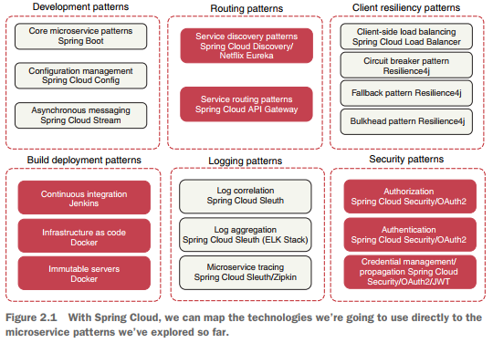

# Explorando el mundo de los microservicios con Spring Cloud

---

`Spring Cloud` ofrece un conjunto de características **(service registration and discovery, circuit breakers,
monitoring, y otros)** que nos permitirán construir rápidamente arquitecturas de microservicios con configuraciones
mínimas.

## ¿Qué es Spring Cloud?

**Spring Cloud es una colección de herramientas** que engloba el trabajo de empresas de código abierto como VMware,
HashiCorp y Netflix en patrones de entrega. **Spring Cloud simplifica la instalación y configuración de nuestros
proyectos y proporciona soluciones a los patrones más comunes en nuestra aplicación Spring.**

La `Figura 2.1` asigna los patrones enumerados en el capítulo anterior a los proyectos de Spring Cloud que los
implementan.

