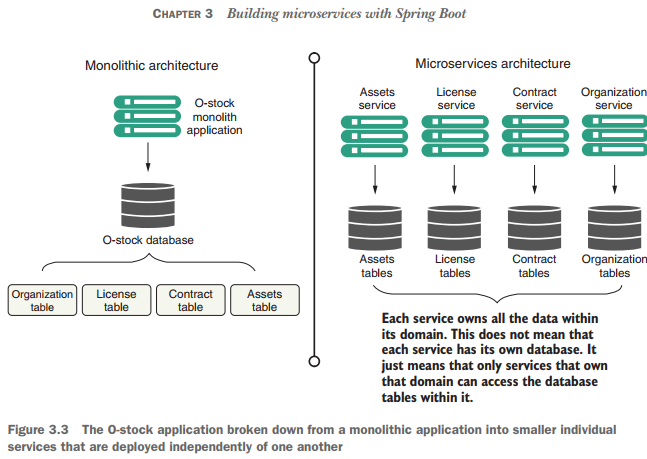
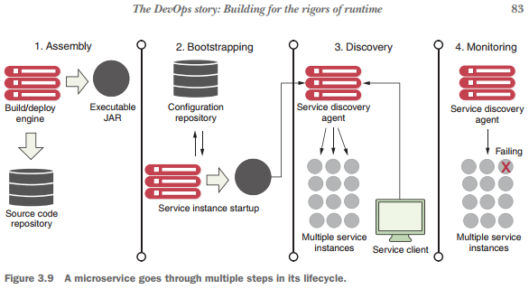

# Building Microservices With Spring Boot

---

## La historia del arquitecto: diseño de la arquitectura de microservicios

El papel de un arquitecto en un proyecto de software es proporcionar un modelo funcional del problema que debe
resolverse. El arquitecto proporciona el andamiaje sobre el cual los desarrolladores construirán su código para que
todas las piezas de la aplicación encajen. Al crear un microservicio, el arquitecto de un proyecto se centra en tres
tareas clave:

- Descomponer el problema empresarial
- Establecer granularidad del servicio
- Definición de las interfaces de servicio.

La `Figura 3.3` muestra cómo el código de la aplicación y el modelo de datos se “fragmentan” en partes individuales.

**NOTA**
> Creamos bases de datos individuales para cada servicio, pero también puede compartir bases de datos entre los
> servicios.

Después de dividir un dominio problemático en partes discretas, a menudo nos encontraremos luchando por determinar si
hemos alcanzado el nivel adecuado de granularidad para nuestros servicios. Un microservicio que sea demasiado grueso o
fino tendrá varios atributos reveladores, que analizaremos en breve.

`Figura 3.3` La aplicación O-stock se desglosa desde una aplicación monolítica en servicios individuales más pequeños
que se implementan de forma independiente unos de otros



## La historia del desarrollador: creación de un microservicio con Spring Boot y Java

En esta sección, exploraremos las prioridades del desarrollador al crear el microservicio de licencias a partir del
modelo de dominio O-stock.

**NOTA**
> Creamos el esqueleto del servicio de licencias en el capítulo anterior.

Las siguientes secciones ver en el archivo `README.md` del microservicio `licensing-service`:

1. Implementar una clase de controlador Spring Boot para mapear un punto final para exponer los puntos finales del
   servicio de licencias.
2. Implementar la internacionalización para que los mensajes se puedan adaptar a diferentes idiomas.
3. Implementar Spring HATEOAS para proporcionar suficiente información para que el usuario pueda interactuar con el
   servidor.

## La historia del DevOps: construcción para los rigores del tiempo de ejecución

Si bien DevOps es un campo de TI rico y emergente, para el ingeniero de DevOps, el diseño del microservicio tiene que
ver con la gestión del servicio después de que entra en producción. Escribir el código suele ser la parte fácil.
Mantenerlo funcionando es la parte difícil. Comenzaremos nuestro esfuerzo de desarrollo de microservicios con cuatro
principios y los desarrollaremos más adelante en el libro:

- `Un microservicio debe ser autónomo`. También debería poder implementarse de forma independiente con múltiples
  instancias del servicio iniciadas y desmanteladas con un único artefacto de software.


- `Un microservicio debe ser configurable`. Cuando se inicia una instancia de servicio, debe leer los datos que necesita
  para configurarse desde una ubicación central o transmitir su información de configuración como variables de entorno.
  No debería ser necesaria ninguna intervención humana para configurar el servicio.


- `Una instancia de microservicio debe ser transparente para el cliente`. El cliente nunca debe saber la ubicación
  exacta de un servicio. En cambio, un cliente de microservicio debería hablar con un agente de descubrimiento de
  servicios. Eso permite que la aplicación ubique una instancia de un microservicio sin tener que conocer su ubicación
  física.


- `Un microservicio debe comunicar su estado`. Esta es una parte fundamental de su arquitectura en la nube. Las
  instancias de microservicio fallarán y los agentes de descubrimiento deberán evitar las instancias de servicio
  incorrectas. En este libro, usaremos `Spring Boot Actuator` para mostrar el estado de cada microservicio.

Estos cuatro principios exponen la paradoja que puede existir con el desarrollo de microservicios. Los microservicios
son más pequeños en tamaño y alcance, pero su uso introduce más partes móviles en una aplicación porque los
microservicios se distribuyen y ejecutan de forma independiente unos de otros en sus propios contenedores. Esto
introduce un alto grado de coordinación y más oportunidades de puntos de falla en la aplicación.

Desde una perspectiva de `DevOps`, debe abordar las necesidades operativas de un microservicio desde el principio y
traducir estos cuatro principios en un conjunto estándar de eventos del ciclo de vida que ocurren cada vez que se
construye e implementa un microservicio en un entorno. Los cuatro principios se pueden asignar a los siguientes ciclos
de vida operativos. La figura 3.9 muestra cómo encajan estos cuatro pasos.

- `Montaje del servicio`: cómo empaqueta e implementa su servicio para garantizar la repetibilidad y la coherencia, de
  modo que el mismo código de servicio y tiempo de ejecución se implementen exactamente de la misma manera.

- `Arranque del servicio`: cómo separar el código de configuración específico de su aplicación y entorno del código de
  tiempo de ejecución para que pueda iniciar e implementar una instancia de microservicio rápidamente en cualquier
  entorno sin intervención humana.

- `Registro/descubrimiento de servicio`: cuando se implementa una nueva instancia de microservicio, cómo hacer que la
  nueva instancia de servicio sea detectable por otros clientes de aplicaciones.

- `Monitoreo de servicios`: en un entorno de microservicios, es común que se ejecuten varias instancias del mismo
  servicio debido a necesidades de alta disponibilidad. Desde una perspectiva de DevOps, es necesario monitorear las
  instancias de microservicios y asegurarse de que cualquier falla se direccione alrededor de las instancias de servicio
  fallidas y que se eliminen.



## Montaje de servicios: empaquetar e implementar sus microservicios

Desde una perspectiva de DevOps, uno de los conceptos clave detrás de una arquitectura de microservicio es que se pueden
implementar rápidamente múltiples instancias de un microservicio en respuesta a un entorno de aplicación modificado (por
ejemplo, una afluencia repentina de solicitudes de usuarios, problemas dentro de la infraestructura, etc.). en). Para
lograr esto, un microservicio debe empaquetarse e instalarse como un único artefacto con todas sus dependencias
definidas en él. Estas dependencias también deben incluir el motor de tiempo de ejecución (por ejemplo, un servidor HTTP
o un contenedor de aplicaciones) que aloja el microservicio.

Afortunadamente, casi todos los marcos de microservicios de Java incluirán un motor de tiempo de ejecución que puede
empaquetar e implementar con el código. Por ejemplo, en el ejemplo de Spring Boot en la figura 3.10, Maven y Spring Boot
crean un archivo JAR Java ejecutable que tiene un motor Tomcat integrado directamente en el JAR. **En el siguiente
ejemplo de línea de comandos, creamos el servicio de licencias como un JAR ejecutable y luego iniciamos el JAR desde la
línea de comandos:**

````bash
$ mvn clean package && java -jar target/licensing-service-0.0.1-SNAPSHOT.jar
````

Para ciertos equipos de operaciones, el concepto de incorporar un entorno de ejecución directamente en el archivo JAR es
un cambio importante en su forma de pensar acerca de la implementación de aplicaciones. En una aplicación web
tradicional Java, la aplicación se implementa en un servidor de aplicaciones. Este modelo implica que el servidor de
aplicaciones es una entidad en sí misma y, a menudo, sería administrado por un equipo de administradores de sistemas que
supervisan la configuración del servidor independientemente de las aplicaciones que se les implementen.

Esta separación de la configuración del servidor de aplicaciones de la aplicación introduce puntos de falla en el
proceso de implementación. Esto se debe a que, en muchas organizaciones, la configuración de los servidores de
aplicaciones no se mantiene bajo control de origen y se administra mediante una combinación de interfaz de usuario y
scripts de administración locales. Es demasiado fácil que la deriva de la configuración se introduzca en el entorno del
servidor de aplicaciones y provoque repentinamente lo que en la superficie parecen ser interrupciones aleatorias.

## Arranque de servicios: gestión de la configuración de sus microservicios

El arranque del servicio (paso 2 en la figura 3.9) ocurre cuando el microservicio se inicia por primera vez y necesita
cargar la información de configuración de su aplicación. 

Como sabe cualquier desarrollador de aplicaciones, habrá ocasiones en las que será necesario configurar el
comportamiento en tiempo de ejecución de la aplicación. Por lo general, esto implica leer los datos de configuración de
su aplicación desde un archivo de propiedades implementado con la aplicación o leer los datos de un almacén de datos
como una base de datos relacional.

Los microservicios suelen encontrarse con el mismo tipo de requisitos de configuración. La diferencia es que en una
aplicación de microservicio que se ejecuta en la nube, es posible que tenga cientos o incluso miles de instancias de
microservicio en ejecución. Para complicar aún más esto, los servicios podrían extenderse por todo el mundo. Con una
gran cantidad de servicios dispersos geográficamente, resulta inviable volver a implementar sus servicios para recoger
nuevos datos de configuración. Almacenar los datos en un almacén de datos externo al servicio resuelve este problema.
Pero los microservicios en la nube ofrecen una serie de desafíos únicos:

- Los datos de configuración tienden a tener una estructura simple y generalmente se leen con frecuencia y se escriben
  con poca frecuencia. Las bases de datos relacionales son excesivas en esta situación porque están diseñadas para
  gestionar modelos de datos mucho más complicados que un simple conjunto de pares clave-valor.


- Debido a que se accede a los datos de forma regular pero cambian con poca frecuencia, los datos deben poder leerse con
  un nivel bajo de latencia.


- El almacén de datos debe tener alta disponibilidad y estar cerca de los servicios que leen los datos. Un almacén de
  datos de configuración no puede dejar de funcionar por completo porque se convertiría en un punto único de falla para
  su aplicación.

En el capítulo 5, mostraremos cómo administrar los datos de configuración de su aplicación de microservicio utilizando
elementos como un simple almacén de datos de valores-clave.