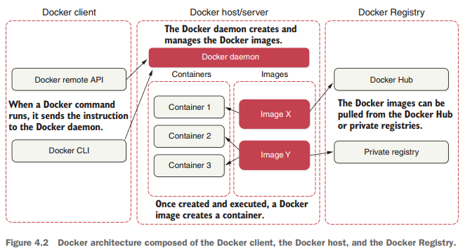
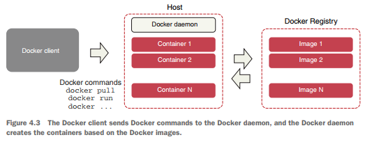
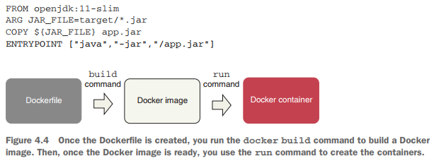
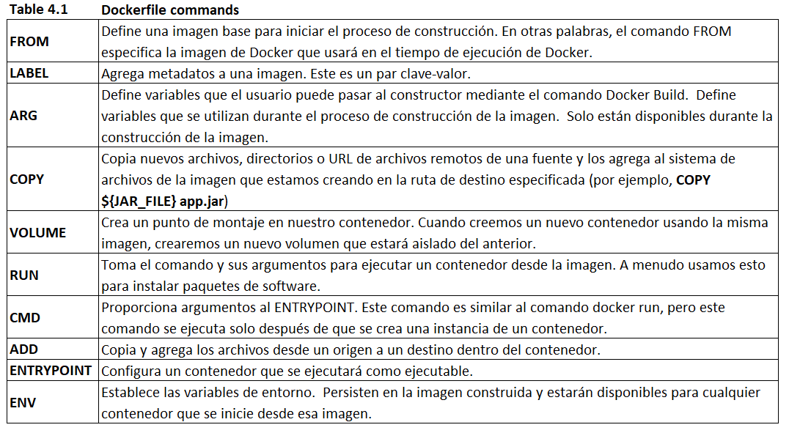

# Welcome to Docker

---

## ¿Qué es Docker?

Docker es un popular motor de contenedores de código abierto basado en Linux, creado por Solomon Hykes, fundador y
director ejecutivo de dotCloud en marzo de 2013. Docker comenzó como una tecnología agradable que era responsable de
lanzar y administrar contenedores dentro de nuestras aplicaciones. Esta tecnología nos permitió compartir los recursos
de una máquina física con diferentes contenedores en lugar de exponer diferentes recursos de hardware como las máquinas
virtuales.

**Definición**
> Un `contenedor` representa un mecanismo de empaquetado lógico que proporciona a las aplicaciones todo lo que necesitan
> para ejecutarse.

Para comprender mejor cómo funciona `Docker`, es esencial tener en cuenta que `Docker Engine` es la pieza central de
todo el sistema Docker. ¿Qué es el motor Docker? Es una aplicación que sigue la arquitectura del patrón
cliente-servidor. Esta aplicación se instala en la máquina host y contiene los siguientes tres componentes críticos:
servidor, API REST e interfaz de línea de comandos (CLI). La `Figura 4.2` ilustra estos componentes de Docker, así como
otros.

Docker Engine contiene los siguientes componentes:

- `Docker daemon`: un servidor, llamado dockerd, que nos permite crear y administrar las imágenes de Docker. La API REST
  envía instrucciones al demonio y el cliente CLI ingresa los comandos de Docker.
- `Cliente Docker`: los usuarios de Docker interactúan con Docker a través de un cliente. Cuando se ejecuta un comando
  de Docker, el cliente se encarga de enviar la instrucción al demonio.
- `Docker Registry`: la ubicación donde se almacenan las imágenes de Docker. Estos registros pueden ser públicos o
  privados. Docker Hub es el lugar predeterminado para los registros públicos, pero también puede crear su propio
  registro privado.
- `Imágenes de Docker`: son plantillas de solo lectura con varias instrucciones para crear un contenedor de Docker. Las
  imágenes se pueden extraer de Docker Hub y puede usarlas tal cual o modificarlas agregando instrucciones adicionales.
  Además, puede crear nuevas imágenes utilizando un Dockerfile. Más adelante, en este capítulo, explicaremos cómo
  utilizar Dockerfiles.
- `Contenedores de Docker`: una vez creada y ejecutada con el comando docker container run, una imagen de Docker crea un
  contenedor. La aplicación y su entorno se ejecutan dentro de este contenedor. Para iniciar, detener y eliminar un
  contenedor Docker, puede utilizar la API de Docker o la CLI.
- `Volúmenes de Docker`: los volúmenes de Docker son el mecanismo preferido para almacenar datos generados por Docker y
  utilizados por los contenedores de Docker. Se pueden gestionar mediante la API de Docker o la CLI de Docker.
- `Redes Docker`: las redes Docker nos permiten conectar los contenedores a tantas redes como queramos. Podemos ver las
  redes como un medio para comunicarnos con contenedores aislados. Docker contiene los siguientes cinco tipos de
  controladores de red: bridge, host, none, overlay and macvlan.

La `Figura 4.3` muestra un diagrama de cómo funciona Docker. Tenga en cuenta que el Docker daemon es responsable de
todas las acciones del contenedor. Como se muestra en la figura 4.3, podemos ver que el demonio recibe los comandos del
cliente Docker; Estos comandos se pueden enviar a través de la CLI o las API REST. En el diagrama podemos ver cómo las
imágenes de Docker que se encuentran en los registros crean los contenedores.

## Dockerfiles

Un Dockerfile es un archivo de texto simple que contiene una lista de instrucciones y comandos que el cliente Docker
llama para crear y preparar una imagen. Este archivo automatiza el proceso de creación de imágenes para usted. Los
comandos utilizados en Dockerfile son similares a los comandos de Linux, lo que hace que Dockerfile sea más fácil de
entender.

El siguiente fragmento de código presenta un breve ejemplo de cómo se ve un Dockerfile. En la sección 4.5.1, le
mostraremos cómo crear Dockerfiles personalizados para sus propios microservicios. La `Figura 4.4` muestra cómo debería
verse el flujo de trabajo de creación de imágenes de Docker.

La `Tabla 4.1` muestra los comandos de Dockerfile más comunes que usaremos en nuestros Dockerfiles. Consulte también el
listado 4.1 para ver un Dockerfile de ejemplo.

