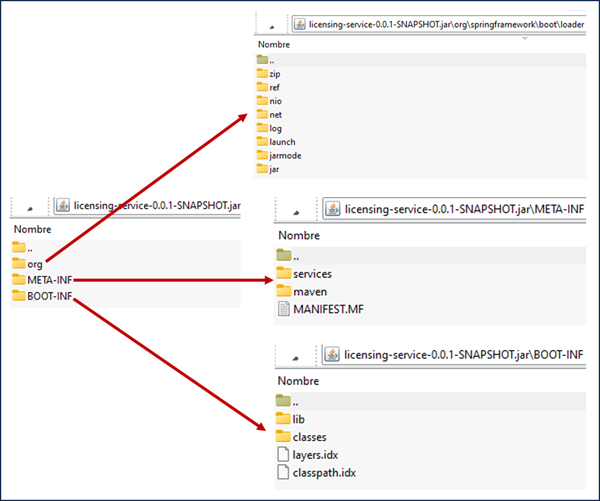

# Welcome to Docker

---

## ¿Qué es Docker?

Docker es un popular motor de contenedores de código abierto basado en Linux, creado por Solomon Hykes, fundador y
director ejecutivo de dotCloud en marzo de 2013. Docker comenzó como una tecnología agradable que era responsable de
lanzar y administrar contenedores dentro de nuestras aplicaciones. Esta tecnología nos permitió compartir los recursos
de una máquina física con diferentes contenedores en lugar de exponer diferentes recursos de hardware como las máquinas
virtuales.

**Definición**
> Un `contenedor` representa un mecanismo de empaquetado lógico que proporciona a las aplicaciones todo lo que necesitan
> para ejecutarse.

Para comprender mejor cómo funciona `Docker`, es esencial tener en cuenta que `Docker Engine` es la pieza central de
todo el sistema Docker. ¿Qué es el motor Docker? Es una aplicación que sigue la arquitectura del patrón
cliente-servidor. Esta aplicación se instala en la máquina host y contiene los siguientes tres componentes críticos:
servidor, API REST e interfaz de línea de comandos (CLI). La `Figura 4.2` ilustra estos componentes de Docker, así como
otros.


Docker Engine contiene los siguientes componentes:

- `Docker daemon`: un servidor, llamado dockerd, que nos permite crear y administrar las imágenes de Docker. La API REST
  envía instrucciones al demonio y el cliente CLI ingresa los comandos de Docker.
- `Cliente Docker`: los usuarios de Docker interactúan con Docker a través de un cliente. Cuando se ejecuta un comando
  de Docker, el cliente se encarga de enviar la instrucción al demonio.
- `Docker Registry`: la ubicación donde se almacenan las imágenes de Docker. Estos registros pueden ser públicos o
  privados. Docker Hub es el lugar predeterminado para los registros públicos, pero también puede crear su propio
  registro privado.
- `Imágenes de Docker`: son plantillas de solo lectura con varias instrucciones para crear un contenedor de Docker. Las
  imágenes se pueden extraer de Docker Hub y puede usarlas tal cual o modificarlas agregando instrucciones adicionales.
  Además, puede crear nuevas imágenes utilizando un Dockerfile. Más adelante, en este capítulo, explicaremos cómo
  utilizar Dockerfiles.
- `Contenedores de Docker`: una vez creada y ejecutada con el comando docker container run, una imagen de Docker crea un
  contenedor. La aplicación y su entorno se ejecutan dentro de este contenedor. Para iniciar, detener y eliminar un
  contenedor Docker, puede utilizar la API de Docker o la CLI.
- `Volúmenes de Docker`: los volúmenes de Docker son el mecanismo preferido para almacenar datos generados por Docker y
  utilizados por los contenedores de Docker. Se pueden gestionar mediante la API de Docker o la CLI de Docker.
- `Redes Docker`: las redes Docker nos permiten conectar los contenedores a tantas redes como queramos. Podemos ver las
  redes como un medio para comunicarnos con contenedores aislados. Docker contiene los siguientes cinco tipos de
  controladores de red: bridge, host, none, overlay and macvlan.

La `Figura 4.3` muestra un diagrama de cómo funciona Docker. Tenga en cuenta que el Docker daemon es responsable de
todas las acciones del contenedor. Como se muestra en la figura 4.3, podemos ver que el demonio recibe los comandos del
cliente Docker; Estos comandos se pueden enviar a través de la CLI o las API REST. En el diagrama podemos ver cómo las
imágenes de Docker que se encuentran en los registros crean los contenedores.


## Dockerfiles

Un Dockerfile es un archivo de texto simple que contiene una lista de instrucciones y comandos que el cliente Docker
llama para crear y preparar una imagen. Este archivo automatiza el proceso de creación de imágenes para usted. Los
comandos utilizados en Dockerfile son similares a los comandos de Linux, lo que hace que Dockerfile sea más fácil de
entender.

El siguiente fragmento de código presenta un breve ejemplo de cómo se ve un Dockerfile. En la sección 4.5.1, le
mostraremos cómo crear Dockerfiles personalizados para sus propios microservicios. La `Figura 4.4` muestra cómo debería
verse el flujo de trabajo de creación de imágenes de Docker.


La `Tabla 4.1` muestra los comandos de Dockerfile más comunes que usaremos en nuestros Dockerfiles. Consulte también el
listado 4.1 para ver un Dockerfile de ejemplo.


## Docker Compose

Docker Compose simplifica el uso de Docker al permitirnos crear scripts que faciliten el diseño y la construcción de
servicios. Con Docker Compose, puede ejecutar varios contenedores como un único servicio o puede crear diferentes
contenedores simultáneamente.

Un archivo docker `compose.yml` debería verse como el que se muestra en la siguiente lista. Más adelante, en este
capítulo, explicaremos cómo crear nuestro archivo docker `compose.yml`.

## Construyendo la imagen Docker

**FUENTES**

- [baeldung: spring boot docker images](https://www.baeldung.com/spring-boot-docker-images)
- [spring.io: spring boot docker](https://spring.io/guides/topicals/spring-boot-docker)
- [spring: Efficient Container Images](https://docs.spring.io/spring-boot/docs/current/reference/html/container-images.html)
- [medium: Dockerizing Spring Boot: Best Practices for Efficient Containerization](https://medium.com/@kiarash.shamaii/dockerizing-spring-boot-best-practices-for-efficient-containerization-f60ed3980dc7)
- [Spring framework Guru: Why You Should be Using Spring Boot Docker Layers](https://springframework.guru/why-you-should-be-using-spring-boot-docker-layers/)
- [Layered Jars: Spring Microservices In Action 2021 - Página 106]()

La forma tradicional de crear imágenes de Docker con Spring Boot es utilizar un `Dockerfile`. A continuación se muestra
un ejemplo sencillo:

````Dockerfile
FROM eclipse-temurin:21-jdk-alpine
EXPOSE 8080
ARG JAR_FILE=target/demo-app-1.0.0.jar
ADD ${JAR_FILE} app.jar
ENTRYPOINT ["java","-jar","/app.jar"]
````

Luego podríamos usar el comando `docker image build` para crear una imagen de Docker. Esto funciona bien para la mayoría
de las aplicaciones, pero tiene un par de inconvenientes.

Primero, estamos usando un `JAR gordo` (le dice jar gordo, porque es un empaquetado que contiene archivos y directorios)
creado por `Spring Boot`. Esto puede afectar el tiempo de inicio, especialmente en un entorno en contenedores. Podemos
ahorrar tiempo de inicio agregando el contenido desempaquetado del archivo `jar`.

En segundo lugar, las imágenes de Docker se crean en capas. La naturaleza de los `jars` de Spring Boot hace que
todo el código de la aplicación y las bibliotecas de terceros se coloquen en una sola capa. Esto significa que incluso
cuando solo cambia una línea de código, se debe reconstruir toda la capa.

Al desempaquetar el `jar` antes de construir, **el código de la aplicación y las librerías de terceros obtienen cada uno
su propia capa.** Esto nos permite aprovechar el mecanismo de almacenamiento en `caché de Docker`. Ahora, cuando se
cambia una línea de código, solo es necesario reconstruir esa capa correspondiente.

Con esto en mente, veamos cómo `Spring Boot` ha mejorado el proceso de creación de imágenes de Docker.

## JARs por Capas

Spring Boot también admite la creación de imágenes de Docker utilizando contenedores en capas. Para entender cómo
funciona, veamos un diseño típico de un `JAR` de Spring Boot.

Para crear el `JAR` podemos ejecutar el siguiente comando:

````bash
$ .\mvnw clean package -DSkiptest
````

Una vez que tenemos el `JAR` creado, podemos ver la lista de todos los archivos y directorios que están contenidos
dentro del archivo `JAR` especificado:

**Donde**

- `t`, listar el contenido del archivo JAR (en inglés, "table of contents").
- `f`, especificar el archivo JAR sobre el cual se realizará la operación.

````bash
$ jar tf .\target\licensing-service-0.0.1-SNAPSHOT.jar

META-INF/
META-INF/MANIFEST.MF
META-INF/services/
META-INF/services/java.nio.file.spi.FileSystemProvider
org/
org/springframework/
org/springframework/boot/
org/springframework/boot/loader/
org/springframework/boot/loader/jar/
org/springframework/boot/loader/jar/ManifestInfo.class
...
org/springframework/boot/loader/jarmode/
org/springframework/boot/loader/jarmode/JarMode.class
org/springframework/boot/loader/launch/
...
org/springframework/boot/loader/log/
...
org/springframework/boot/loader/net/
...
org/springframework/boot/loader/net/protocol/nested/
...
org/springframework/boot/loader/nio/
...
org/springframework/boot/loader/ref/
...
org/springframework/boot/loader/zip/
...
BOOT-INF/
BOOT-INF/classes/
BOOT-INF/classes/dev/
BOOT-INF/classes/dev/magadiflo/
BOOT-INF/classes/dev/magadiflo/licensing/
BOOT-INF/classes/dev/magadiflo/licensing/app/
BOOT-INF/classes/dev/magadiflo/licensing/app/config/
BOOT-INF/classes/dev/magadiflo/licensing/app/controller/
BOOT-INF/classes/dev/magadiflo/licensing/app/model/
BOOT-INF/classes/dev/magadiflo/licensing/app/service/
BOOT-INF/classes/i18n/
META-INF/maven/
META-INF/maven/dev.magadiflo/
META-INF/maven/dev.magadiflo/licensing-service/
BOOT-INF/classes/application.yml
BOOT-INF/classes/dev/magadiflo/licensing/app/config/InternationalizationConfig.class
...
BOOT-INF/lib/
BOOT-INF/lib/spring-boot-3.2.5.jar
...
BOOT-INF/classpath.idx
BOOT-INF/layers.idx
````

Como vemos, el `JAR` está compuesto por varios directorios y archivos. En la imagen siguiente podemos ver más claramente
el contenido de un jar típico de spring boot:



## [Capas de imágenes de Docker](https://docs.spring.io/spring-boot/docs/current/maven-plugin/reference/htmlsingle/#packaging.layers)

Para facilitar la creación de `imágenes Docker optimizadas`, Spring Boot admite agregar un archivo de índice de
capa al jar. **Proporciona una lista de capas y las partes del jar que deben estar contenidas dentro de ellas.** La
lista de capas en el índice está ordenada según el orden en que se deben agregar las capas a la imagen de Docker. **De
fábrica, se admiten las siguientes capas:**

- `dependencies` (para dependencias publicadas regularmente)
- `spring-boot-loader` (para todo lo que se encuentra en `org/springframework/boot/loader`)
- `snapshot-dependencies` (para dependencias de instantáneas)
- `application` (para clases de aplicación y recursos)

Con el `jar` en capas, la estructura es similar a la estructura que vimos en el apartado `JARs por Capas`,
pero en este nuevo caso, tenemos el archivo `layers.idx` donde se muestra cada directorio del `JAR` asignado
a una capa. Si observamos la imagen anterior, dentro del directorio `BOOT-INF` hay un
archivo llamado `layers.idx`, podemos darle doble clic y nos mostrará el siguiente contenido:

````yml
- "dependencies":
    - "BOOT-INF/lib/"
- "spring-boot-loader":
    - "org/"
- "snapshot-dependencies":
- "application":
    - "BOOT-INF/classes/"
    - "BOOT-INF/classpath.idx"
    - "BOOT-INF/layers.idx"
    - "META-INF/"
````

**NOTA**
> El archivo reempaquetado incluye por defecto el archivo `layers.idx`.

También podemos ejecutar el siguiente comando en el directorio raíz de nuestra aplicación para
mostrar las capas y el orden en el que se deben agregar estas a nuestro `Dockerfile`:

````bash
$ java -Djarmode=layertools -jar .\target\licensing-service-0.0.1-SNAPSHOT.jar list

dependencies
spring-boot-loader
snapshot-dependencies
application
````

**Donde**

- `-Djarmode=layertools`, indica que el `JAR` debe ser ejecutado en un `"modo de herramientas"` que permite trabajar con
  capas dentro del `JAR`. Esto se usa típicamente con `JARs por capas`, que es un enfoque para empaquetar aplicaciones
  Java de manera que diferentes partes del JAR, como las librerías externas y el código de la aplicación, estén en capas
  separadas.
- `layertools` para `jarmode` generalmente permite ejecutar operaciones específicas relacionadas con el manejo de capas.
  En nuestro caso, el comando incluye el `list`, lo que nos permite listar las capas que se pueden extraer del jar.

Esta estratificación está diseñada para separar el código según la probabilidad de que cambie entre compilaciones de
aplicaciones. Es menos probable que el código de la biblioteca cambie entre compilaciones, por lo que se coloca en sus
propias capas para permitir que las herramientas reutilicen las capas del caché. **Es más probable que el código de la
aplicación cambie entre compilaciones, por lo que está aislado en una capa separada.**

**CONCLUSIÓN**
> El objetivo es colocar el `código de la aplicación` y las `librerías de terceros` en capas que reflejen la frecuencia
> con la que cambian.

Por ejemplo, es probable que el código de la aplicación sea lo que cambia con más frecuencia, por lo que obtiene su
propia capa. Además, cada capa puede evolucionar por sí sola y solo cuando una capa haya cambiado se reconstruirá para
la imagen de Docker.

Ahora que entendemos la nueva estructura del jar en capas, veamos cómo podemos utilizarla para crear imágenes de Docker
eficientes.

## [Creando Imagen de Docker Eficiente](https://docs.spring.io/spring-boot/docs/current/reference/html/container-images.html)

Si bien es posible convertir un jar de Spring Boot en una imagen de Docker con solo unas pocas líneas en el
`Dockerfile,` usaremos la función de `capas` para crear una `imagen de Docker optimizada`.

El comando `extract` se puede utilizar para dividir fácilmente la aplicación en capas que se agregarán al
`dockerfile`.

Agregamos el archivo `Dockerfile` en la raíz de nuestro microservicio para crear la `imagen docker optimizada` que
utiliza un `jarmode`:

````Dockerfile
FROM eclipse-temurin:21-jdk-alpine AS dependencies
WORKDIR /app
COPY ./mvnw ./
COPY ./.mvn ./.mvn
COPY ./pom.xml ./

RUN sed -i -e 's/\r$//' ./mvnw
RUN ./mvnw dependency:go-offline

COPY ./src ./src
RUN ./mvnw clean package -DskipTests

FROM eclipse-temurin:21-jre-alpine AS builder
WORKDIR /app
COPY --from=dependencies /app/target/*.jar ./app.jar
RUN java -Djarmode=layertools -jar app.jar extract

FROM eclipse-temurin:21-jre-alpine AS runner
WORKDIR /app
COPY --from=builder /app/dependencies ./
COPY --from=builder /app/spring-boot-loader ./
COPY --from=builder /app/snapshot-dependencies ./
COPY --from=builder /app/application ./

CMD ["java", "org.springframework.boot.loader.launch.JarLauncher"]
````

**DONDE**

Hemos construido un archivo `Dockerfile` `multi-stage` de tres etapas. Veamos algunos detalles:

- En la primera etapa estamos usando la imagen base del `eclipse-temurin:21-jdk-alpine` de java, esto es importante
  porque en esta etapa vamos a descargar las dependencias y compilar el `jar`, por eso necesitamos que sea un `JDK`.


- En las dos últimas etapas usamos como imagen base `eclipse-temurin:21-jre-alpine`, es decir, únicamente el entorno
  para ejecutar una aplicación java, aquí ya no necesitamos el JDK, sino solo el `JRE`, además que es más liviano.


- `RUN sed -i -e 's/\r$//' ./mvnw`, es un comando de Linux que utiliza sed, el editor de flujo, para eliminar los
  caracteres de retorno de carro (\r) al final de cada línea en el archivo mvnw.


- `RUN ./mvnw dependency:go-offline`, iniciamos la descarga de las dependencias de maven.


- `RUN java -Djarmode=layertools -jar app.jar extract`:

    - Spring Boot 2.3 introdujo un modo especial para manejar los archivos JAR, llamado `Layertools`. Esto permite que
      el JAR se estructure en capas lógicas como "dependencies", "spring-boot-loader", "snapshot-dependencies", y "
      application".
    - **El objetivo de estas capas es optimizar la reconstrucción de imágenes Docker.** Al tener una estructura de
      capas, si una parte del código cambia, solo se necesita reconstruir las capas afectadas en lugar de todo el JAR.
      Esto puede resultar en una construcción de imágenes Docker más rápida y eficiente.
    - Este comando utiliza el modo de herramientas de capa (`layertools`) que permite ejecutar operaciones específicas
      relacionadas con el manejo de capas.
    - El comando `extract` extrae capas del jar para la creación de la imagen. Este comando descompone el archivo JAR de
      la siguiente manera:
        - `Dependencies`: Las dependencias de tiempo de ejecución.
        - `Spring-Boot-Loader`: La parte responsable de iniciar una aplicación Spring Boot.
        - `Snapshot-Dependencies`: Dependencias etiquetadas como "snapshot".
        - `Application`: El código específico de la aplicación, como tus clases y recursos.


- `COPY --from=builder /app/dependencies ./` (y los otros `COPY` de las capas del Jar), copiamos las distintas capas
  que han sido extraídas por el comando descrito anteriormente. Las copiamos en una nueva etapa del Dockerfile.


- `CMD ["java", "org.springframework.boot.loader.launch.JarLauncher"]`, hasta este punto no estamos trabajando con
  un `JAR`, sino más bien con el `desempaquetado del JAR`, eso significa que no podemos usar el
  clásico `CMD ["java","-jar","/app.jar"]` para ejecutar la aplicación cuando inicie el contenedor. El `JarLauncher` es
  parte del sistema de carga de Spring Boot. Este lanzador permite cargar la aplicación desde capas separadas,
  esencialmente emulando el comportamiento de un JAR ejecutable pero permitiendo el uso de capas para optimizar la
  reconstrucción del contenedor. En resumen, en esta última etapa del `Dockerfile` estamos copiando el `desempaquetado`
  del jar de la etapa 2 al directorio `/app` de esta última etapa. Eso significa, que el contenedor final, tendrá en el
  directorio `/app` todos los directorios y archivos del desempaquetado del jar y para poder iniciar la aplicación
  utilizaremos el `JarLauncher` ubicado en el directorio `org.springframework.boot.loader.launch`. Más adelante, cuando
  creemos un contendor veremos que nuestro directorio `/app` contendrá los directorios y archivos del desempaquetado del
  jar.

[IMPORTANTE](https://medium.com/@kiarash.shamaii/dockerizing-spring-boot-best-practices-for-efficient-containerization-f60ed3980dc7)

> Si usamos springboot 3.2 o menos, entonces usar:<br>
> `CMD ["java" , "org.springframework.boot.loader.JarLauncher"]`
>
> Si usamos springboot 3.2 o superior, entonce usar: <br>
> `CMD ["java" , "org.springframework.boot.loader.launch.JarLauncher"]`

Una vez que hemos definido nuestro `Dockerfile`, ejecutamos el siguiente comando mediante la línea de comandos para
construir la imagen de nuestro microservicio:

````bash
$ docker image build -t licensing-service:v1 .

[+] Building 0.0s (0/0)  docker:default
[+] Building 104.3s (23/23) FINISHED
=> [internal] load build definition from Dockerfile
=> => transferring dockerfile: 767B
=> [internal] load metadata for docker.io/library/eclipse-temurin:21-jdk-alpine            
=> [internal] load metadata for docker.io/library/eclipse-temurin:21-jre-alpine            
=> [internal] load .dockerignore                                                           
=> => transferring context: 188B                                                           
=> [dependencies 1/9] FROM docker.io/library/eclipse-temurin:21-jdk-alpine                 
=> [internal] load build context                                                           
=> => transferring context: 86.46kB                                                        
=> [builder 1/4] FROM docker.io/library/eclipse-temurin:21-jre-alpine                      
=> [dependencies 2/9] WORKDIR /app                                                         
=> [builder 2/4] WORKDIR /app                                                              
=> [dependencies 3/9] COPY ./mvnw ./                                                       
=> [dependencies 4/9] COPY ./.mvn ./.mvn                                                   
=> [dependencies 5/9] COPY ./pom.xml ./                                                    
=> [dependencies 6/9] RUN sed -i -e 's/\r$//' ./mvnw                                       
=> [dependencies 7/9] RUN ./mvnw dependency:go-offline                                     
=> [dependencies 8/9] COPY ./src ./src                                                     
=> [dependencies 9/9] RUN ./mvnw clean package -DskipTests                                 
=> [builder 3/4] COPY --from=dependencies /app/target/*.jar ./app.jar                      
=> [builder 4/4] RUN java -Djarmode=layertools -jar app.jar extract                        
=> [runner 3/6] COPY --from=builder /app/dependencies ./                                   
=> [runner 4/6] COPY --from=builder /app/spring-boot-loader ./                             
=> [runner 5/6] COPY --from=builder /app/snapshot-dependencies ./                          
=> [runner 6/6] COPY --from=builder /app/application ./                                    
=> exporting to image                                                                      
=> => exporting layers                                                                     
=> => writing image sha256:1b0edc7af474e8215721125684bb9cc8e1917273fe4ed429fbe7904507ebac1c
=> => naming to docker.io/library/licensing-service:v1                                     
````

Para ver la imagen creada, podemos listar todas las imágenes y verla que allí se encuentra:

````bash
$ docker image ls

REPOSITORY                  TAG             IMAGE ID       CREATED         SIZE
licensing-service           v1              1b0edc7af474   7 minutes ago   213MB
...
````

## Ejecutando contenedor Docker

Como ya tenemos la imagen creada de nuestro microservicio, podemos levantar un contenedor usando la siguientes
instrucciones:

````bash
$ docker container run -d -p 8080:8080 --name c-licensing-service licensing-service:v1
````

Comprobamos que nuestro contenedor se ha creado correctamente:

````bash
$ docker container ls -a
CONTAINER ID   IMAGE                  COMMAND                  CREATED          STATUS          PORTS                    NAMES
e579615acc7f   licensing-service:v1   "/__cacert_entrypoin…"   25 seconds ago   Up 24 seconds   0.0.0.0:8080->8080/tcp   c-licensing-service
````

Si ingresamos al contenedor y listamos la carpeta `/app` veremos los directorios `BOOT-INF`,
`META-INF` y `org`, es decir, el contendor tiene los directorios y archivos extraídos del jar y no el `.jar`
propiamente. Precisamente por esa razón es que en el `Dockerfile` definimos el
comando `CMD ["java", "org.springframework.boot.loader.launch.JarLauncher"]` como una manera de poder iniciar la
aplicación cuando se inicie el contenedor, dado que ahora no tenemos un `jar` dentro del contendor, sino más bien, los
directorios desempaquetados.

````bash
$ docker container exec -it c-licensing-service /bin/sh
/app # ls
BOOT-INF  META-INF  org
/app #
````

Es importante tener en cuenta que, lo que tenemos dentro del contenedor es el contenido del jar extraído y no el
jar mismo (empaquetado). El beneficio está en el lado del `Dockerfile`, dado que como lo hemos extraído y al estar
haciendo `COPY` de cada capa, aprovechamos la característica de Docker de tenerlos en `CACHÉ` aquellas capas que no han
cambiado.

Ahora, realizamos una petición HTTP a uno de los endpoints expuestos por nuestro microservicio:

````bash
$ curl -v -X POST -H "Content-Type: application/json" -H "Accept-Language: es" -d "{\"licenseId\": \"0235454846\", \"description\": \"Software product\", \"productName\": \"Teclado\", \"licenseType\": \"full\"}" http://localhost:8080/v1/organization/optimaGrowth/license
Note: Unnecessary use of -X or --request, POST is already inferred.
*   Trying [::1]:8080...
* Connected to localhost (::1) port 8080
> POST /v1/organization/optimaGrowth/license HTTP/1.1
> Host: localhost:8080
> User-Agent: curl/8.4.0
> Accept: */*
> Content-Type: application/json
> Accept-Language: es
> Content-Length: 111
>
< HTTP/1.1 200
< Content-Type: text/plain;charset=UTF-8
< Content-Length: 166
< Date: Sat, 04 May 2024 07:23:01 GMT
<
¡Licencia creada License(id=null, licenseId=0235454846, description=Software product, organizationId=optimaGrowth, productName=Teclado, licenseType=full) con éxito!
````

## Modificando código fuente

Vamos a agregar un endpoint al controlador de nuestro microservicio, eso significa que debemos volver a construir
nuestra imagen para que los cambios en el código fuente se apliquen.

````java

@RequiredArgsConstructor
@RestController
@RequestMapping(path = "/v1/organization/{organizationId}/license")
public class LicenseController {
    /* other code */
    @GetMapping
    public ResponseEntity<?> getMessage(@PathVariable String organizationId) {
        return ResponseEntity.ok(Map.entry("message", "La organización es " + organizationId + ", ok!"));
    }
}
````

Con nuestra "nueva funcionalidad" agregada, volvemos a generar la imagen de nuestro microservicio ejecutando el comando:

````bash
$ docker image build -t licensing-service:v2 .   
                                                                                                               
2024/05/04 02:29:23 http2: server: error reading preface from client //./pipe/docker_engine: file has already been closed                                       
[+] Building 0.0s (0/0)  docker:default2024/05/04 02:29:24 http2: server: error reading preface from client //./pipe/docker_engine: file has already been closed
[+] Building 19.9s (23/23) FINISHED                                                                                                                             
 => [internal] load build definition from Dockerfile                                                                                                            
 => => transferring dockerfile: 767B                                                                                                                            
 => [internal] load metadata for docker.io/library/eclipse-temurin:21-jre-alpine                                                                                
 => [internal] load metadata for docker.io/library/eclipse-temurin:21-jdk-alpine                                                                                
 => [internal] load .dockerignore                                                                                                                               
 => => transferring context: 188B                                                                                                                               
 => [builder 1/4] FROM docker.io/library/eclipse-temurin:21-jre-alpine                                                                                          
 => [internal] load build context                                                                                                                               
 => => transferring context: 5.32kB                                                                                                                             
 => [dependencies 1/9] FROM docker.io/library/eclipse-temurin:21-jdk-alpine                                                                                     
 => CACHED [dependencies 2/9] WORKDIR /app                                                                                                                      
 => CACHED [dependencies 3/9] COPY ./mvnw ./                                                                                                                    
 => CACHED [dependencies 4/9] COPY ./.mvn ./.mvn                                                                                                                
 => CACHED [dependencies 5/9] COPY ./pom.xml ./                                                                                                                 
 => CACHED [dependencies 6/9] RUN sed -i -e 's/\r$//' ./mvnw                                                                                                    
 => CACHED [dependencies 7/9] RUN ./mvnw dependency:go-offline                                                                                                  
 => [dependencies 8/9] COPY ./src ./src                                                                                                                         
 => [dependencies 9/9] RUN ./mvnw clean package -DskipTests                                                                                                     
 => CACHED [builder 2/4] WORKDIR /app                                                                                                                           
 => [builder 3/4] COPY --from=dependencies /app/target/*.jar ./app.jar                                                                                          
 => [builder 4/4] RUN java -Djarmode=layertools -jar app.jar extract                                                                                            
 => CACHED [runner 3/6] COPY --from=builder /app/dependencies ./                                                                                                
 => CACHED [runner 4/6] COPY --from=builder /app/spring-boot-loader ./                                                                                          
 => CACHED [runner 5/6] COPY --from=builder /app/snapshot-dependencies ./                                                                                       
 => [runner 6/6] COPY --from=builder /app/application ./                                                                                                        
 => exporting to image                                                                                                                                          
 => => exporting layers                                                                                                                                         
 => => writing image sha256:e2594f13e42498a6dbc3a462d7b2bb8ab8bb6a4825fd7554fd395ec27c883f8a                                                                    
 => => naming to docker.io/library/licensing-service:v2                                                                                                         
````

Como observamos, varias de las capas las está tomando de `CACHÉ`. Ahora, enfoquémonos en las capas del
jar del que hablábamos en apartados superiores: `dependencies`, `spring-boot-loader` y `snapshot-dependencies`, estas
tres capas también las está tomando de `CACHÉ` y tiene sentido, dado que la modificación que hicimos fue en el
código fuente, en ningún otro lado más, por esa razón la única capa del jar que está volviendo a cargarse es la
capa `application`.

Ahora, crearemos el contenedor de esta nueva imagen:

````bash
$ docker container run -d -p 8081:8080 --name c-licensing-service-v2 licensing-service:v2
````

Comprobamos que nuestro contenedor se ha creado correctamente:

````bash
$ docker container ls -a
CONTAINER ID   IMAGE                  COMMAND                  CREATED          STATUS          PORTS                    NAMES
104c880529ab   licensing-service:v2   "/__cacert_entrypoin…"   18 seconds ago   Up 17 seconds   0.0.0.0:8081->8080/tcp   c-licensing-service-v2
e579615acc7f   licensing-service:v1   "/__cacert_entrypoin…"   14 minutes ago   Up 14 minutes   0.0.0.0:8080->8080/tcp   c-licensing-service
````

Ahora comprobamos que la nueva funcionalidad está en el contenedor que acabamos de crear:

````bash
$ curl -v http://localhost:8081/v1/organization/optimaGrowth/license | jq
>
< HTTP/1.1 200
< Content-Type: application/json
<
{
  "message": "La organización es optimaGrowth, ok!"
}
````