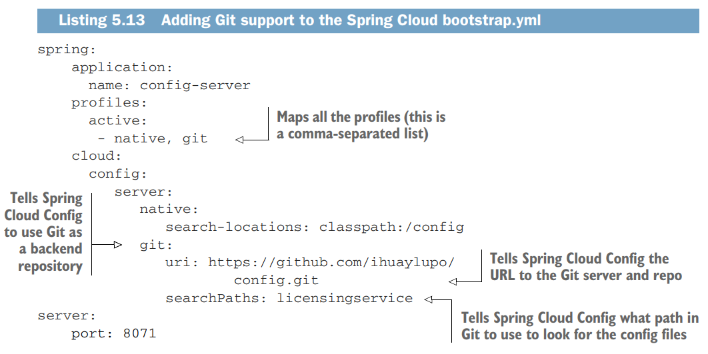

# Controlando su configuración con Spring Cloud Config Server

[Pág. 110] Capítulo 5

---

Muchos desarrolladores recurren a archivos de propiedades (YAML, JSON o XML) para almacenar su información de
configuración. Configurar su aplicación en estos archivos se convierte en una tarea simple, tan fácil que la mayoría de
los desarrolladores nunca hacen más que colocar su archivo de configuración bajo control de código fuente (si es así) e
implementar el archivo como parte de su aplicación. Este enfoque puede funcionar con una pequeña cantidad de
aplicaciones, pero rápidamente se desmorona cuando se trata de aplicaciones basadas en la nube que pueden contener
cientos de microservicios, donde cada microservicio, a su vez, puede tener múltiples instancias de servicio en
ejecución.

Por ejemplo, imaginemos que tenemos cientos de microservicios y cada microservicio contiene diferentes configuraciones
para tres entornos. Si no gestionamos esos archivos fuera de la aplicación, cada vez que haya un cambio deberemos buscar
el archivo en el repositorio de códigos, seguir el proceso de integración (si lo hay) y reiniciar la aplicación. Para
evitar este escenario catastrófico, como mejor práctica para el desarrollo de microservicios basados en la nube,
debemos considerar lo siguiente:

- Separe completamente la configuración de una aplicación del código real que se está implementando.


- Cree imágenes de aplicaciones inmutables que nunca cambien a medida que se promocionan en sus entornos.


- Inyecte cualquier información de configuración de la aplicación al inicio del servidor a través de variables de
  entorno o un repositorio centralizado que los microservicios leen al inicio.

## Sobre la gestión de la configuración (y la complejidad)

Comencemos nuestra discusión sobre la gestión de la configuración de aplicaciones estableciendo cuatro principios que
queremos seguir:

- `Segregar`: necesitamos separar completamente la información de configuración del servicio de la implementación física
  real de un servicio. De hecho, la configuración de la aplicación no debería implementarse con la instancia de
  servicio. En su lugar, la información de configuración debe pasarse como variables de entorno al iniciar el servicio o
  leerse desde un repositorio centralizado cuando se inicia el servicio.


- `Abstraer`: también necesitamos abstraer el acceso a los datos de configuración detrás de una interfaz de servicio.
  En lugar de escribir código que lea directamente el repositorio de servicios, ya sea basado en archivos o en una base
  de datos JDBC, deberíamos utilizar un servicio JSON basado en REST para recuperar los datos de configuración de la
  aplicación.


- `Centralizar`: debido a que una aplicación basada en la nube puede tener literalmente cientos de servicios, es
  fundamental minimizar la cantidad de repositorios diferentes utilizados para almacenar datos de configuración.
  Centralice la configuración de su aplicación en la menor cantidad de repositorios posible.


- `Reforzar`: debido a que la información de configuración de su aplicación estará completamente segregada de su
  servicio implementado y centralizada, es fundamental que la solución que utilice e implemente tenga alta
  disponibilidad y sea redundante.

Una de las cosas clave que debe recordar es que cuando separa su información de configuración fuera de su código real,
está creando una dependencia externa que deberá administrarse y controlarse. No podemos enfatizar lo suficiente que es
necesario rastrear los datos de configuración de la aplicación y controlar la versión porque la configuración de la
aplicación mal administrada es un caldo de cultivo para errores difíciles de detectar e interrupciones no planificadas.

## Su arquitectura de Gestión de la Configuración

Como recordará de los capítulos anteriores, la carga de la gestión de configuración de un microservicio se produce
durante la fase de arranque del microservicio. Como recordatorio, la figura 5.1 muestra el ciclo de vida del
microservicio.


Tomemos los cuatro principios que presentamos en la sección 5.1 (`segregar`, `abstraer`, `centralizar` y `reforzar`) y
veamos cómo se aplican cuando se inicia el servicio. La Figura 5.2 presenta el proceso de arranque con más detalle y
muestra cómo un servicio de configuración juega un papel crítico en este paso.


En la figura 5.2, se están llevando a cabo varias actividades. Aquí hay un resumen de cada paso en la figura:

1. Cuando aparece una instancia de microservicio, llama a un punto final de servicio para leer su información de
   configuración, que es específica del entorno en el que opera. La información de conexión para la administración de la
   configuración (credenciales de conexión, punto final de servicio, etc.) luego pasa a el microservicio cuando se
   inicia.


2. La configuración real reside en un repositorio. Según la implementación de su repositorio de configuración, puede
   elegir diferentes formas de conservar sus datos de configuración. Esto puede incluir archivos bajo control de fuente,
   bases de datos relacionales o almacenes de datos de valores-clave.


3. La gestión real de los datos de configuración de la aplicación se produce independientemente de cómo se implemente la
   aplicación. Los cambios en la gestión de la configuración generalmente se manejan a través del proceso de compilación
   e implementación, donde las modificaciones se pueden etiquetar con información de versión e implementar en los
   diferentes entornos (desarrollo, preparación, producción, etc.).


4. Cuando cambie la gestión de la configuración, los servicios que utilizan los datos de configuración de esa aplicación
   deben ser notificados de la alteración y actualizar su copia de los datos de la aplicación.

En este punto, hemos trabajado en la arquitectura conceptual que ilustra las diferentes piezas de un patrón de gestión
de configuración y cómo estas piezas encajan entre sí. Ahora veremos las diferentes soluciones para lograr la gestión de
la configuración y luego veremos un problema concreto.

## Opciones de implementación

Afortunadamente, puede elegir entre una gran cantidad de proyectos de código abierto probados en batalla para
implementar una solución de gestión de configuración. Veamos varias de las diferentes opciones disponibles y compárelas.
La tabla 5.1 presenta las opciones.


Todas las soluciones de la `tabla 5.1` se pueden utilizar fácilmente para crear una solución de gestión de
configuración. Para los ejemplos de este capítulo, y en el resto del libro,
usaremos` Spring Cloud Configuration Server` (a menudo llamado `Spring Cloud Config Server` o,
simplemente, `Config Server`), que se adapta perfectamente a nuestra arquitectura de microservicios Spring. Elegimos
esta solución porque:

- Spring Cloud Configuration Server es fácil de configurar y usar.

- Spring Cloud Config se integra estrechamente con Spring Boot. Literalmente puede leer todos los datos de configuración
  de su aplicación con algunas anotaciones fáciles de usar.

- Config Server ofrece múltiples backends para almacenar datos de configuración.

- De todas las soluciones en la tabla 5.1, Config Server puede integrarse directamente con la plataforma de control de
  fuente `Git` y con `HashiCorp Vault`. Explicaremos estos temas más adelante en este capítulo.

## Construyendo nuestro servidor de configuración Spring Cloud

`Spring Cloud Configuration Server` es una aplicación basada en REST que se basa en Spring Boot. El `Config Server` no
viene como un servidor independiente. En su lugar, puede optar por incrustarlo en una aplicación Spring Boot existente
o iniciar un nuevo proyecto Spring Boot con el servidor integrado. La mejor práctica es mantener las cosas separadas.

Lo primero que debemos hacer para construir nuestro servidor de configuración es crear un proyecto Spring Boot con
Spring Initializr (https://start.spring.io/).

Luego de crear el servicio `config-server`, el `pom.xml` ser verá de la siguiente manera:

````xml

<project>
    <!--Spring Boot 3.2.5-->
    <!--Java 21-->
    <!--spring-cloud.version 2023.0.1-->
    <dependencies>
        <dependency>
            <groupId>org.springframework.boot</groupId>
            <artifactId>spring-boot-starter-actuator</artifactId>
        </dependency>
        <dependency>
            <groupId>org.springframework.cloud</groupId>
            <artifactId>spring-cloud-config-server</artifactId>
        </dependency>

        <dependency>
            <groupId>org.springframework.boot</groupId>
            <artifactId>spring-boot-starter-test</artifactId>
            <scope>test</scope>
        </dependency>
    </dependencies>
    <dependencyManagement>
        <dependencies>
            <dependency>
                <groupId>org.springframework.cloud</groupId>
                <artifactId>spring-cloud-dependencies</artifactId>
                <version>${spring-cloud.version}</version>
                <type>pom</type>
                <scope>import</scope>
            </dependency>
        </dependencies>
    </dependencyManagement>
</project>
````

No analizaremos todo el archivo `pom` en detalle, pero para empezar tomaremos nota de algunas áreas clave. En el archivo
Maven anterior, podemos ver cuatro partes importantes. La primera es la `versión Spring Boot` y la siguiente es la
`versión Spring Cloud` que vamos a utilizar. En este ejemplo, utilizamos la versión `2023.0.1 de Spring Cloud`. El
tercer punto resaltado en la lista son las dependencias específicas que usaremos en el servicio, y el último punto es la
lista de materiales `(BOM)` principal de `Spring Cloud Config` que usaremos.

Esta lista de materiales principal contiene todas las bibliotecas y dependencias de terceros que se utilizan en el
proyecto de nube y los números de versión de los proyectos individuales que componen esa versión. En este ejemplo,
utilizamos la versión definida previamente en la sección `<properties>` del archivo `pom`. **Al utilizar una definición
de BOM, podemos garantizar que usaremos versiones compatibles de los subproyectos en Spring Cloud. También significa que
no tenemos que declarar números de versión para nuestras subdependencias.**

El siguiente paso en la creación de nuestro `Spring Cloud Config Server` es configurar un archivo para definir la
configuración central del servidor para que pueda ejecutarse. En nuestro caso agregaremos ciertas configuraciones
a nuestro `application.yml`, empezaremos por las siguientes configuraciones:

````yaml
server:
  port: 8888
  error:
    include-message: always

spring:
  application:
    name: config-server
````

Hay dos partes importantes a destacar en la configuración anterior. **El primero es el nombre de la aplicación.**
Es vital nombrar todos los servicios que vamos a crear en nuestra arquitectura para el descubrimiento de servicios, que
describiremos en el siguiente capítulo. **El segundo punto a tener en cuenta es el puerto en el que Spring Configuration
Server escuchará** para proporcionar los datos de configuración solicitados.

## Configurar la clase de arranque de Spring Cloud Config Server

El siguiente paso en la creación de nuestro servicio Spring Cloud Config es configurar la clase de arranque Spring Cloud
Config. Cada servicio Spring Cloud necesita una clase de arranque que podamos usar para iniciar el servicio.

Recuerde, esta clase contiene varias partes importantes: un método Java main() que actúa como punto de entrada para que
se inicie el servicio y un conjunto de anotaciones de Spring que le indican al servicio inicial qué tipo de
comportamientos Spring lanzará para el servicio. La siguiente lista muestra la clase de arranque para nuestro
`Spring Cloud Config Server`.

`Spring Cloud Config Server` proporciona una API basada en recursos HTTP para configuración externa (pares nombre-valor
o contenido YAML equivalente). El servidor se puede integrar en una aplicación Spring Boot mediante la anotación
`@EnableConfigServer`. En consecuencia, la siguiente aplicación es un servidor de configuración:

````java

@EnableConfigServer // Habilita el servicio como un servidor de configuraciones de Spring Cloud Config
@SpringBootApplication
public class ConfigServerApplication {

    public static void main(String[] args) {
        SpringApplication.run(ConfigServerApplication.class, args);
    }

}
````

El siguiente paso es definir la ubicación de búsqueda de nuestros datos de configuración. Comencemos con el ejemplo más
simple: **el sistema de archivos.**

## Usando Spring Cloud Config Server con un sistema de archivos (filesystem)

El servidor de configuración de Spring Cloud utiliza una entrada en el archivo `application.yml` para señalar el
repositorio que contiene los datos de configuración de la aplicación. Configurar un repositorio basado en un sistema de
archivos es la forma más sencilla de lograrlo. Para hacer esto, actualicemos nuestro `application.yml`. La siguiente
lista muestra el contenido requerido para este archivo para **configurar un repositorio de sistema de archivos.**

````yml
server:
  port: 8888
  error:
    include-message: always

spring:
  application:
    name: config-server
  profiles:
    active: native

  cloud:
    config:
      server:
        #Configuración local: estas ubicaciones pueden ser classpath o ubicaciones en el sistema de archivos.
        native:
          #Lee desde una carpeta específica del sistema de archivos
          search-locations:
            file: ///${FILE_PATH}
````

Debido a que **usaremos el sistema de archivos para almacenar información de configuración de la aplicación**, debemos
decirle al `Spring Cloud Config Server` que se ejecute con el perfil `native`. Recuerde, un perfil de Spring es una
característica principal que ofrece el framework de Spring. Nos permite asignar nuestros beans a diferentes entornos,
como desarrollo, prueba, preparación, producción, native y otros.

**NOTA**
> Recuerde, `native` es solo un perfil creado para `Spring Cloud Configuration Server`, lo que indica que los archivos
> de configuración se recuperarán o leerán desde el `classpath` o el `filesystem`.

Cuando usamos un repositorio basado en un `filesystem`, también usaremos el perfil `native` **porque es un perfil
en el servidor de configuración que no usa ninguna configuración de `Git` o` Vault`**, pero carga los archivos de
configuración desde el `classpath` local o el `file system` (cualquier URL estática a la que desee señalar con
`spring.cloud.config.server.native.searchLocations`). Para utilizar el perfil nativo, inicie Config Server con
`spring.profiles.active=native`.

La última parte de `application.yml`, como se muestra en el código siguiente, proporciona la configuración de Spring
Cloud dentro del directorio donde residen los datos de la aplicación. Por ejemplo:

````yml
server:
  native:
    search-locations:
      file: ///M:/PROGRAMACION/DESARROLLO_JAVA_SPRING/08.book_ms-in-action-2021/local-config-server-repo
````

**NOTA**
> Recuerde usar el prefijo `file:` para los recursos del archivo (el valor predeterminado sin prefijo suele ser el
> `classpath`). Al igual que con cualquier configuración de Spring Boot, puede incrustar marcadores de posición de
> entorno estilo `${}`, pero recuerde que las rutas absolutas en Windows requieren un `/` adicional (por ejemplo,
> `/${user.home}/config-repo`).

**ATENCIÓN**
> El valor predeterminado de `search-locations` es idéntico al de una aplicación Spring Boot local (es
> decir, `[classpath:/, classpath:/config, file:./, file:./config]`). Esto no expone el `application.properties`
> del servidor a todos los clientes, porque cualquier fuente de propiedad presente en el servidor se elimina antes de
> enviarse al cliente.

**TIP**
> Usar un `filesystem` es excelente para comenzar rápidamente y realizar pruebas. Para usarlo en producción, debe
> asegurarse de que el sistema de archivos sea confiable y compartido en todas las instancias del Config Server.

El parámetro importante en la entrada de configuración es `search-locations`. Este parámetro proporciona una
lista separada por comas de los directorios para cada aplicación que tendrán propiedades administradas por Config
Server. En el ejemplo anterior, usamos una ubicación del sistema de archivos:

> file:///M:/PROGRAMACION/DESARROLLO_JAVA_SPRING/08.book_ms-in-action-2021/local-config-server-repo

Pero también podemos indicar un `classpath` específico para buscar nuestros datos de configuración. Esto se configura
con el siguiente código:

````yml
server:
  native:
    search-locations: classpath:/config
````

**NOTA**
> El atributo `classpath` hace que `Spring Cloud Config Server` busque en la carpeta `src/main/resources/config`.

Ahora que hemos configurado nuestro `Spring Configuration Server`, creemos nuestros archivos de propiedades del servicio
de licencia. Para simplificar este ejemplo, usaremos la ubicación de búsqueda de classpath establecida en el fragmento
de código anterior. Luego, como en el ejemplo anterior, crearemos los archivos de propiedades de licencia en una carpeta
`/config`.

## Configurando los archivos de configuración para un servicio

En esta sección, usaremos el ejemplo del servicio de licencias que comenzamos en los capítulos iniciales de este libro.
Servirá como ejemplo de cómo utilizar Spring Cloud Config.

Nuevamente, para que este ejemplo sea simple, configuraremos los datos de configuración de la aplicación para tres
entornos: un entorno `default` para cuando ejecutamos el servicio localmente, un entorno `dev` y un entorno de `prod`.

Con Spring Cloud Config, todo funciona según una jerarquía. **La configuración de su aplicación está representada por el
nombre de la aplicación y luego un archivo de propiedades para cada entorno que desee configurar.** En cada uno de estos
entornos, configuraremos las siguientes propiedades de configuración:

- Una propiedad de ejemplo que será utilizada directamente por nuestro servicio de licencias.
- Una configuración de Spring Actuator que usaremos en el servicio de licencia.
- Una configuración de base de datos para el servicio de licencias.

La `Figura 5.5` ilustra cómo configuraremos y usaremos el servicio `Spring Cloud Config`. Un punto importante a
mencionar es
que a medida que cree su servicio de configuración, será otro microservicio que se ejecutará en su entorno. Una vez
configurado, se puede acceder al contenido del servicio a través de un endpoint REST basado en HTTP.

La convención de nomenclatura para los archivos de configuración de la aplicación es `appname-env.properties` o
`appname-env.yml`. Como puede ver en la `figura 5.5`, los nombres de los entornos se traducen directamente en las URL a
las que se accederá para explorar la información de configuración. Más adelante, cuando iniciamos el ejemplo del
microservicio de licencia, el entorno en el que queremos ejecutar el servicio se especifica mediante el perfil Spring
Boot que ingresa en la línea de comando al iniciar el servicio. Si no se pasa un perfil en la línea de comando, Spring
Boot utiliza de forma predeterminada los datos de configuración contenidos en el archivo `application.properties`
empaquetado con la aplicación.


**NOTA**
> Cuando solicita un `perfil específico del entorno`, se devuelven tanto el perfil solicitado como el perfil `default`.

### Propiedades de configuración del perfil `default`

`licensing-service.yml`

````yml
example:
  property: 'Soy el archivo de propiedad del servicio licensing-service por DEFAULT'

spring:
  database:
    driverClassName: org.postgresql.Driver
  jpa:
    hibernate:
      ddl-auto: none
      naming-strategy: org.hibernate.cfg.ImprovedNamingStrategy
    properties:
      hibernate:
        dialect: org.hibernate.dialect.PostgreSQLDialect
    database: POSTGRESQL
    show-sql: true

  datasource:
    platform: postgres
    testWhileIdle: true
    validationQuery: 'SELECT 1'

management:
  endpoints:
    web:
      exposure:
        include: '*'
    enabled-by-default: true
````

### Propiedades de configuración del perfil `dev`

`licensing-service-dev.yml`

````yml
example:
  property: 'Soy el archivo de propiedad del servicio licensing-service para DEV'

spring:
  datasource:
    url: jdbc:postgresql://localhost:5432/db_licensing_service_dev
    username: postgres
    password: magadiflo
````

### Propiedades de configuración del perfil `prod`

`licensing-service-prod.yml`

````yaml
example:
  property: 'Soy el archivo de propiedad del servicio licensing-service para PROD'

spring:
  datasource:
    url: jdbc:postgresql://localhost:5432/db_licensing_service_prod
    username: postgres
    password: magadiflo
````

**Piense antes de implementar**
> Le `desaconsejamos el uso de una solución basada en un sistema de archivos` para aplicaciones en la nube de tamaño
> mediano a grande. Usar el enfoque del sistema de archivos significa que necesita implementar un punto de montaje de
> archivos compartido para todos los servidores de configuración que quieran acceder a los datos de configuración de la
> aplicación. Configurar servidores de sistemas de archivos compartidos en la nube es factible, pero le impone a usted
> la responsabilidad de mantener este entorno. Mostramos el enfoque del sistema de archivos como el ejemplo más fácil de
> usar cuando se moja los pies con Spring Cloud Configuration Server. `En una sección posterior, le mostraremos cómo
> configurar el servidor de configuración para usar GitHub y HashiCorp Vault para almacenar la configuración de su
> aplicación.`

Ahora que hemos hecho suficiente trabajo para iniciar el servidor de configuración, comprobemos su funcionamiento.
Vamos a iniciarlo.

### Iniciando Servidor Spring Cloud Config Server

Cuando iniciemos el `Spring Cloud Config Server` nos debería mostrar la pantalla de presentación de Spring Boot en la
línea de comando.

````bash
$ .\mvnw spring-boot:run

[INFO] Scanning for projects...
...
[INFO] --- spring-boot:3.2.5:run (default-cli) @ config-server ---
[INFO] Attaching agents: []

  .   ____          _            __ _ _
 /\\ / ___'_ __ _ _(_)_ __  __ _ \ \ \ \
( ( )\___ | '_ | '_| | '_ \/ _` | \ \ \ \
 \\/  ___)| |_)| | | | | || (_| |  ) ) ) )
  '  |____| .__|_| |_|_| |_\__, | / / / /
 =========|_|==============|___/=/_/_/_/
 :: Spring Boot ::                (v3.2.5)

d.m.c.app.ConfigServerApplication        : Starting ConfigServerApplication using Java 21.0.1 with PID 14780 (M:\PROGRAMACION\DESARROLLO_JAVA_SPRING\08.book_ms-in-action-2021\spring-microservices-in-action-2021\projects\config-server\target\classes started by USUARIO in M:\PROGRAMACION\DESARROLLO_JAVA_SPRING\08.book_ms-in-action-2021\spring-microservices-in-action-2021\projects\config-server) 
d.m.c.app.ConfigServerApplication        : The following 1 profile is active: "native"
o.s.cloud.context.scope.GenericScope     : BeanFactory id=db215e97-977c-3847-b676-3c40335a84d2
o.s.b.w.embedded.tomcat.TomcatWebServer  : Tomcat initialized with port 8888 (http)
o.apache.catalina.core.StandardService   : Starting service [Tomcat]
o.apache.catalina.core.StandardEngine    : Starting Servlet engine: [Apache Tomcat/10.1.20]
o.a.c.c.C.[Tomcat].[localhost].[/]       : Initializing Spring embedded WebApplicationContext
w.s.c.ServletWebServerApplicationContext : Root WebApplicationContext: initialization completed in 2095 ms
o.s.b.a.e.web.EndpointLinksResolver      : Exposing 1 endpoint(s) beneath base path '/actuator'
o.s.b.w.embedded.tomcat.TomcatWebServer  : Tomcat started on port 8888 (http) with context path ''
d.m.c.app.ConfigServerApplication        : Started ConfigServerApplication in 4.406 seconds (process running for 5.029)
````

**Notar** que en el log muestra que el perfil activo que se está usando es `"native"` tal como se había configurado
en el `application.yml` del `config-server`. Recordar que este perfil `native` en el servidor de configuración nos
permite usar el
[File System Backend](https://docs.spring.io/spring-cloud-config/reference/server/environment-repository/file-system-backend.html)
que no usa `GIT` pero carga los archivos de configuración desde el `classpath` local o el sistema de archivos.

### Propiedades de configuración del perfil `default`

Vamos a ver las propiedades de configuración del perfil `deafult` para el microservicio `licensing-service`.

Ahora, si apunta su navegador a `http://localhost:8888/licensing-service/default`, verá `payload` JSON
devuelta con todas las propiedades contenidas en el archivo `licensing-service.properties`. La siguiente solicitud
muestra los resultados de llamar a este punto final.

````bash
$ curl -v http://localhost:8888/licensing-service/default | jq
>
< HTTP/1.1 200
< Content-Type: application/json
< Transfer-Encoding: chunked
< Date: Tue, 07 May 2024 00:48:35 GMT
<
{
  "name": "licensing-service",
  "profiles": [
    "default"
  ],
  "label": null,
  "version": null,
  "state": null,
  "propertySources": [
    {
      "name": "classpath:/config/licensing-service.yml",
      "source": {
        "example.property": "Soy el archivo de propiedad del servicio licensing-service por DEFAULT",
        "spring.database.driverClassName": "org.postgresql.Driver",
        "spring.jpa.hibernate.ddl-auto": "none",
        "spring.jpa.hibernate.naming-strategy": "org.hibernate.cfg.ImprovedNamingStrategy",
        "spring.jpa.properties.hibernate.dialect": "org.hibernate.dialect.PostgreSQLDialect",
        "spring.jpa.database": "POSTGRESQL",
        "spring.jpa.show-sql": true,
        "spring.datasource.platform": "postgres",
        "spring.datasource.testWhileIdle": true,
        "spring.datasource.validationQuery": "SELECT 1",
        "management.endpoints.web.exposure.include": "*",
        "management.endpoints.enabled-by-default": true
      }
    }
  ]
}
````

### Propiedades de configuración del perfil `dev`

Vamos a ver las propiedades de configuración del perfil `dev` para el microservicio `licensing-service`.

Si desea ver la información de configuración para el entorno del servicio de licencias basado en desarrollo, seleccione
el punto final GET `http://localhost:8888/licensing-service/dev`. La siguiente solicitud muestra el resultado de llamar
a este punto final.

````bash
curl -v http://localhost:8888/licensing-service/dev | jq
>
< HTTP/1.1 200
< Content-Type: application/json
< Transfer-Encoding: chunked
< Date: Tue, 07 May 2024 00:52:48 GMT
<
{
  "name": "licensing-service",
  "profiles": [
    "dev"
  ],
  "label": null,
  "version": null,
  "state": null,
  "propertySources": [
    {
      "name": "classpath:/config/licensing-service-dev.yml",
      "source": {
        "example.property": "Soy el archivo de propiedad del servicio licensing-service para DEV",
        "spring.datasource.url": "jdbc:postgresql://localhost:5432/db_licensing_service_dev",
        "spring.datasource.username": "postgres",
        "spring.datasource.password": "magadiflo"
      }
    },
    {
      "name": "classpath:/config/licensing-service.yml",
      "source": {
        "example.property": "Soy el archivo de propiedad del servicio licensing-service por DEFAULT",
        "spring.database.driverClassName": "org.postgresql.Driver",
        "spring.jpa.hibernate.ddl-auto": "none",
        "spring.jpa.hibernate.naming-strategy": "org.hibernate.cfg.ImprovedNamingStrategy",
        "spring.jpa.properties.hibernate.dialect": "org.hibernate.dialect.PostgreSQLDialect",
        "spring.jpa.database": "POSTGRESQL",
        "spring.jpa.show-sql": true,
        "spring.datasource.platform": "postgres",
        "spring.datasource.testWhileIdle": true,
        "spring.datasource.validationQuery": "SELECT 1",
        "management.endpoints.web.exposure.include": "*",
        "management.endpoints.enabled-by-default": true
      }
    }
  ]
}
````

Si miramos de cerca, veremos que cuando seleccionamos el endpoint `dev`, Spring Cloud Configuration Server
devolvió tanto las propiedades de configuración por `default` como la configuración del servicio de licencias de
`dev`. **La razón por la que Spring Cloud Config devuelve ambos conjuntos de información de configuración es que el
framework Spring implementa un mecanismo jerárquico para resolver problemas.**

Cuando el framework de Spring hace esto, primero busca la propiedad definida en el `default properties`
y luego anula el valor por `default` con un valor específico del entorno, si hay alguno presente. En términos concretos,
si define una propiedad en el archivo `licensing-service.properties` y no la define en ninguna de las otras
configuraciones del entorno (por ejemplo, `licensing-service-dev.properties`), el framework de Spring usará el valor
`default`.

### Propiedades de configuración del perfil `prod`

Vamos a ver las propiedades de configuración del perfil `prod` para el microservicio `licensing-service`.

Si desea ver la información de configuración para el entorno del servicio de licencias para producción, seleccione
el punto final GET `http://localhost:8888/licensing-service/prod`. La siguiente solicitud muestra el resultado de llamar
a este punto final.

````bash
$ curl -v http://localhost:8888/licensing-service/prod | jq
>
< HTTP/1.1 200
< Content-Type: application/json
< Transfer-Encoding: chunked
< Date: Tue, 07 May 2024 01:05:15 GMT
<
{
  "name": "licensing-service",
  "profiles": [
    "prod"
  ],
  "label": null,
  "version": null,
  "state": null,
  "propertySources": [
    {
      "name": "classpath:/config/licensing-service-prod.yml",
      "source": {
        "example.property": "Soy el archivo de propiedad del servicio licensing-service para PROD",
        "spring.datasource.url": "jdbc:postgresql://localhost:5432/db_licensing_service_prod",
        "spring.datasource.username": "postgres",
        "spring.datasource.password": "magadiflo"
      }
    },
    {
      "name": "classpath:/config/licensing-service.yml",
      "source": {
        "example.property": "Soy el archivo de propiedad del servicio licensing-service por DEFAULT",
        "spring.database.driverClassName": "org.postgresql.Driver",
        "spring.jpa.hibernate.ddl-auto": "none",
        "spring.jpa.hibernate.naming-strategy": "org.hibernate.cfg.ImprovedNamingStrategy",
        "spring.jpa.properties.hibernate.dialect": "org.hibernate.dialect.PostgreSQLDialect",
        "spring.jpa.database": "POSTGRESQL",
        "spring.jpa.show-sql": true,
        "spring.datasource.platform": "postgres",
        "spring.datasource.testWhileIdle": true,
        "spring.datasource.validationQuery": "SELECT 1",
        "management.endpoints.web.exposure.include": "*",
        "management.endpoints.enabled-by-default": true
      }
    }
  ]
}
````

Como vemos, el resultado nos muestra las propiedades de configuración por `default` y las configuraciones del entorno
de producción `prod`.

## Integrando Spring Cloud Config con un cliente Spring Boot

En los capítulos anteriores, construimos un esqueleto simple de nuestro servicio de licencias que no hizo más que
devolver un objeto Java codificado que representa un único registro de licencia. En esta sección, crearemos el servicio
de licencias con una base de datos `PostgreSQL` para contener los datos de las licencias.

Nos comunicaremos con la base de datos utilizando `Spring Data` y asignaremos nuestros datos de la tabla de licencias a
un Plain Old Java Object (POJO) que contiene los datos. Usaremos `Spring Cloud Configuration Server` para leer la
conexión de la base de datos y una propiedad simple. La `Figura 5.8` muestra lo que sucederá entre
el `servicio de licencias` y el servicio `Spring Cloud Config`.

Cuando se inicia el `servicio de licencias` por primera vez, le pasaremos tres datos: el `perfil de Spring`, el
`nombre de la aplicación` y el `punto final que el servicio de licencias` debe usar para comunicarse con el servicio
Spring Cloud Config. El perfil de Spring se asigna al entorno de las propiedades que se recuperan para el servicio
Spring.


Cuando se inicia el servicio de licencias, se comunicará con el servicio Spring Cloud Config a través de un punto final
creado a partir del perfil de Spring que se le pasó. Luego, el servicio` Spring Cloud Config` utilizará el repositorio
backend configurado `(sistema de archivos, Git o Vault)` para recuperar la información de configuración específica del
valor del perfil solicitado. Luego, los valores de propiedad apropiados se devuelven al servicio de
licencias. Luego, el marco Spring Boot inyectará estos valores en las partes apropiadas de la aplicación.

## Configurando el servicio de licencias con dependencias de Spring Cloud Config Service

Cambiemos nuestro enfoque del servidor de configuración de Spring Cloud al servicio de licencias. Lo primero que debe
hacer es agregar un par de entradas más al archivo Maven en su servicio de licencias.

La siguiente lista proporciona las dependencias que necesitamos agregar.

````xml

<project>
    <!--Sprint Boot 3.2.5-->
    <!--Java 21-->
    <!--spring-cloud.version 2023.0.1-->
    <properties>
        <java.version>21</java.version>
        <spring-cloud.version>2023.0.1</spring-cloud.version>
    </properties>
    <dependencies>
        <!-- other dependencies -->
        <dependency>
            <groupId>org.springframework.boot</groupId>
            <artifactId>spring-boot-starter-data-jpa</artifactId>
        </dependency>
        <dependency>
            <groupId>org.springframework.cloud</groupId>
            <artifactId>spring-cloud-starter-config</artifactId>
        </dependency>

        <dependency>
            <groupId>org.postgresql</groupId>
            <artifactId>postgresql</artifactId>
            <scope>runtime</scope>
        </dependency>
    </dependencies>
    <dependencyManagement>
        <dependencies>
            <dependency>
                <groupId>org.springframework.cloud</groupId>
                <artifactId>spring-cloud-dependencies</artifactId>
                <version>${spring-cloud.version}</version>
                <type>pom</type>
                <scope>import</scope>
            </dependency>
        </dependencies>
    </dependencyManagement>
</project>
````

## Configurando el servicio de licencias para usar Spring Cloud Config

Una vez definidas las dependencias de Maven, debemos indicarle al servicio de licencias dónde contactar con Spring Cloud
Configuration Server. En un servicio Spring Boot que utiliza Spring Cloud Config, la información de configuración se
puede establecer en uno de estos archivos: bootstrap.yml, bootstrap.properties, `application.yml` o
application.properties.

````yaml
spring:
  application:
    name: licensing-service
  profiles:
    active: dev
  config:
    import: optional:configserver:http://localhost:8888

# other properties
````

`spring.application.name` es el nombre de su aplicación (por ejemplo, `licensing-service`) y debe asignarse directamente
al nombre del directorio de configuración dentro de su Spring Cloud Configuration Server. La segunda
propiedad, `spring.profiles.active`, le indica a Spring Boot con qué perfil debe ejecutarse la aplicación. Recuerde, un
perfil es un mecanismo para diferenciar los datos de configuración consumidos por la aplicación Spring Boot. Para el
perfil del servicio de licencia, respaldará el entorno al que se asignará el servicio directamente en su entorno de
configuración de la nube. Por ejemplo, al pasar dev como su perfil, el servidor de configuración utilizará las
propiedades dev. Si no configura un perfil, el servicio de licencias utilizará el perfil default.

`Spring Boot 2.4` introdujo una nueva forma de importar datos de configuración a través de la
propiedad `spring.config.import`. Esta es ahora la forma predeterminada de vincularse al `Config Server`.

La propiedad `spring.config.import` permitirá al servicio de licencia conectarse al servidor de configuración en la
ubicación especificada `http://localhost:8888`. La eliminación del prefijo `opcional:` hará que el `Config Client`
falle si no puede conectarse al `Config Server`.

## Probando Spring Cloud Config Client

Antes de levantar nuestro microservicio `licensing-service` para obtener las configuraciones del servidor
`Spring Cloud Config Server` debemos crear la base de datos en postgres llamada `db_licensing_service_dev`. Una vez
creada la base de datos, el primer microservicio que debemos levantar es el de `Spring Cloud Config Server`, dado
que este microservicio contiene las configuraciones que requiero para poder levantar el microservicio
`licensing-service`.

1. Levantando servidor de configuraciones `config-server`:

````bash
$ .\mvnw spring-boot:run

  .   ____          _            __ _ _
 /\\ / ___'_ __ _ _(_)_ __  __ _ \ \ \ \
( ( )\___ | '_ | '_| | '_ \/ _` | \ \ \ \
 \\/  ___)| |_)| | | | | || (_| |  ) ) ) )
  '  |____| .__|_| |_|_| |_\__, | / / / /
 =========|_|==============|___/=/_/_/_/
 :: Spring Boot ::                (v3.2.5)

d.m.c.app.ConfigServerApplication        : Starting ConfigServerApplication using Java 21.0.1 with PID 2244 (M:\PROGRAMACION\DESARROLLO_JAVA_SPRING\08.book_ms-in-action-2021\spring-microservices-in-action-2021\projects\config-server\target\classes started by USUARIO in M:\PROGRAMACION\DESARROLLO_JAVA_SPRING\08.book_ms-in-action-2021\spring-microservices-in-action-2021\projects\config-server)
d.m.c.app.ConfigServerApplication        : The following 1 profile is active: "native"
o.s.cloud.context.scope.GenericScope     : BeanFactory id=db215e97-977c-3847-b676-3c40335a84d2
o.s.b.w.embedded.tomcat.TomcatWebServer  : Tomcat initialized with port 8888 (http)
o.apache.catalina.core.StandardService   : Starting service [Tomcat]
o.apache.catalina.core.StandardEngine    : Starting Servlet engine: [Apache Tomcat/10.1.20]
o.a.c.c.C.[Tomcat].[localhost].[/]       : Initializing Spring embedded WebApplicationContext
w.s.c.ServletWebServerApplicationContext : Root WebApplicationContext: initialization completed in 2313 ms
o.s.b.a.e.web.EndpointLinksResolver      : Exposing 1 endpoint(s) beneath base path '/actuator'
o.s.b.w.embedded.tomcat.TomcatWebServer  : Tomcat started on port 8888 (http) with context path ''
d.m.c.app.ConfigServerApplication        : Started ConfigServerApplication in 5.126 seconds (process running for 5.814)
````

2. Levantando microservicio `licensing-service`:

````bash
$ .\mvnw spring-boot:run

  .   ____          _            __ _ _
 /\\ / ___'_ __ _ _(_)_ __  __ _ \ \ \ \
( ( )\___ | '_ | '_| | '_ \/ _` | \ \ \ \
 \\/  ___)| |_)| | | | | || (_| |  ) ) ) )
  '  |____| .__|_| |_|_| |_\__, | / / / /
 =========|_|==============|___/=/_/_/_/
 :: Spring Boot ::                (v3.2.5)

d.m.l.app.LicensingServiceApplication    : Starting LicensingServiceApplication using Java 21.0.1 with PID 9972 (M:\PROGRAMACION\DESARROLLO_JAVA_SPRING\08.book_ms-in-action-2021\spring-microservices-in-action-2021\projects\licensing-service\target\classes started by USUARIO in M:\PROGRAMACION\DESARROLLO_JAVA_SPRING\08.book_ms-in-action-2021\spring-microservices-in-action-2021\projects\licensing-service)
d.m.l.app.LicensingServiceApplication    : The following 1 profile is active: "dev"
o.s.c.c.c.ConfigServerConfigDataLoader   : Fetching config from server at : http://localhost:8888
o.s.c.c.c.ConfigServerConfigDataLoader   : Located environment: name=licensing-service, profiles=[default], label=null, version=null, state=null
o.s.c.c.c.ConfigServerConfigDataLoader   : Fetching config from server at : http://localhost:8888
o.s.c.c.c.ConfigServerConfigDataLoader   : Located environment: name=licensing-service, profiles=[dev], label=null, version=null, state=null
.s.d.r.c.RepositoryConfigurationDelegate : Bootstrapping Spring Data JPA repositories in DEFAULT mode.
.s.d.r.c.RepositoryConfigurationDelegate : Finished Spring Data repository scanning in 24 ms. Found 0 JPA repository interfaces.
o.s.cloud.context.scope.GenericScope     : BeanFactory id=8b6acd3f-98b8-33b6-9f46-65941b2cea4a
o.s.b.w.embedded.tomcat.TomcatWebServer  : Tomcat initialized with port 8080 (http)
o.apache.catalina.core.StandardService   : Starting service [Tomcat]
o.apache.catalina.core.StandardEngine    : Starting Servlet engine: [Apache Tomcat/10.1.20]
o.a.c.c.C.[Tomcat].[localhost].[/]       : Initializing Spring embedded WebApplicationContext
w.s.c.ServletWebServerApplicationContext : Root WebApplicationContext: initialization completed in 2825 ms
o.hibernate.jpa.internal.util.LogHelper  : HHH000204: Processing PersistenceUnitInfo [name: default]
org.hibernate.Version                    : HHH000412: Hibernate ORM core version 6.4.4.Final
o.h.c.internal.RegionFactoryInitiator    : HHH000026: Second-level cache disabled
o.s.o.j.p.SpringPersistenceUnitInfo      : No LoadTimeWeaver setup: ignoring JPA class transformer
com.zaxxer.hikari.HikariDataSource       : HikariPool-1 - Starting...
com.zaxxer.hikari.pool.HikariPool        : HikariPool-1 - Added connection org.postgresql.jdbc.PgConnection@5f4df55e
com.zaxxer.hikari.HikariDataSource       : HikariPool-1 - Start completed.
org.hibernate.orm.deprecation            : HHH90000025: PostgreSQLDialect does not need to be specified explicitly using 'hibernate.dialect' (remove the property setting and it will be selected by default)
o.h.e.t.j.p.i.JtaPlatformInitiator       : HHH000489: No JTA platform available (set 'hibernate.transaction.jta.platform' to enable JTA platform integration)
j.LocalContainerEntityManagerFactoryBean : Initialized JPA EntityManagerFactory for persistence unit 'default'
JpaBaseConfiguration$JpaWebConfiguration : spring.jpa.open-in-view is enabled by default. Therefore, database queries may be performed during view rendering. Explicitly configure spring.jpa.open-in-view to disable this warning
o.s.b.a.e.web.EndpointLinksResolver      : Exposing 19 endpoint(s) beneath base path '/actuator'
o.s.b.w.embedded.tomcat.TomcatWebServer  : Tomcat started on port 8080 (http) with context path ''
d.m.l.app.LicensingServiceApplication    : Started LicensingServiceApplication in 8.27 seconds (process running for 8.903)
````

Al levantar el microservicio `licensing-service`, vemos cierta actividad en la consola del servidor de configuraciones:

````bash
o.a.c.c.C.[Tomcat].[localhost].[/]       : Initializing Spring DispatcherServlet 'dispatcherServlet'
o.s.web.servlet.DispatcherServlet        : Initializing Servlet 'dispatcherServlet'
o.s.web.servlet.DispatcherServlet        : Completed initialization in 2 ms
o.s.c.c.s.e.NativeEnvironmentRepository  : Adding property source: Config resource 'class path resource [config/licensing-service.yml]' via location 'classpath:/config/'
o.s.c.c.s.e.NativeEnvironmentRepository  : Adding property source: Config resource 'class path resource [config/licensing-service-dev.yml]' via location 'classpath:/config/'
o.s.c.c.s.e.NativeEnvironmentRepository  : Adding property source: Config resource 'class path resource [config/licensing-service.yml]' via location 'classpath:/config/'
````

Debido a que mejora todos sus servicios con capacidades de introspección a través de `Spring Boot Actuator`, puede
confirmar el entorno en el que se está ejecutando seleccionando el siguiente punto
final: `http://localhost:8080/actuator/env`.

El endpoint `/env` proporciona una lista completa de la información de configuración sobre el servicio, incluidas las
propiedades y los endpoints con los que se inicia el servicio.

La información devuelta por los puntos finales `/env`, `/configprops` y `/quartz` puede ser confidencial, por lo que,
**de forma predeterminada**, los valores siempre están completamente desinfectados (reemplazados por `******`).

Por lo tanto, si queremos ver los valores en vez de `******` cuando llamemos al endpoint `/env` necesitamos agregar
la siguiente configuración en el `application.yml` del microservicio `licensing-service`:

````yaml
management:
  # another configuration
  endpoint:
    env:
      show-values: ALWAYS
````

Ahora, sí volvemos a iniciar la aplicación de `licensing-service` y llamamos al endpoint `/env`, donde vemos los
valores de las propiedades que está tomando, en nuestro caso, está tomando las configuraciones del perfil `dev`.

````bash
$ curl -v http://localhost:8080/actuator/env | jq

"activeProfiles": [
        "dev"
],
...
{
  "name": "configserver:classpath:/config/licensing-service-dev.yml",
  "properties": {
    "example.property": {
      "value": "Soy el archivo de propiedad del servicio licensing-service para DEV",
      "origin": "Config Server classpath:/config/licensing-service-dev.yml:2:13"
    },
    "spring.datasource.url": {
      "value": "jdbc:postgresql://localhost:5432/db_licensing_service_dev",
      "origin": "Config Server classpath:/config/licensing-service-dev.yml:6:10"
    },
    "spring.datasource.username": {
      "value": "postgres",
      "origin": "Config Server classpath:/config/licensing-service-dev.yml:7:15"
    },
    "spring.datasource.password": {
      "value": "magadiflo",
      "origin": "Config Server classpath:/config/licensing-service-dev.yml:8:15"
    }
  }
},
{
  "name": "configserver:classpath:/config/licensing-service.yml",
  "properties": {
    "example.property": {
      "value": "Soy el archivo de propiedad del servicio licensing-service por DEFAULT",
      "origin": "Config Server classpath:/config/licensing-service.yml:2:13"
    },
    "spring.database.driverClassName": {
      "value": "org.postgresql.Driver",
      "origin": "Config Server classpath:/config/licensing-service.yml:6:22"
    },
    "spring.jpa.hibernate.ddl-auto": {
      "value": "none",
      "origin": "Config Server classpath:/config/licensing-service.yml:9:17"
    },
    "spring.jpa.hibernate.naming-strategy": {
      "value": "org.hibernate.cfg.ImprovedNamingStrategy",
      "origin": "Config Server classpath:/config/licensing-service.yml:10:24"
    },
    "spring.jpa.properties.hibernate.dialect": {
      "value": "org.hibernate.dialect.PostgreSQLDialect",
      "origin": "Config Server classpath:/config/licensing-service.yml:13:18"
    },
    "spring.jpa.database": {
      "value": "POSTGRESQL",
      "origin": "Config Server classpath:/config/licensing-service.yml:14:15"
    },
    "spring.jpa.show-sql": {
      "value": true,
      "origin": "Config Server classpath:/config/licensing-service.yml:15:15"
    },
    "spring.datasource.platform": {
      "value": "postgres",
      "origin": "Config Server classpath:/config/licensing-service.yml:18:15"
    },
    "spring.datasource.testWhileIdle": {
      "value": true,
      "origin": "Config Server classpath:/config/licensing-service.yml:19:20"
    },
    "spring.datasource.validationQuery": {
      "value": "SELECT 1",
      "origin": "Config Server classpath:/config/licensing-service.yml:20:22"
    },
    "management.endpoints.web.exposure.include": {
      "value": "*",
      "origin": "Config Server classpath:/config/licensing-service.yml:26:18"
    },
    "management.endpoints.enabled-by-default": {
      "value": true,
      "origin": "Config Server classpath:/config/licensing-service.yml:27:25"
    }
  }
},
...
````

## [Leer propiedades directamente usando @ConfigurationProperties](https://www.baeldung.com/configuration-properties-in-spring-boot)

Spring Boot tiene muchas características útiles, incluida la `configuración externalizada` y el fácil acceso a las
propiedades definidas en los archivos de `propiedades`.

La anotación `@ConfigurationProperties`, extrae todas las propiedades de ejemplo del Spring Cloud Configuration Server y
las inyecta en el atributo de propiedad de la clase ServiceProperties.

`@ConfigurationProperties(prefix = "example")` funciona mejor con propiedades jerárquicas que tienen el mismo prefijo;
por lo tanto, agregamos un prefijo `example`.

Spring Boot proporciona infraestructura para vincular tipos `@ConfigurationProperties` y registrarlos como beans. Puede
habilitar las propiedades de configuración clase por clase o **habilitar el escaneo de propiedades de configuración que
funciona de manera similar al escaneo de componentes.**

Para utilizar el escaneo de propiedades de configuración, agregue la anotación `@ConfigurationPropertiesScan` a su
aplicación. Normalmente, se agrega a la clase de aplicación principal que está anotada con `@SpringBootApplication` pero
se puede agregar a cualquier clase `@Configuration`. De forma predeterminada, el escaneo se realizará desde el paquete
de la clase que declara la anotación. Si desea definir paquetes específicos para escanear, puede hacerlo como se muestra
en el siguiente ejemplo `@ConfigurationPropertiesScan({ "com.example.app", "com.example.another" })`.

A partir de `Spring Boot 2.2`, Spring encuentra y registra clases anotadas con `@ConfigurationProperties` a través del
escaneo del `classpath`. Para escanear clases anotadas con `@ConfigurationProperties` debe optarse explícitamente
por agregar la anotación `@ConfigurationPropertiesScan`. Por lo tanto, no tenemos que anotar dichas clases con
`@Component` (y otras meta-anotaciones como `@Configuration`), ni siquiera usar el `@EnableConfigurationProperties`.

A continuación se muestra nuestra clase que representa las propiedades que definimos en los properties con el prefijo
`example`:

````java

@Getter
@Setter
@ConfigurationProperties(prefix = "example")
public class ServiceProperties {
    private String property;
}
````

**DONDE**

- La anotación `@ConfigurationProperties(prefix = "example")` es utilizada en Spring Boot para enlazar propiedades
  configuradas en un archivo de configuración (como `application.properties` o `application.yml`) con una clase de Java.
  Al definir esta anotación con un prefijo específico (en nuestro caso es `example`), estás indicando a Spring que las
  propiedades dentro del archivo de configuración que comiencen con ese prefijo deben ser mapeadas a los campos
  correspondientes en la clase anotada.

Veamos uno de los archivos de propiedades que está en el microservicio `config-server`. Abramos en este caso el archivo
`licensing-service-dev.yml`. Observamos que hay una propiedad cuyo prefijo inicia con `example`. Esta propiedad será
enlazada con el atributo `property` de la clase `ServiceProperties`.

````yml
example:
  property: 'Soy el archivo de propiedad del servicio licensing-service para DEV'

spring:
  datasource:
    url: jdbc:postgresql://localhost:5432/db_licensing_service_dev
    username: postgres
    password: magadiflo
````

Para finalizar la configuración debemos agregar la anotación `@ConfigurationPropertiesScan` a la clase principal del
proyecto:

````java

@ConfigurationPropertiesScan
@SpringBootApplication
public class LicensingServiceApplication {
    public static void main(String[] args) {
        SpringApplication.run(LicensingServiceApplication.class, args);
    }
}
````

**DONDE**

- `@ConfigurationPropertiesScan` es una anotación que le indica a Spring que escanee el paquete y sus subpaquetes en
  busca de clases anotadas con `@ConfigurationProperties`. Si aplicas esta anotación a tu clase principal de Spring
  Boot, se escanearán todas las clases en el mismo paquete y en subpaquetes, registrando automáticamente como beans
  todas las clases que tengan `@ConfigurationProperties`.

**SUGERENCIA**
> Si bien es posible inyectar valores de configuración directamente en propiedades de clases individuales, nos ha
> resultado útil centralizar toda la información de configuración en una única clase de configuración y luego inyectar
> la clase de configuración donde sea necesaria.

## Escribiendo un Data Source usando Spring Cloud Config Server

En este punto, la información de configuración de la base de datos se inyecta directamente en su microservicio. Con la
configuración de la base de datos establecida, configurar su microservicio de licencias se convierte en un ejercicio de
uso de componentes estándar de Spring para construir y recuperar los datos de la base de datos de Postgres.

Para continuar con el ejemplo, necesitamos refactorizar las licencias en diferentes clases, donde cada clase tiene
responsabilidades separadas.

````java
/**
 * Recordar que el RepresentationModel<License> corresponde 
 * a la implementación del hateoas en el proyecto.
 */
@ToString
@Getter
@Setter
@Entity
@Table(name = "licenses")
public class License extends RepresentationModel<License> {
    @Id
    private String licenseId;

    private String description;

    @Column(nullable = false)
    private String organizationId;

    @Column(nullable = false)
    private String productName;

    @Column(nullable = false)
    private String licenseType;

    private String comment;

    public License withComments(String comment) {
        this.setComment(comment);
        return this;
    }
}
````

Creamos el repositorio para License definiendo dos métodos personalizados:

````java
public interface LicenseRepository extends CrudRepository<License, String> {
    List<License> findByOrganizationId(String organizationId);

    Optional<License> findByOrganizationIdAndLicenseId(String organizationId, String licenseId);
}
````

Ahora, debemos realizar una refactorización a nuestra clase de servicio. Notar que estamos inyectando nuestra interfaz
de repositorio y la clase `ServiceProperties` que contiene las propiedades enlazadas al archivo de propiedades con
el que se esté trabajando.

````java

@RequiredArgsConstructor
@Service
public class LicenseService {

    private final MessageSource message;
    private final LicenseRepository licenseRepository;
    private final ServiceProperties serviceProperties;

    public License getLicense(String licenseId, String organizationId) {
        return this.licenseRepository.findByOrganizationIdAndLicenseId(organizationId, licenseId)
                .map(licenseDB -> licenseDB.withComments(this.serviceProperties.getProperty()))
                .orElseThrow(() -> new IllegalArgumentException(
                                this.message.getMessage("license.search.error.message", null, LocaleContextHolder.getLocale())
                                        .formatted(licenseId, organizationId)
                        )
                );
    }

    public License createLicense(License license) {
        license.setLicenseId(UUID.randomUUID().toString());
        License licenseDB = this.licenseRepository.save(license);
        return licenseDB.withComments(this.serviceProperties.getProperty());
    }

    public License updateLicense(String licenseId, License license) {
        return this.licenseRepository.findById(licenseId)
                .map(licenseDB -> {
                    licenseDB.setDescription(license.getDescription());
                    licenseDB.setLicenseType(license.getLicenseType());
                    licenseDB.setProductName(license.getProductName());
                    licenseDB.setOrganizationId(license.getOrganizationId());
                    return licenseDB;
                })
                .map(this.licenseRepository::save)
                .map(licenseDB -> licenseDB.withComments(this.serviceProperties.getProperty()))
                .orElseThrow(() -> new NoSuchElementException(
                                this.message.getMessage("license.search.error.update.message", null, LocaleContextHolder.getLocale())
                                        .formatted(licenseId)
                        )
                );
    }

    public String deleteLicense(String licenseId) {
        this.licenseRepository.deleteById(licenseId);
        return this.message.getMessage("license.delete.message", null, LocaleContextHolder.getLocale())
                .formatted(licenseId);
    }

}
````

Como en nuestra clase de servicio hemos agregado algunos mensajes, vamos a tener que hacer lo mismo en los archivos
`messages_es.properties` y `messages_en.properties`. En mi caso solo agregaré en el primer archivo para avanzar con el
proyecto, pero sí, es necesario que esté en ambos archivos.

````properties
license.create.message=¡Licencia creada %s con éxito!
license.update.message=Licencia %s actualizada con éxito!
license.search.error.message=No se puede encontrar la licencia con el ID de licencia %s y el ID de organización %s
license.delete.message=Mensaje con ID %s eliminado
license.search.error.update.message=No se puede encontrar la licencia con ID %s para ser actualizada.
````

El controlador también necesita ser refactorizado, así que procedemos a hacerlo:

````java

@RequiredArgsConstructor
@RestController
@RequestMapping(path = "/v1/organization/{organizationId}/license")
public class LicenseController {

    private final LicenseService licenseService;

    @GetMapping(path = "/{licenseId}")
    public ResponseEntity<License> getLicense(@PathVariable String organizationId, @PathVariable String licenseId) {
        License license = this.licenseService.getLicense(licenseId, organizationId);

        license.add(
                WebMvcLinkBuilder.linkTo(WebMvcLinkBuilder.methodOn(LicenseController.class).getLicense(organizationId, license.getLicenseId())).withSelfRel(),
                WebMvcLinkBuilder.linkTo(WebMvcLinkBuilder.methodOn(LicenseController.class).createLicense(license)).withRel("createLicense"),
                WebMvcLinkBuilder.linkTo(WebMvcLinkBuilder.methodOn(LicenseController.class).updateLicense(organizationId, license)).withRel("updateLicense"),
                WebMvcLinkBuilder.linkTo(WebMvcLinkBuilder.methodOn(LicenseController.class).deleteLicense(organizationId)).withRel("deleteLicense")
        );

        return ResponseEntity.ok(license);
    }

    @PutMapping(path = "/{licenseId}")
    public ResponseEntity<License> updateLicense(@PathVariable String licenseId, @RequestBody License license) {
        return ResponseEntity.ok(this.licenseService.updateLicense(licenseId, license));
    }

    @PostMapping
    public ResponseEntity<License> createLicense(@RequestBody License license) {
        return ResponseEntity.ok(this.licenseService.createLicense(license));
    }

    @DeleteMapping(path = "/{licenseId}")
    public ResponseEntity<String> deleteLicense(@PathVariable String licenseId) {
        return ResponseEntity.ok(this.licenseService.deleteLicense(licenseId));
    }

}
````

## Probando Creación de tablas en PostgreSQL

Antes de iniciar las aplicaciones, necesitamos modificar el atributo `ddl-auto` al valor `update` para que cuando
iniciemos la aplicación de `licensing-service` las tablas se generen automáticamente.

````yml
spring:
  # other property
  jpa:
    hibernate:
      ddl-auto: update
    # other properties
````

Ahora sí, la primera aplicación que debemos iniciar es el `config-server`. A continuación levantamos la siguiente
aplicación `licensing-service`:

````bash
Connected to the target VM, address: '127.0.0.1:58930', transport: 'socket'

  .   ____          _            __ _ _
 /\\ / ___'_ __ _ _(_)_ __  __ _ \ \ \ \
( ( )\___ | '_ | '_| | '_ \/ _` | \ \ \ \
 \\/  ___)| |_)| | | | | || (_| |  ) ) ) )
  '  |____| .__|_| |_|_| |_\__, | / / / /
 =========|_|==============|___/=/_/_/_/
 :: Spring Boot ::                (v3.2.5)

d.m.l.app.LicensingServiceApplication    : Starting LicensingServiceApplication using Java 21.0.1 with PID 2252 (M:\PROGRAMACION\DESARROLLO_JAVA_SPRING\08.book_ms-in-action-2021\spring-microservices-in-action-2021\projects\licensing-service\target\classes started by USUARIO in M:\PROGRAMACION\DESARROLLO_JAVA_SPRING\08.book_ms-in-action-2021\spring-microservices-in-action-2021)
d.m.l.app.LicensingServiceApplication    : The following 1 profile is active: "dev"
o.s.c.c.c.ConfigServerConfigDataLoader   : Fetching config from server at : http://localhost:8888
o.s.c.c.c.ConfigServerConfigDataLoader   : Located environment: name=licensing-service, profiles=[default], label=null, version=null, state=null
o.s.c.c.c.ConfigServerConfigDataLoader   : Fetching config from server at : http://localhost:8888
o.s.c.c.c.ConfigServerConfigDataLoader   : Located environment: name=licensing-service, profiles=[dev], label=null, version=null, state=null
.s.d.r.c.RepositoryConfigurationDelegate : Bootstrapping Spring Data JPA repositories in DEFAULT mode.
.s.d.r.c.RepositoryConfigurationDelegate : Finished Spring Data repository scanning in 100 ms. Found 1 JPA repository interface.
o.s.cloud.context.scope.GenericScope     : BeanFactory id=9f806dfd-573e-3abc-8613-0a58ec5b1e6b
o.s.b.w.embedded.tomcat.TomcatWebServer  : Tomcat initialized with port 8080 (http)
o.apache.catalina.core.StandardService   : Starting service [Tomcat]
o.apache.catalina.core.StandardEngine    : Starting Servlet engine: [Apache Tomcat/10.1.20]
o.a.c.c.C.[Tomcat].[localhost].[/]       : Initializing Spring embedded WebApplicationContext
w.s.c.ServletWebServerApplicationContext : Root WebApplicationContext: initialization completed in 4680 ms
o.hibernate.jpa.internal.util.LogHelper  : HHH000204: Processing PersistenceUnitInfo [name: default]
org.hibernate.Version                    : HHH000412: Hibernate ORM core version 6.4.4.Final
o.h.c.internal.RegionFactoryInitiator    : HHH000026: Second-level cache disabled
o.s.o.j.p.SpringPersistenceUnitInfo      : No LoadTimeWeaver setup: ignoring JPA class transformer
com.zaxxer.hikari.HikariDataSource       : HikariPool-1 - Starting...
com.zaxxer.hikari.pool.HikariPool        : HikariPool-1 - Added connection org.postgresql.jdbc.PgConnection@77d3c3d7
com.zaxxer.hikari.HikariDataSource       : HikariPool-1 - Start completed.
org.hibernate.orm.deprecation            : HHH90000025: PostgreSQLDialect does not need to be specified explicitly using 'hibernate.dialect' (remove the property setting and it will be selected by default)
o.h.e.t.j.p.i.JtaPlatformInitiator       : HHH000489: No JTA platform available (set 'hibernate.transaction.jta.platform' to enable JTA platform integration)
Hibernate: 
    create table licenses (
        license_id varchar(255) not null,
        comment varchar(255),
        description varchar(255),
        license_type varchar(255) not null,
        organization_id varchar(255) not null,
        product_name varchar(255) not null,
        primary key (license_id)
    )
j.LocalContainerEntityManagerFactoryBean : Initialized JPA EntityManagerFactory for persistence unit 'default'
JpaBaseConfiguration$JpaWebConfiguration : spring.jpa.open-in-view is enabled by default. Therefore, database queries may be performed during view rendering. Explicitly configure spring.jpa.open-in-view to disable this warning
o.s.b.a.e.web.EndpointLinksResolver      : Exposing 19 endpoint(s) beneath base path '/actuator'
o.s.b.w.embedded.tomcat.TomcatWebServer  : Tomcat started on port 8080 (http) with context path ''
d.m.l.app.LicensingServiceApplication    : Started LicensingServiceApplication in 14.834 seconds (process running for 15.883)
````

Como observamos, primero se conecta al servidor de configuraciones para obtener las configuraciones que usaremos para
levantar este microservicio según el perfil que hayamos definido (`dev`). A continuacón utiliza las propiedades de
configuración el perfil `dev` para iniciar el propio microservicio.

````bash
$ curl -v -X POST -H "Content-Type: application/json" -d "{\"description\": \"Buena licencia\", \"organizationId\": \"000111222\", \"productName\": \"Impresora\", \"licenseType\": \"full\"}" http://localhost:8080/v1/organization/optimaGrowth/license | jq
>
< HTTP/1.1 200
< Content-Type: application/hal+json
<
{
  "licenseId": "a9c7901b-6f0c-4ec7-b42c-fcb483062c17",
  "description": "Buena licencia",
  "organizationId": "000111222",
  "productName": "Impresora",
  "licenseType": "full",
  "comment": "Soy el archivo de propiedad del servicio licensing-service para DEV"
}
````

## Probando cambiar el perfil a `prod`

En la ejecución anterior trabajamos el microservicio `licensing-service` con el perfil `dev` y vimos que la creación
de la tabla fue creada en base a dicho perfil. Ahora, cambiaremos el perfil a `prod` y veremos que debe ocurrir los
mismo. Para eso debemos tener creada primero nuestra base de datos llamada `db_licensing_service_prod` que está
configurada en el archivo de propiedades del `config-server`.

`application.yml` del servicio `licensing-service`

````yaml
spring:
  #other properties
  profiles:
    active: prod
````

Si ejecutamos la aplicación veremos en consola la creación de la tabla `licenses` dándonos la certeza de que todo ha
sido ejecutado correctamente.

Realizamos una petición para crear una licencia; observemos que incluso en el atributo `comment` viene el texto
que hemos definido en el archivo `licensing-service-prod.yml`.

````bash
$ curl -v -X POST -H "Content-Type: application/json" -d "{\"description\": \"Estamos en produccion\", \"organizationId\": \"0001\", \"productName\": \"Celular\", \"licenseType\": \"full-prod\"}" http://localhost:8080/v1/organization/optimaGrowth/license | jq
>
< HTTP/1.1 200
< Content-Type: application/hal+json
<
{
  "licenseId": "4243ed15-cf05-4982-8a77-ef32e599e555",
  "description": "Estamos en produccion",
  "organizationId": "0001",
  "productName": "Celular",
  "licenseType": "full-prod",
  "comment": "Soy el archivo de propiedad del servicio licensing-service para PROD"
}
````

## Actualizando sus propiedades usando Spring Cloud Config Server

Una de las primeras preguntas que surge de los equipos de desarrollo cuando quieren usar el Spring Cloud Configuration
Server es cómo pueden actualizar dinámicamente sus aplicaciones cuando cambia una propiedad. No te preocupes.
**El `Config Server` siempre proporciona la versión más reciente de una propiedad.** ¡Los cambios realizados en una
propiedad a través de su repositorio subyacente estarán actualizados!

Sin embargo, **las aplicaciones Spring Boot solo leen sus propiedades al inicio**, por lo que los cambios de propiedad
realizados en el `Config Server` no serán recogidos automáticamente por la aplicación Spring Boot.
Pero `Spring Boot Actuator` ofrece una anotación `@RefreshScope` que permite a un equipo de desarrollo acceder a un
endpoint `/refresh` que **obligará a la aplicación Spring Boot a volver a leer su configuración de aplicación.**

Para usar la anotación `@RefreshScope` en Spring Boot para permitir la recarga dinámica de las propiedades de
configuración obtenidas de un servidor de configuración, debes aplicar la anotación a los beans que quieres recargar
cuando haya una actualización.

En nuestro caso, anotaremos nuestra clase `ServiceProperties` con `@RefreshScope` para indicar que debe ser recargada
cuando se desencadene un evento de actualización. Es importante tener en cuenta que en el libro de
`Microservicios In Action 2021` esta anotación la colocan en la clase principal de la aplicación
`LicensingServiceApplication`.

````java
import org.springframework.cloud.context.config.annotation.RefreshScope;

@Getter
@Setter
@RefreshScope  // Indica que esta clase debe ser recargada cuando se refresca la configuración
@ConfigurationProperties(prefix = "example")
public class ServiceProperties {
    private String property;
}
````

**ATENCIÓN**

- Tenga en cuenta un par de cosas sobre la anotación `@RefreshScope`. Esta anotación solo recarga las **propiedades
  personalizadas** de Spring que tiene en la configuración de su aplicación.

- Esta anotación no recargará elementos como la configuración de su base de datos utilizada por Spring Data, etc.

## Probando actualización de propiedades

Vamos a levantar los dos microservicios en el orden siguiente: `config-server` y `licensing-service`.

Realizamos una petición al endpoint para ver algunos detalles:

````bash
$ curl -v http://localhost:8080/v1/organization/optimaGrowth/license/a9c7901b-6f0c-4ec7-b42c-fcb483062c17 | jq
>
< HTTP/1.1 200
< Content-Type: application/hal+json
< Transfer-Encoding: chunked
< Date: Tue, 07 May 2024 22:50:51 GMT
<
{
  "licenseId": "a9c7901b-6f0c-4ec7-b42c-fcb483062c17",
  "description": "Buena licencia",
  "organizationId": "optimaGrowth",
  "productName": "Impresora",
  "licenseType": "full",
  "comment": "Soy el archivo de propiedad del servicio licensing-service para DEV",
  "_links": {
    "self": {
      "href": "http://localhost:8080/v1/organization/optimaGrowth/license/a9c7901b-6f0c-4ec7-b42c-fcb483062c17"
    },
    "createLicense": {
      "href": "http://localhost:8080/v1/organization/{organizationId}/license",
      "templated": true
    },
    "updateLicense": {
      "href": "http://localhost:8080/v1/organization/{organizationId}/license/optimaGrowth",
      "templated": true
    },
    "deleteLicense": {
      "href": "http://localhost:8080/v1/organization/{organizationId}/license/optimaGrowth",
      "templated": true
    }
  }
}
````

Como observamos, el valor del `comment` es `Soy el archivo de propiedad del servicio licensing-service para DEV`;
esta configuración personalizada la tenemos en el archivo `licensing-service-dev.yml` en el servidor de configuraciones.
Ahora, procederemos a cambiar su valor:

````yaml
example:
  property: 'Estamos en el perfil DEV'
#another property
````

**IMPORTANTE**

Recordemos cómo es que actualmente tenemos las configuraciones del `application.yml` del servidor de configuraciones:

````yml
server:
  port: 8888
  error:
    include-message: always

spring:
  application:
    name: config-server
  profiles:
    active: native

  cloud:
    config:
      server:
        native:
          search-locations: classpath:/config
````

Hasta este punto estamos usando `Spring Cloud Config` en modo `"native"`, en lugar de un repositorio `Git`; eso
significa que, estamos obteniendo la configuración directamente de archivos locales en el `classpath` del servidor
de configuración. En este caso, cuando modifiquemos manualmente estos archivos, debemos asegurarnos de que el
servidor de configuración recargue la configuración para que los clientes conectados obtengan los valores actualizados.

Aunque `Spring Cloud Config` en modo `"native"` busca automáticamente las actualizaciones, es posible que necesites
`reiniciar` el servidor de configuración para asegurarte de que recargue los archivos modificados. Si estás
utilizando un servidor de configuración que se ejecuta como parte de un proyecto de Spring Boot,
**reiniciar el servidor debería ser suficiente.**

Entonces, luego de haber reiniciado el servidor de configuraciones, debemos **recargar el cliente**, es decir,
ejecutar el endpoint de `spring boot actuator` para que nuestra aplicación `licensing-service` reconozca el nuevo
valor de la propiedad personalizada:

````bash
$ curl -v -X POST http://localhost:8080/actuator/refresh | jq
>
< HTTP/1.1 200
< Content-Type: application/vnd.spring-boot.actuator.v3+json
<
[
  "example.property"
]
````

El resultado anterior nos muestra qué propiedad ha sido actualizada y corresponde precisamente con la propiedad que
actualizamos manualmente.

Ahora verificamos que los cambios se reflejen, así que nuevamente realizamos la siguiente petición:

````bash
$ curl -v http://localhost:8080/v1/organization/optimaGrowth/license/a9c7901b-6f0c-4ec7-b42c-fcb483062c17 | jq
>
< HTTP/1.1 200
< Content-Type: application/hal+json
<
{
  "licenseId": "a9c7901b-6f0c-4ec7-b42c-fcb483062c17",
  "description": "Buena licencia",
  "organizationId": "optimaGrowth",
  "productName": "Impresora",
  "licenseType": "full",
  "comment": "Estamos en el perfil DEV",
  "_links": {
    "self": {
      "href": "http://localhost:8080/v1/organization/optimaGrowth/license/a9c7901b-6f0c-4ec7-b42c-fcb483062c17"
    },
    "createLicense": {
      "href": "http://localhost:8080/v1/organization/{organizationId}/license",
      "templated": true
    },
    "updateLicense": {
      "href": "http://localhost:8080/v1/organization/{organizationId}/license/optimaGrowth",
      "templated": true
    },
    "deleteLicense": {
      "href": "http://localhost:8080/v1/organization/{organizationId}/license/optimaGrowth",
      "templated": true
    }
  }
}
````

Genial, ahora podemos observar que el atributo `comment` tiene el valor que hemos modificado y eso ocurrió sin la
necesidad de reiniciar el microservicio `licensing-service`, aunque sí tuvimos que reiniciar el servidor de
configuraciones, y eso es porque estamos trabajando en modo `native`. Cuando trabajemos con `GIT` no tendremos
necesidad de reiniciar ningún servidor.

**NOTAS FINALES**
> Trabajar con configuraciones en modo `"native"` puede ser útil para entornos simples o durante el desarrollo, pero
> puede requerir reiniciar manualmente el servidor de configuración para que los cambios surtan efecto. En entornos de
> producción, considera el uso de un repositorio centralizado como Git, que permite un mayor control y automatización en
> la actualización de configuraciones.
>
> Si usas `Git` como fuente de configuración con `Spring Cloud Config`, **no deberías necesitar reiniciar el servidor de
> configuración cada vez que realices cambios.** El servidor de configuración debe ser capaz de detectar cambios
> automáticamente a través de "polling" o webhooks, y los clientes deben poder recargar la configuración mediante el
> endpoint `/actuator/refresh` o usando `Spring Cloud Bus` para propagar la actualización de configuraciones.

## Usando el servidor de configuración de Spring Cloud con Git

Como se mencionó anteriormente, usar un sistema de archivos como repositorio backend (`native`) para
`Spring Cloud Configuration Server` puede resultar poco práctico para una aplicación basada en la nube.
Esto se debe a que el equipo de desarrollo tiene que configurar y administrar un sistema de archivos compartido que está
montado en todas las instancias de `Config Server`, y `Config Server` se integra con diferentes repositorios backend que
se pueden usar para alojar las propiedades de configuración de la aplicación.

Un enfoque que hemos utilizado con éxito es **emplear un `servidor de configuración Spring Cloud` con un repositorio de
control de código fuente `Git`.** Al usar `Git`, puede obtener todos los beneficios de poner sus propiedades de
administración de configuración bajo control de código fuente y proporcionar un mecanismo sencillo para integrar la
implementación de sus archivos de configuración de propiedades en su proceso de compilación e implementación.

Para usar `Git`, necesitamos agregar la configuración al archivo `application.yml` del servicio `Spring Cloud Config`.
La siguiente lista muestra cómo.

````yml
server:
  port: 8888
  error:
    include-message: always

spring:
  application:
    name: config-server

  cloud:
    config:
      server:
        git:
          uri: https://github.com/magadiflo/spring-microservices-in-action-2021.git
          searchPaths: config-repo
````

**NOTA**

- El `searchPaths` le dice a Spring Cloud Config qué ruta en `Git` usar para buscar los archivos de configuración.
- En esta configuración, estamos configurando `Git` como la fuente de datos para `Spring Cloud Config Server`. No
  necesariamente necesitas especificar un perfil activo de `git` para que esto funcione; `Spring Cloud Config Server`
  cargará automáticamente la configuración de `Git` como backend debido a la configuración explícita en el `YAML`.
- Sin embargo, especificar `spring.profiles.active: git` puede ser útil si quieres dejar claro que esta instancia de
  Config Server está utilizando Git como fuente de datos. Esto puede ser especialmente relevante cuando tienes múltiples
  configuraciones posibles y quieres controlar cuál se activa.

**NOTA**

> En el libro de `Microservices In Action - 2021` trabajan con dos perfiles de Spring Configuration
> Server `native y git`. En mi caso solo trabajaré con `Git`, así que eliminaré aquellas configuraciones que no usaré.

Para saber cómo es que en el libro usan las dos configuraciones, dejo a continuación la imagen referencial de libro:



Las cuatro piezas clave de las propiedades de configuración del listado anterior incluyen las siguientes:

- spring.profiles.active
- spring.cloud.config.server.git
- spring.cloud.config.server.git.uri
- spring.cloud.config.server.git.searchPaths

La propiedad `spring.profiles.active` establece todos los perfiles activos para el servicio Spring Config. **Esta lista
separada por comas utiliza las mismas reglas de precedencia que una aplicación Spring Boot: los perfiles activos tienen
prioridad sobre los perfiles predeterminados y el último perfil es el ganador.** La propiedad
`spring.cloud.config.server.git` le dice a Spring Cloud Config Server que use un repositorio backend no basado en un
sistema de archivos. En la lista anterior, nos conectamos al repositorio Git basado en la nube, `GitHub`.

La propiedad `spring.cloud.config.server.git.uri` proporciona la URL del repositorio al que se está conectando.
Y finalmente, la propiedad `spring.cloud.config.server.git.searchPaths` le dice al servidor de configuración la
ruta relativa en el repositorio de Git que se buscará cuando se inicie el servidor de configuración de la nube.
Al igual que la versión del sistema de archivos de la configuración, el valor en el atributo
`spring.cloud.config.server.git.searchPaths` será una lista separada por comas para cada servicio alojado por el
servicio de configuración.

**NOTA**
> La implementación predeterminada de un repositorio de entorno en Spring Cloud Config es el backend de `Git`.

### Creando archivos de configuraciones para los distintos perfiles que serán subidos a GitHub

En la raíz de este proyecto crearé un directorio llamado `config-repo`, dicho directorio será subido a GitHub desde
donde nuestro servidor de configuraciones leerá las propiedades definidas. A continuación se muestran el contenido
de los distintos perfiles ubicados en dicho directorio:

`licensing.yml`

````yml
example:
  property: '[GIT] licensing-service.yml: DEFAULT'

spring:
  database:
    driverClassName: org.postgresql.Driver
  jpa:
    hibernate:
      ddl-auto: update
      naming-strategy: org.hibernate.cfg.ImprovedNamingStrategy
    properties:
      hibernate:
        dialect: org.hibernate.dialect.PostgreSQLDialect
        format_sql: true
    database: POSTGRESQL
    show-sql: true

  datasource:
    platform: postgres
    testWhileIdle: true
    validationQuery: 'SELECT 1'

management:
  endpoints:
    web:
      exposure:
        include: '*'
    enabled-by-default: true
````

`licensing-service-dev.yml`

````yml
example:
  property: '[GIT] licensing-service-dev.yml: DEV'

spring:
  datasource:
    url: jdbc:postgresql://localhost:5432/db_licensing_service_dev
    username: postgres
    password: magadiflo
````

`licensing-service-prod.yml`

````yml
example:
  property: '[GIT] licensing-service-prod.yml: PROD'

spring:
  datasource:
    url: jdbc:postgresql://localhost:5432/db_licensing_service_prod
    username: postgres
    password: magadiflo
````

Una vez que tenemos todos los perfiles en nuestro directorio `config-repo`, lo commiteamos y lo pusheamos a `GitHub`.

## Ejecutando Servidor de configuraciones obteniendo configuraciones de GitHub

Ahora, levantamos el servidor de configuraciones, quien nos traerá la información de cada perfil desde `GitHub`. Para
comprobarlo realizamos una petición al propio servidor de configuración solicitándole información del
perfil `licensing-service/dev`:

````bash
$ curl -v http://localhost:8888/licensing-service/dev | jq
>
< HTTP/1.1 200
< Content-Type: application/json
<
{
  "name": "licensing-service",
  "profiles": [
    "dev"
  ],
  "label": null,
  "version": "80d8d3fdd4472c7b1c472a3ec0d2f349404ac653",
  "state": null,
  "propertySources": [
    {
      "name": "https://github.com/magadiflo/spring-microservices-in-action-2021.git/config-repo/licensing-service-dev.yml",
      "source": {
        "example.property": "[GIT] licensing-service-dev.yml: DEV",
        "spring.datasource.url": "jdbc:postgresql://localhost:5432/db_licensing_service_dev",
        "spring.datasource.username": "postgres",
        "spring.datasource.password": "magadiflo"
      }
    },
    {
      "name": "https://github.com/magadiflo/spring-microservices-in-action-2021.git/config-repo/licensing-service.yml",
      "source": {
        "example.property": "[GIT] licensing-service.yml: DEFAULT",
        "spring.database.driverClassName": "org.postgresql.Driver",
        "spring.jpa.hibernate.ddl-auto": "update",
        "spring.jpa.hibernate.naming-strategy": "org.hibernate.cfg.ImprovedNamingStrategy",
        "spring.jpa.properties.hibernate.dialect": "org.hibernate.dialect.PostgreSQLDialect",
        "spring.jpa.properties.hibernate.format_sql": true,
        "spring.jpa.database": "POSTGRESQL",
        "spring.jpa.show-sql": true,
        "spring.datasource.platform": "postgres",
        "spring.datasource.testWhileIdle": true,
        "spring.datasource.validationQuery": "SELECT 1",
        "management.endpoints.web.exposure.include": "*",
        "management.endpoints.enabled-by-default": true
      }
    }
  ]
}
````

Ahora, si levantamos el servicio de licencias y hacemos una petición veremos que la configuración vendrá de la que se
obtuvo de GitHub para nuestro perfil dev.

````bash
$ curl -v http://localhost:8080/v1/organization/optimaGrowth/license/a9c7901b-6f0c-4ec7-b42c-fcb483062c17 | jq
>
< HTTP/1.1 200
< Content-Type: application/hal+json
<
{
  "licenseId": "a9c7901b-6f0c-4ec7-b42c-fcb483062c17",
  "description": "Buena licencia",
  "organizationId": "optimaGrowth",
  "productName": "Impresora",
  "licenseType": "full",
  "comment": "[GIT] licensing-service-dev.yml: DEV",
  "_links": {
    "self": {
      "href": "http://localhost:8080/v1/organization/optimaGrowth/license/a9c7901b-6f0c-4ec7-b42c-fcb483062c17"
    },
    "createLicense": {
      "href": "http://localhost:8080/v1/organization/{organizationId}/license",
      "templated": true
    },
    "updateLicense": {
      "href": "http://localhost:8080/v1/organization/{organizationId}/license/optimaGrowth",
      "templated": true
    },
    "deleteLicense": {
      "href": "http://localhost:8080/v1/organization/{organizationId}/license/optimaGrowth",
      "templated": true
    }
  }
}
````

## Probando actualización de propiedades con Git

Ahora que nuestro servidor de configuración ya está trabajando con `Git` y `GitHub`, vamos a realizar una actualización
de la propiedad personalizada sin reiniciar **ni el servidor de configuración ni el microservicio licensing-service.**

1. Actualizamos el archivo `licensing-service-dev.yml`. Simplemente hemos agregado el texto !Actualizado¡.

````yml
example:
  property: '[GIT] licensing-service-dev.yml: DEV, ¡Actualizado!'

spring:
  datasource:
    url: jdbc:postgresql://localhost:5432/db_licensing_service_dev
    username: postgres
    password: magadiflo
````

2. Hacemos un commit del cambio y hacemos push a github.
3. Tanto el servidor de configuraciones como el microservicio licensing-service-dev deben estar funcionando sin haberse
   detenido.
4. Si llamamos al servidor de configuraciones para preguntarle por el perfil `licensing-service/dev` debería devolvernos
   las configuraciones ya actualizadas.

````bash
$ curl -v http://localhost:8888/licensing-service/dev | jq
>
< HTTP/1.1 200
< Content-Type: application/json
<
{
  "name": "licensing-service",
  "profiles": [
    "dev"
  ],
  "label": null,
  "version": "f113a53a55e41be217f7fe979248151ab901cc6d",
  "state": null,
  "propertySources": [
    {
      "name": "https://github.com/magadiflo/spring-microservices-in-action-2021.git/config-repo/licensing-service-dev.yml",
      "source": {
        "example.property": "[GIT] licensing-service-dev.yml: DEV, ¡Actualizado!",
        "spring.datasource.url": "jdbc:postgresql://localhost:5432/db_licensing_service_dev",
        "spring.datasource.username": "postgres",
        "spring.datasource.password": "magadiflo"
      }
    },
    {
      "name": "https://github.com/magadiflo/spring-microservices-in-action-2021.git/config-repo/licensing-service.yml",
      "source": {
        "example.property": "[GIT] licensing-service.yml: DEFAULT",
        "spring.database.driverClassName": "org.postgresql.Driver",
        "spring.jpa.hibernate.ddl-auto": "update",
        "spring.jpa.hibernate.naming-strategy": "org.hibernate.cfg.ImprovedNamingStrategy",
        "spring.jpa.properties.hibernate.dialect": "org.hibernate.dialect.PostgreSQLDialect",
        "spring.jpa.properties.hibernate.format_sql": true,
        "spring.jpa.database": "POSTGRESQL",
        "spring.jpa.show-sql": true,
        "spring.datasource.platform": "postgres",
        "spring.datasource.testWhileIdle": true,
        "spring.datasource.validationQuery": "SELECT 1",
        "management.endpoints.web.exposure.include": "*",
        "management.endpoints.enabled-by-default": true
      }
    }
  ]
}
````

5. Ahora, debemos decirle a nuestro microservicio de licencias que actualice las configuraciones

````bash
$ curl -v -X POST http://localhost:8080/actuator/refresh | jq
>
< HTTP/1.1 200
< Content-Type: application/vnd.spring-boot.actuator.v3+json
< Transfer-Encoding: chunked
< Date: Wed, 08 May 2024 01:19:13 GMT
<
[
  "config.client.version",
  "example.property"
]
````

6. Finalmente, realizamos la prueba llamando al endpoint.

````bash
$ curl -v http://localhost:8080/v1/organization/optimaGrowth/license/a9c7901b-6f0c-4ec7-b42c-fcb483062c17 | jq
>
< HTTP/1.1 200
< Content-Type: application/hal+json
< Transfer-Encoding: chunked
<
{
  "licenseId": "a9c7901b-6f0c-4ec7-b42c-fcb483062c17",
  "description": "Buena licencia",
  "organizationId": "optimaGrowth",
  "productName": "Impresora",
  "licenseType": "full",
  "comment": "[GIT] licensing-service-dev.yml: DEV, ¡Actualizado!",
  "_links": {
    "self": {
      "href": "http://localhost:8080/v1/organization/optimaGrowth/license/a9c7901b-6f0c-4ec7-b42c-fcb483062c17"
    },
    "createLicense": {
      "href": "http://localhost:8080/v1/organization/{organizationId}/license",
      "templated": true
    },
    "updateLicense": {
      "href": "http://localhost:8080/v1/organization/{organizationId}/license/optimaGrowth",
      "templated": true
    },
    "deleteLicense": {
      "href": "http://localhost:8080/v1/organization/{organizationId}/license/optimaGrowth",
      "templated": true
    }
  }
}
````

Como nota final, ahora estamos usando `Spring Cloud Config Server` con `Git y GitHub`; cuando hicimos un cambio en una
propiedad personalizada, no tuvimos que reiniciar el servidor de configuración ni el microservicio de licensing-service,
simplemente llamamos al endpoint `/refresh` del servicio de licencia, posterior a la actualización del repositorio
remoto con los cambios.

## Integrando Vault con el servicio Spring Cloud Config

`Vault` **es una plataforma de `HashiCorp` que nos permite almacenar de forma segura secretos, configuraciones,
contraseñas, etc. En otras palabras, todos los datos confidenciales están en Vault.** Un secreto es cualquier cosa a la
que desee controlar estrictamente el acceso, como claves API, contraseñas, certificados y más. Vault proporciona una
interfaz unificada para cualquier secreto, al mismo tiempo que proporciona un estricto control de acceso y registra un
registro de auditoría detallado.

`Vault` sigue un proceso de cifrado con una clave maestra que no se conserva en ningún lugar. Esta clave se divide en
diferentes fragmentos, siguiendo el algoritmo Shamir's Secret Sharing.

Para configurar `Vault` en nuestro servicio `Spring Config`, debemos agregar un perfil de `vault`. Este perfil permite
la integración con `Vault` y nos permite almacenar de forma segura las propiedades de la aplicación de nuestros
microservicios. Para lograr esta integración, usaremos `Docker` para crear un contenedor
`Vault` ([hashicorp/vault](https://hub.docker.com/r/hashicorp/vault)) con el siguiente comando:

````bash
$ docker container run -d -p 8200:8200 --name vault -e VAULT_DEV_ROOT_TOKEN_ID=myroot -e VAULT_DEV_LISTEN_ADDRESS=0.0.0.0:8200 hashicorp/vault:1.16
````

El comando `docker container run` contiene estos parámetros:

- `VAULT_DEV_ROOT_TOKEN_ID`: este parámetro establece el ID del token raíz generado. El token raíz es el token de acceso
  inicial para comenzar a configurar Vault. Esto establece el ID del token raíz generado inicial en un valor
  determinado.

- `VAULT_DEV_LISTEN_ADDRESS`: este parámetro establece la dirección IP y el puerto del escucha del servidor de
  desarrollo; el valor predeterminado es `0.0.0.0:8200`.

**NOTA**
> En este ejemplo, ejecutaremos Vault localmente. Si necesita información adicional sobre cómo ejecutar Vault en modo
> servidor, le recomendamos encarecidamente que visite la información de la imagen oficial de Vault Docker
> en https://hub.docker.com/_/vault.

Luego de haber ejecutado el comando `docker container run` listamos los contenedores para ver que tenemos el que
acabamos de crear:

````bash
$ docker container ls -a
CONTAINER ID   IMAGE                  COMMAND                  CREATED       STATUS       PORTS                    NAMES
6b48366c4e25   hashicorp/vault:1.16   "docker-entrypoint.s…"   2 hours ago   Up 2 hours   0.0.0.0:8200->8200/tcp   vault
````

Una vez que nuestro contenedor de Vault se está ejecutando, podemos comenzar a crear nuestros secretos. Para que este
ejemplo sea más sencillo, usaremos la interfaz de usuario de Vault, pero si prefiere continuar con los comandos CLI,
hágalo.

## Vault UI

- [Resolviendo el desafío de la gestión de la configuración utilizando Spring Cloud Config Server & Vault](https://medium.com/@davidowen2008/solving-the-configuration-management-challenge-using-spring-cloud-config-server-vault-c5fc63134b25)
- [Configuración de Spring Cloud con HashiCorp Vault](https://medium.com/@vincent.va44/spring-cloud-config-with-hashicorp-vault-a18460c989f4)

`Vault` ofrece una interfaz unificada que facilita el proceso de creación de secretos. Para acceder a esta interfaz de
usuario, debemos ingresar la siguiente URL: `http://127.0.0.1:8200/ui/vault/auth`. Esta URL se definió mediante el
parámetro `VAULT_DEV_LISTEN_ADDRESS` establecido con el comando `docker container run`. La siguiente imagen muestra la
página de inicio de sesión de la interfaz de usuario de `Vault`.


Creando un **nuevo motor secreto** en la interfaz de usuario de Vault


Ahora que tenemos nuestro nuevo motor secreto, creemos nuestro secreto. La figura 5.12 muestra cómo hacerlo.


En la imagen siguiente se observa cómo es que queda la interfaz luego de haber creado un secreto.


### [Creando secretos para un perfil del microservicio](https://medium.com/@davidowen2008/solving-the-configuration-management-challenge-using-spring-cloud-config-server-vault-c5fc63134b25)

**Tenga en cuenta que almacenar un secreto usando la sintaxis `spring-microservices/licensing-service,dev`
nos permite almacenar una propiedad específica del perfil `dev` del servicio `licensing-service`.**

En consecuencia, podemos crear secretos para el perfil `dev` de nuestro microservicio `licensing-service`. Esto lo
hacemos de la siguiente manera:


En la imagen siguiente se observa cómo es que queda la interfaz luego de haber creado un secreto para cuando se
seleccione el perfil `dev` del microservicio `licensing-service`:


Ahora que hemos configurado `Vault` y los secretos, configuremos nuestro `Spring Cloud Config Server` para comunicarnos
con `Vault`. Para hacer eso, agregaremos el perfil de `Vault` a nuestro archivo `application.yml` para `Config Server`.
La siguiente lista muestra cómo debería verse su archivo de propiedades:

````yml
server:
  port: 8888
  error:
    include-message: always

spring:
  application:
    name: config-server
  profiles:
    active: vault, git

  cloud:
    config:
      server:
        vault:
          host: 127.0.0.1
          port: 8200
          kvVersion: 2
          backend: spring-microservices
        git:
          uri: https://github.com/magadiflo/spring-microservices-in-action-2021.git
          searchPaths: config-repo
#        native:
#          search-locations: classpath:/config
````

**DONDE**

- `kvVersion: 2`, establece la versión del motor de secretos kv. Se recomienda utilizar kvVersion de 2.
- `backend: spring-microservices`, se refiere al camino o "mount path" del motor de secretos dentro de HashiCorp Vault
  desde donde Spring Cloud Config Server obtendrá la configuración. Es decir, este es el **nombre que le dimos al
  motor de secretos KV (Secrets Engine) cuando lo montamos en Vault.**
- En la configuración `spring.profiles.active` estamos usando dos perfiles: `vault` y `git`, esto significa que cuando
  trabajamos con más de un perfil, el orden en el que aparecen en la lista determina la prioridad. El primer perfil en
  la lista tiene la prioridad más baja, y el último perfil tiene la prioridad más alta. Esto significa que si tienes
  configuraciones conflictivas entre perfiles, en este escenario, las configuraciones de `git` prevalecerán sobre las
  de `vault`.

**NOTA**
> Un punto importante aquí es la versión del motor kv secrets. El valor predeterminado para
> `spring.cloud.config.server.kv-version` es 1. Pero se recomienda usar la versión 2 cuando usamos `Vault 0.10.0` o
> posterior.

Ahora que tenemos todo configurado, probemos nuestro servidor de configuración mediante una solicitud HTTP. Aquí puedes
usar un comando cURL o algún cliente REST como Postman:

````bash
$ curl -v -H "X-Config-Token: myroot" http://localhost:8888/licensing-service/default | jq
>
< HTTP/1.1 200
< Content-Type: application/json
< Transfer-Encoding: chunked
< Date: Thu, 09 May 2024 01:15:47 GMT
<
{
  "name": "licensing-service",
  "profiles": [
    "default"
  ],
  "label": null,
  "version": null,
  "state": null,
  "propertySources": [
    {
      "name": "vault:licensing-service",
      "source": {
        "message.text": "Mensaje desde Vault! - default"
      }
    },
    {
      "name": "https://github.com/magadiflo/spring-microservices-in-action-2021.git/config-repo/licensing-service.yml",
      "source": {
        "example.property": "[GIT] licensing-service.yml: DEFAULT",
        "spring.database.driverClassName": "org.postgresql.Driver",
        "spring.jpa.hibernate.ddl-auto": "update",
        "spring.jpa.hibernate.naming-strategy": "org.hibernate.cfg.ImprovedNamingStrategy",
        "spring.jpa.properties.hibernate.dialect": "org.hibernate.dialect.PostgreSQLDialect",
        "spring.jpa.properties.hibernate.format_sql": true,
        "spring.jpa.database": "POSTGRESQL",
        "spring.jpa.show-sql": true,
        "spring.datasource.platform": "postgres",
        "spring.datasource.testWhileIdle": true,
        "spring.datasource.validationQuery": "SELECT 1",
        "management.endpoints.web.exposure.include": "*",
        "management.endpoints.enabled-by-default": true
      }
    }
  ]
}
````

Del resultado anterior, como tenemos dos perfiles activos: `vault` y `git` es que estamos obteniendo las configuraciones
para cada perfil. Ahora, hemos consultado las configuraciones para el perfil `default` del microservicio
`licensing-service`, es por eso que como respuesta tenemos las configuraciones `default` de cada perfil activo.

Ahora, consultemos las configuraciones del perfil de desarrollo `dev` para el microservicio `licensing-service`:

````bash
$ curl -v -H "X-Config-Token: myroot" http://localhost:8888/licensing-service/dev | jq
>
< HTTP/1.1 200
< Content-Type: application/json
< Transfer-Encoding: chunked
<
{
  "name": "licensing-service",
  "profiles": [
    "dev"
  ],
  "label": null,
  "version": null,
  "state": null,
  "propertySources": [
    {
      "name": "vault:licensing-service,dev",
      "source": {
        "message.text": "Mensaje desde Vault! - dev"
      }
    },
    {
      "name": "vault:licensing-service",
      "source": {
        "message.text": "Mensaje desde Vault! - default"
      }
    },
    {
      "name": "https://github.com/magadiflo/spring-microservices-in-action-2021.git/config-repo/licensing-service-dev.yml",
      "source": {
        "example.property": "[GIT] licensing-service-dev.yml: DEV, ¡Actualizado!",
        "spring.datasource.url": "jdbc:postgresql://localhost:5432/db_licensing_service_dev",
        "spring.datasource.username": "postgres",
        "spring.datasource.password": "magadiflo"
      }
    },
    {
      "name": "https://github.com/magadiflo/spring-microservices-in-action-2021.git/config-repo/licensing-service.yml",
      "source": {
        "example.property": "[GIT] licensing-service.yml: DEFAULT",
        "spring.database.driverClassName": "org.postgresql.Driver",
        "spring.jpa.hibernate.ddl-auto": "update",
        "spring.jpa.hibernate.naming-strategy": "org.hibernate.cfg.ImprovedNamingStrategy",
        "spring.jpa.properties.hibernate.dialect": "org.hibernate.dialect.PostgreSQLDialect",
        "spring.jpa.properties.hibernate.format_sql": true,
        "spring.jpa.database": "POSTGRESQL",
        "spring.jpa.show-sql": true,
        "spring.datasource.platform": "postgres",
        "spring.datasource.testWhileIdle": true,
        "spring.datasource.validationQuery": "SELECT 1",
        "management.endpoints.web.exposure.include": "*",
        "management.endpoints.enabled-by-default": true
      }
    }
  ]
}
````

Del resultado anterior, observamos que estamos obteniendo las configuraciones para el perfil `dev` del microservicio
`licensing-service` además, también obtenemos las configuraciones del perfil `default`, pero quien tendrá prioridad
será el perfil que hemos seleccionado `dev`.
