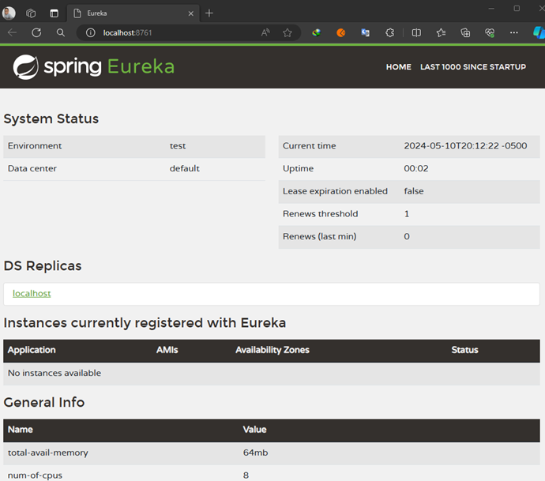

# Sobre el service discovery

Pág. 148

---

En cualquier arquitectura distribuida, necesitamos encontrar el nombre de host o la dirección IP donde se encuentra una
máquina. Este concepto ha existido desde el comienzo de la informática distribuida y se conoce formalmente
como `"service discovery"`. El service discovery puede ser algo tan simple como mantener un archivo de
propiedades con las direcciones de todos los servicios remotos utilizados por una aplicación, o algo tan formalizado
como un repositorio `Universal Description, Discovery and Integration (UDDI)`. El service discovery es
fundamental para las aplicaciones de microservicios basadas en la nube por dos razones clave:

- `Escalamiento horizontal o  scale out`: este patrón generalmente requiere ajustes en la arquitectura de la aplicación,
  como agregar más instancias de un servicio dentro de un servicio en la nube y más contenedores.


- `Resiliencia`: este patrón se refiere a la capacidad de absorber el impacto de los problemas dentro de una
  arquitectura o servicio sin afectar el negocio. Las arquitecturas de microservicios deben ser extremadamente sensibles
  para evitar que un problema en un solo servicio (o instancia de servicio) se propague en cascada hacia los
  consumidores del servicio.

En primer lugar, **el service discovery permite al equipo de aplicaciones escalar rápidamente
(horizontalmente) la cantidad de instancias de servicios que se ejecutan en un entorno.** Los consumidores del servicio
se abstraen de la ubicación física del servicio. Debido a que los consumidores del servicio no conocen la ubicación
física de las instancias de servicio reales, se pueden agregar o eliminar nuevas instancias de servicio del conjunto de
servicios disponibles.

Esta capacidad para escalar servicios rápidamente sin interrumpir a los consumidores del servicio es un concepto
atractivo. Puede ayudar a un equipo de desarrollo, acostumbrado a construir una aplicación monolítica para un solo
cliente (por ejemplo, para un único cliente), a dejar de pensar en escalar solo en términos de agregar hardware más
grande y mejor `(escalamiento vertical)`, y en su lugar, adoptar el enfoque más robusto de escalar agregando más
servidores con más servicios `(escalamiento horizontal)`.

Un enfoque monolítico suele llevar a los equipos de desarrollo a comprar en exceso sus necesidades de capacidad. Los
aumentos de capacidad se producen en grupos y picos y rara vez son un proceso fluido y constante. Por ejemplo, considere
el número incremental de request realizadas a sitios de comercio electrónico antes de algunos días festivos. Los
microservicios nos permiten escalar nuevas instancias de servicios bajo demanda. El service discovery ayuda a
abstraer estas implementaciones para que ocurran lejos del consumidor del servicio.

El segundo beneficio del service discovery es que ayuda a aumentar la resiliencia de la aplicación. Cuando una
instancia de un microservicio se vuelve inestable o no está disponible, la mayoría de los motores de descubrimiento de
servicios eliminan esa instancia de su lista interna de servicios disponibles. El daño causado por un servicio caído se
minimiza porque el motor de service discovery redirige los servicios evitando el servicio no disponible.

Veamos ahora cómo puede implementar un mecanismo sólido de service discovery para sus aplicaciones basadas en
la nube.

## Service discovery en la nube

La solución para un entorno de microservicios basado en la nube es utilizar un mecanismo de service discovery
que sea:

- `Altamente disponible`: el service discovery debe ser capaz de admitir un entorno de agrupación en
  clústeres "caliente" donde las búsquedas de servicios se puedan compartir entre varios nodos en un clúster de
  service discovery. Si un nodo deja de estar disponible, otros nodos del clúster deberían poder hacerse
  cargo.<br><br>
  **Un clúster se puede definir como un grupo de múltiples instancias de servidor.** Todas las instancias de este
  entorno tienen una configuración idéntica y trabajan juntas para ofrecer alta disponibilidad, confiabilidad y
  escalabilidad. Un clúster, combinado con un load balancer, puede ofrecer conmutación por error para prevenir
  interrupciones del servicio y replicación de sesiones para almacenar datos de sesión.


- `Peet-to-peer`: cada nodo en el clúster de service discovery comparte el estado de una instancia de
  servicio.


- `Load balancer`, el service discovery necesita equilibrar dinámicamente la carga de las solicitudes en todas
  las instancias de servicio. Esto garantiza que las invocaciones de servicio se distribuyan entre todas las instancias
  de servicio gestionadas por él. En muchos sentidos, el service discovery reemplaza a los balanceadores de
  carga más estáticos y administrados manualmente que se encuentran en muchas de las primeras implementaciones de
  aplicaciones web.


- `Resilient`, el cliente del service discovery debe almacenar en caché local la información del servicio.
  El almacenamiento en caché local permite la degradación gradual de la función de descubrimiento de
  servicios, de modo que si el servicio discovery service deja de estar disponible, las aplicaciones aún
  pueden funcionar y localizar los servicios en función de la información mantenida en su caché local.


- `Fault tolerant`, el service discovery debe detectar cuándo una instancia de servicio no está en buen estado
  y eliminar esa instancia de la lista de servicios disponibles que pueden aceptar solicitudes de clientes. Debe
  detectar estas fallas en los servicios y tomar medidas sin intervención humana.

En las siguientes secciones, vamos a

- Explicar la arquitectura conceptual de cómo funciona un agente de service discovery basado en la nube.
- Mostrarle cómo el almacenamiento en caché y el load balancing del lado del cliente permiten que el servicio
  continúe funcionando incluso cuando el agente service discovery no está disponible.
- Mostrarle cómo implementar el service discovery utilizando Spring Cloud y los agentes de descubrimiento de
  servicios Eureka de Netflix.

## La arquitectura del Service Discovery

Para comenzar nuestra discusión sobre el service discovery, debemos comprender cuatro conceptos. Estos
conceptos generales suelen compartirse en todas las implementaciones de service discovery:

- `Registro de servicio`: cómo se registra un servicio con el agente de service discovery.
- `Búsqueda de dirección de servicio por parte del cliente`: cómo un cliente de servicio busca información de servicio
- `Intercambio de información`: cómo los nodos comparten información de servicio.
- `Supervisión del estado`: cómo los servicios comunican su estado al agente de service discovery.

El objetivo principal del service discovery es tener una arquitectura donde nuestros servicios indiquen dónde
están ubicados físicamente en lugar de tener que configurar manualmente su ubicación. La `Figura 6.2` muestra cómo se
agregan y eliminan instancias de servicio, y cómo actualizan el agente de service discovery y quedan
disponibles para procesar las solicitudes de los usuarios. La `Figura 6.2` muestra el flujo de los cuatro puntos
anteriores (registro de servicios, búsqueda de service discovery, intercambio de información y monitoreo del
estado) y lo que normalmente ocurre cuando implementamos un patrón de service discovery. En la figura, se han
iniciado uno o más nodos de service discovery. Estas instancias de service discovery generalmente no
tienen un equilibrador de carga frente a ellas.


A medida que se inician las instancias de servicio, `registrarán su ubicación física, ruta y puerto` que una o más
instancias de service discovery pueden usar para acceder a las instancias. Si bien cada instancia de un
servicio tiene una dirección IP y un puerto únicos, cada instancia de servicio que aparece se registra con el mismo ID
de servicio. **Un `ID de servicio` no es más que una clave que identifica de forma única un grupo de las mismas
instancias de servicio.**

Por lo general, un servicio solo se registra en una instancia de servicio de service discovery. La mayoría de
las implementaciones de service discovery utilizan un modelo de propagación de datos de igual a igual, donde
los datos de cada instancia de servicio se comunican a todos los demás nodos del clúster. Dependiendo de la
implementación del service discovery, el mecanismo de propagación puede usar una lista codificada de servicios
para propagar o usar un protocolo de multidifusión como el protocolo de estilo de chismes o infección para permitir que
otros nodos "descubran" cambios en el clúster.

Finalmente, cada instancia de servicio ingresa o retira su estado mediante el servicio de service discovery.
Cualquier servicio que no devuelva una buena verificación de estado se elimina del grupo de instancias de servicio
disponibles. Una vez que un servicio se registra en un servicio de service discovery, está listo para ser
utilizado por una aplicación o servicio que necesita hacer uso de sus capacidades. Existen diferentes modelos para que
un cliente descubra un servicio.

Como primer enfoque, el cliente confía únicamente en el motor de descubrimiento de servicios para resolver las
ubicaciones de los servicios cada vez que se llama a un servicio. Con este enfoque, el motor de descubrimiento de
servicios se invoca cada vez que se realiza una llamada a una instancia de microservicio registrada. Desafortunadamente,
este enfoque es frágil porque el cliente del servicio depende completamente del motor de descubrimiento de servicios
para encontrar e invocar un servicio.

Un enfoque más sólido utiliza lo que se llama `load balancing del lado del cliente`. Este mecanismo utiliza un
algoritmo como `zone-specific` o `round-robin` para invocar las instancias de los servicios de llamada. Cuando decimos
**"load balancing con algoritmo round-robin"**, nos referimos a una forma de distribuir las solicitudes de los clientes
entre varios servidores. Consiste en reenviar una solicitud de cliente a cada uno de los servidores por turno. Una
ventaja de utilizar el `load balancing lado del cliente con Eureka` es que cuando una instancia de servicio
deja de funcionar, se elimina del registro. Una vez hecho esto, el `load balancing del lado del cliente` se
actualiza sin intervención manual estableciendo una comunicación constante con el servicio de registro. La `figura 6.3`
ilustra este enfoque.


En este modelo, cuando un cliente consumidor necesita invocar un servicio

1. Se comunica con el service discovery para todas las instancias que solicita un consumidor de servicios
   (cliente) y luego almacena en caché los datos localmente en la máquina del consumidor de servicios.


2. Cada vez que un cliente quiere llamar al servicio, el consumidor del servicio busca la información de ubicación del
   servicio en la `memoria caché`. Por lo general, **el almacenamiento en caché del lado del cliente utilizará un
   simple algoritmo de equilibrio de carga, como el algoritmo load-balancing round-robin**, para garantizar que las
   llamadas de servicio se distribuyan entre múltiples instancias de servicio.


3. Luego, el cliente se comunica periódicamente con el service discovery y actualiza su caché de instancias de
   servicio. La caché del cliente eventualmente es consistente, pero siempre existe el riesgo de que cuando el cliente
   contacta la instancia de descubrimiento de servicios para una actualización y se realizan llamadas, las llamadas se
   dirijan a una instancia de servicio que no está en buen estado.

Si durante el curso de la llamada a un servicio, la llamada al servicio falla, la caché de descubrimiento de servicios
local se invalida y el cliente de descubrimiento de servicios intentará actualizar sus entradas desde el agente de
descubrimiento de servicios. Tomemos ahora el patrón de descubrimiento de servicios genérico y apliquémoslo a nuestro
dominio del problema O-stock.

## Service discovery en acción usando Spring y Netflix Eureka

En esta sección, implementaremos el descubrimiento de servicios configurando un agente de descubrimiento de servicios y
luego registraremos dos servicios con el agente. Con esta implementación, usaremos la información recuperada por el
descubrimiento de servicios para llamar a un servicio desde otro servicio. `Spring Cloud` ofrece múltiples métodos para
buscar información de un agente de descubrimiento de servicios. Analizaremos las fortalezas y debilidades de cada
enfoque.

Nuevamente, `Spring Cloud` hace que este tipo de configuración sea trivial. Usaremos `Spring Cloud` y el
motor `Eureka Service Discovery de Netflix` para implementar su patrón de descubrimiento de servicios. Para el *
*equilibrio de carga del lado del cliente**, usaremos `Spring Cloud Load Balancer`.

**NOTA**
> En este capítulo, no usaremos `Ribbon`. `Ribbon` era el equilibrador de carga del lado del cliente de facto para
> comunicaciones basadas en REST entre aplicaciones que utilizan Spring Cloud. Aunque el equilibrio de carga del lado
> del cliente de Netflix Ribbon era una solución estable, ahora ha entrado en modo de mantenimiento, por lo que,
> lamentablemente, ya no se desarrollará más.

En esta sección, explicaremos cómo utilizar Spring Cloud Load Balancer, que reemplaza a Ribbon. Actualmente, Spring
Cloud Load Balancer todavía está en desarrollo activo, por lo que se esperan nuevas funcionalidades pronto. En los dos
capítulos anteriores, mantuvimos nuestro servicio de licencias simple e incluimos el nombre de la organización para las
licencias con los datos de la licencia. En este capítulo, dividiremos la información de la organización en su propio
servicio. **La `Figura 6.4` muestra la implementación del almacenamiento en caché del lado del cliente con Eureka para
nuestros microservicios O-stock.**

Cuando se invoca el servicio de licencias, llamará al servicio de la organización para recuperar la información de la
organización asociada con el ID de la organización designada.


La resolución real de la ubicación del servicio de la organización se mantiene en un registro de descubrimiento de
servicios. Para este ejemplo, registraremos dos instancias del servicio de la organización con un registro de
descubrimiento de servicios y luego usaremos el equilibrio de carga del lado del cliente para buscar y almacenar en
caché el registro en cada instancia de servicio. La `figura 6.4` muestra esta disposición:

1. A medida que los servicios se inician, los servicios de organización y licencia se registran en el servicio Eureka.
   Este proceso de registro le dice a Eureka la ubicación física y el número de puerto de cada instancia de servicio,
   junto con un ID de servicio para el servicio que se está iniciando.
2. Cuando el servicio de licencias llama al servicio de la organización, utiliza `Spring Cloud Load Balancer` para
   proporcionar equilibrio de carga del lado del cliente. `Load Balancer` se pone en contacto con el `servicio Eureka`
   para recuperar información de ubicación del servicio y luego la almacena en caché localmente.
3. Periódicamente, `Spring Cloud Load Balancer` hará ping al servicio `Eureka` y actualizará su caché local de
   ubicaciones de servicios.

Cualquier nueva instancia de servicio de la organización ahora es visible para el servicio de licencias localmente,
mientras que las instancias en mal estado se eliminan de la caché local. Implementaremos este diseño configurando
nuestro servicio `Spring Cloud Eureka`.

## Construyendo nuestro Spring Eureka Service

En esta sección, `configuraremos nuestro servicio Eureka usando Spring Boot`. Al igual que el servicio Spring Cloud
Config, la configuración de un servicio `Spring Cloud Eureka` comienza con la creación de un nuevo proyecto Spring Boot
y la aplicación de anotaciones y configuraciones.

````xml
<!--Spring Boot 3.2.5-->
<!--Java 21-->
<!--spring-cloud.version 2023.0.1-->
<dependencies>
    <dependency>
        <groupId>org.springframework.boot</groupId>
        <artifactId>spring-boot-starter-actuator</artifactId>
    </dependency>
    <dependency>
        <groupId>org.springframework.cloud</groupId>
        <artifactId>spring-cloud-starter-config</artifactId>
    </dependency>
    <dependency>
        <groupId>org.springframework.cloud</groupId>
        <artifactId>spring-cloud-starter-netflix-eureka-server</artifactId>
        <exclusions>
            <exclusion>
                <groupId>commons-logging</groupId>
                <artifactId>commons-logging</artifactId>
            </exclusion>
        </exclusions>
    </dependency>

    <dependency>
        <groupId>org.springframework.boot</groupId>
        <artifactId>spring-boot-starter-test</artifactId>
        <scope>test</scope>
    </dependency>
</dependencies>
````

**NOTA**  
Si observamos en las dependencias anteriores, estoy excluyendo el `commons-logging` de la dependencia de eureka server,
esto lo hago, porque cuando llegué a ejecutar el proyecto sin esta exclusión me mostró un mensaje:

````bash
Standard Commons Logging discovery in action with spring-jcl: please remove commons-logging.jar from classpath in order to avoid potential conflicts
````

Si leemos detenidamente el mensaje, cláramente me está pidiendo que `eliminte` el  `commons-logging.jar` del classpath
para evitar posibles conflictos. Pero por qué debemos agregar la exclusión en la dependencia del **¿eureka server?**,
bueno, uno porque en el mensaje indica `Logging discovery` y lo otro es que si hacemos un `.\mvnw dependency:tree`
veremos que el `commons-logging` está en las dependencias de eureka:

````bash
 .\mvnw dependency:tree

...
[INFO] +- org.springframework.boot:spring-boot-starter-actuator:jar:3.2.5:compile
........................................................................
[INFO] +- org.springframework.cloud:spring-cloud-starter-netflix-eureka-server:jar:4.1.1:compile
[INFO] |  +- org.springframework.cloud:spring-cloud-netflix-eureka-server:jar:4.1.1:compile
[INFO] |  |  +- org.springframework.boot:spring-boot-starter-web:jar:3.2.5:compile
[INFO] |  |  |  +- org.springframework.boot:spring-boot-starter-json:jar:3.2.5:compile
.........................................................................
[INFO] |  |  +- org.springframework.cloud:spring-cloud-netflix-eureka-client:jar:4.1.1:compile
[INFO] |  |  |  \- com.netflix.eureka:eureka-client:jar:2.0.2:compile
[INFO] |  |  |     +- com.netflix.netflix-commons:netflix-eventbus:jar:0.3.0:compile
[INFO] |  |  |     |  +- com.netflix.netflix-commons:netflix-infix:jar:0.3.0:runtime
.........................................................................
[INFO] |  |  |     \- org.codehaus.jettison:jettison:jar:1.5.4:runtime
[INFO] |  |  +- com.netflix.eureka:eureka-client-jersey3:jar:2.0.2:compile
[INFO] |  |  |  \- org.glassfish.jersey.connectors:jersey-apache-connector:jar:3.1.6:compile
[INFO] |  |  |     +- commons-codec:commons-codec:jar:1.16.1:compile
[INFO] |  |  |     \- commons-logging:commons-logging:jar:1.3.1:compile //<------- Dependencia a excluir
[INFO] |  |  +- com.netflix.eureka:eureka-core-jersey3:jar:2.0.2:compile
[INFO] |  |  |  \- com.netflix.eureka:eureka-core:jar:2.0.2:compile
[INFO] |  |  +- org.glassfish.jersey.containers:jersey-container-servlet:jar:3.1.6:compile
...
````

El siguiente paso es configurar el archivo `eureka-server/src/main/resources/application.yml` con las configuraciones
que necesitamos para recuperar la configuración de `Spring Config Server` creado previamente en el capítulo 5. La
siguiente lista muestra cómo debería verse su archivo `application.yml`.

````yml
server:
  error:
    include-message: always

spring:
  application:
    name: eureka-server

  config:
    import: optional:configserver:http://localhost:8888
````

El siguiente paso agrega la configuración necesaria para configurar el servicio `Eureka` que se ejecuta en modo
independiente (sin otros nodos en el clúster) en `Spring Configuration Server`.

Para lograr esto, debemos crear el archivo de configuración de `Eureka Server` en el repositorio que configuramos en el
servicio `Spring Config`. **(Recuerde, podemos especificar un repositorio como classpath, sistema de archivos,
GIT o Vault).** El archivo de configuración debe llamarse como el valor de la propiedad `spring.application.name`
definida previamente en el archivo `application.yml` del servicio `Eureka`. Para los propósitos de este ejemplo,
crearemos el archivo `eureka-server.yml` en el `classpath` `/config-server/src/main/resources/config/eureka-server.yml`.
El código siguiente muestra el contenido de este archivo.

`eureka-server.yml`

````yml
server:
  port: 8761

eureka:
  instance:
    hostname: localhost

  client:
    register-with-eureka: false
    fetch-registry: false
    service-url:
      defaultZone: http://${eureka.instance.hostname}:${server.port}/eureka/

  server:
    wait-time-in-ms-when-sync-empty: 5
````

**DONDE**

- `server.port`: establece el puerto predeterminado.
- `eureka.instance.hostname`: indica el nombre del host donde se ejecutará la instancia de Eureka. En este caso, se
  estableció como "localhost".
- `eureka.client.register-with-eureka`: al establecerla en `false` estamos configurando el servidor de Eureka Server
  para que no se registre a sí mismo como una instancia en el registro de Eureka.
- `eureka.client.fetch-registry`: establecido en `false`, significa que el propio servidor de Eureka Server no intentará
  recuperar el registro de servicios de otros servidores de Eureka en el entorno. Esto puede ser útil si deseas que el
  servidor de Eureka Server no se comporte como un cliente de Eureka Server, es decir, si deseas que no participe en el
  descubrimiento de servicios en el entorno Eureka.
- `eureka.client.service-url.defaultZone`: proporciona la URL del servicio para cualquier cliente. Es una combinación de
  los atributos `eureka.instance.hostname` y `server.port`.
- `eureka.server.wait-time-in-ms-when-sync-empty`: esta configuración especifica el tiempo de espera en milisegundos que
  el servidor de Eureka debe esperar cuando se está sincronizando y no hay instancias disponibles en el registro. En
  este caso, está configurado en 5 milisegundos. Cuando el `servidor Eureka` no tiene ninguna instancia de servicio
  registrada, puede haber situaciones en las que necesite sincronizarse con instancias que se unan más tarde al
  registro. Esta propiedad controla cuánto tiempo el servidor Eureka espera antes de intentar esta sincronización en
  caso de que no haya instancias registradas en el momento.

Notarás que el último atributo de las configuraciones anteriores, `eureka.server.wait-time-in-ms-when-sync-empty`,
indica el tiempo de espera en milisegundos antes de comenzar. Cuando pruebes tu servicio localmente, debes usar esta
línea porque Eureka no anunciará inmediatamente ningún servicio que se registre en ella. De forma predeterminada, espera
5 minutos para darles a todos los servicios la oportunidad de registrarse antes de anunciarlos. **El uso de esta línea
para pruebas locales ayuda a acelerar el tiempo que tarda el servicio Eureka en iniciarse y mostrar los servicios
registrados en él.** Entonces, podemos concluir lo siguiente:

- Si el valor de esta propiedad es bajo, el servidor Eureka intentará sincronizarse con nuevas instancias de servicio
  con más frecuencia, lo que podría generar un mayor tráfico de red.

- Si el valor es alto, el servidor Eureka esperará más tiempo antes de intentar la sincronización, lo que podría reducir
  el tráfico de red, pero también significa que las nuevas instancias pueden tardar más tiempo en ser descubiertas.

**NOTA**
> Los servicios individuales que se registran en Eureka tardan hasta 30 segundos en aparecer en el servicio Eureka. Esto
> se debe a que Eureka requiere tres pings consecutivos del servicio, separados por 10 segundos, antes de decir que el
> servicio está listo para su uso. Tenga esto en cuenta al implementar y probar sus propios servicios.

El último trabajo de configuración que debe realizar para su servicio Eureka es agregar una anotación a la clase de
arranque de la aplicación que utiliza para iniciar su servicio Eureka. Para el servicio Eureka, puede encontrar la clase
de arranque de la aplicación, `EurekaServerApplication`, en el archivo de clase
`eureka-server/src/main/java/dev/magadiflo/eureka/app/EurekaServerApplication.java`.
La siguiente lista muestra dónde agregar las anotaciones.

````java

@EnableEurekaServer //<-- Habilitando el proyecto como servidor de eureka
@SpringBootApplication
public class EurekaServerApplication {
    public static void main(String[] args) {
        SpringApplication.run(EurekaServerApplication.class, args);
    }
}
````

En este punto, solo utilizamos una nueva anotación, `@EnableEurekaServer`, **para habilitar nuestro servicio como
servicio Eureka.**

Es momento de iniciar nuestro `Eureka Server`, pero primero necesitamos ejecutar el servicio `Spring Config` porque
contiene la configuración de la aplicación de `Eureka`. Si no ejecuta su servicio de configuración primero,
obtendrá errores.

````bash
M:\PROGRAMACION\DESARROLLO_JAVA_SPRING\08.book_ms-in-action-2021\spring-microservices-in-action-2021\projects\config-server (main -> origin)

$ .\mvnw spring-boot:run

  .   ____          _            __ _ _
 /\\ / ___'_ __ _ _(_)_ __  __ _ \ \ \ \
( ( )\___ | '_ | '_| | '_ \/ _` | \ \ \ \
 \\/  ___)| |_)| | | | | || (_| |  ) ) ) )
  '  |____| .__|_| |_|_| |_\__, | / / / /
 =========|_|==============|___/=/_/_/_/
 :: Spring Boot ::                (v3.2.5)

d.m.c.app.ConfigServerApplication        : Starting ConfigServerApplication using Java 21.0.1 with PID 16728 (M:\PROGRAMACION\DESARROLLO_JAVA_SPRING\08.book_ms-in-action-2021\spring-microservices-in-action-2021\projects\config-server\target\classes started by USUARIO in M:\PROGRAMACION\DESARROLLO_JAVA_SPRING\08.book_ms-in-action-2021\spring-microservices-in-action-2021\projects\config-server) 2024-05-10T19:03:56.299-05:00  INFO 16728 --- [config-server] [           main] d.m.c.app.ConfigServerApplication        : The following 1 profile is active: "native"
o.s.cloud.context.scope.GenericScope     : BeanFactory id=db215e97-977c-3847-b676-3c40335a84d2
o.s.b.w.embedded.tomcat.TomcatWebServer  : Tomcat initialized with port 8888 (http)
o.apache.catalina.core.StandardService   : Starting service [Tomcat]
o.apache.catalina.core.StandardEngine    : Starting Servlet engine: [Apache Tomcat/10.1.20]
o.a.c.c.C.[Tomcat].[localhost].[/]       : Initializing Spring embedded WebApplicationContext
w.s.c.ServletWebServerApplicationContext : Root WebApplicationContext: initialization completed in 2126 ms
o.s.b.a.e.web.EndpointLinksResolver      : Exposing 1 endpoint(s) beneath base path '/actuator'
o.s.b.w.embedded.tomcat.TomcatWebServer  : Tomcat started on port 8888 (http) with context path ''
d.m.c.app.ConfigServerApplication        : Started ConfigServerApplication in 4.578 seconds (process running for 5.187)
````

Una vez iniciado el `config-server` procedemos a iniciar el servicio de `Eureka` ejecutando los comandos
`mvn spring-boot:run` o ejecutar `docker-compose`. Una vez que se ejecuta el comando de inicio, deberíamos tener un
servicio Eureka en ejecución sin ningún servicio registrado en él.

````bash
M:\PROGRAMACION\DESARROLLO_JAVA_SPRING\08.book_ms-in-action-2021\spring-microservices-in-action-2021\projects\eureka-server (main -> origin)

$ .\mvnw spring-boot:run

  .   ____          _            __ _ _
 /\\ / ___'_ __ _ _(_)_ __  __ _ \ \ \ \
( ( )\___ | '_ | '_| | '_ \/ _` | \ \ \ \
 \\/  ___)| |_)| | | | | || (_| |  ) ) ) )
  '  |____| .__|_| |_|_| |_\__, | / / / /
 =========|_|==============|___/=/_/_/_/
 :: Spring Boot ::                (v3.2.5)

d.m.eureka.app.EurekaServerApplication   : Starting EurekaServerApplication using Java 21.0.1 with PID 3064 (M:\PROGRAMACION\DESARROLLO_JAVA_SPRING\08.book_ms-in-action-2021\spring-microservices-in-action-2021\projects\eureka-server\target\classes started by USUARIO in M:\PROGRAMACION\DESARROLLO_JAVA_SPRING\08.book_ms-in-action-2021\spring-microservices-in-action-2021\projects\eureka-server)
d.m.eureka.app.EurekaServerApplication   : No active profile set, falling back to 1 default profile: "default"
o.s.c.c.c.ConfigServerConfigDataLoader   : Fetching config from server at : http://localhost:8888
o.s.c.c.c.ConfigServerConfigDataLoader   : Located environment: name=eureka-server, profiles=[default], label=null, version=null, state=null
o.s.cloud.context.scope.GenericScope     : BeanFactory id=32fbf5a9-9f47-34e2-8afd-4dc22f27bf1a
trationDelegate$BeanPostProcessorChecker : Bean 'org.springframework.cloud.client.loadbalancer.LoadBalancerAutoConfiguration$DeferringLoadBalancerInterceptorConfig' of type [org.springframework.cloud.client.loadbalancer.LoadBalancerAutoConfiguration$DeferringLoadBalancerInterceptorConfig] is not eligible for getting processed by all BeanPostProcessors (for example: not eligible for auto-proxying). The currently created BeanPostProcessor [lbRestClientPostProcessor] is declared through a non-static factory method on that class; consider declaring it as static instead.
trationDelegate$BeanPostProcessorChecker : Bean 'deferringLoadBalancerInterceptor' of type [org.springframework.cloud.client.loadbalancer.DeferringLoadBalancerInterceptor] is not eligible for getting processed by all BeanPostProcessors (for example: not eligible for auto-proxying). Is this bean getting eagerly injected into a currently created BeanPostProcessor [lbRestClientPostProcessor]? Check the corresponding BeanPostProcessor declaration and its dependencies.
o.s.b.w.embedded.tomcat.TomcatWebServer  : Tomcat initialized with port 8761 (http)
o.apache.catalina.core.StandardService   : Starting service [Tomcat]
o.apache.catalina.core.StandardEngine    : Starting Servlet engine: [Apache Tomcat/10.1.20]
o.a.c.c.C.[Tomcat].[localhost].[/]       : Initializing Spring embedded WebApplicationContext
w.s.c.ServletWebServerApplicationContext : Root WebApplicationContext: initialization completed in 2282 ms
c.n.d.provider.DiscoveryJerseyProvider   : Using JSON encoding codec LegacyJacksonJson
c.n.d.provider.DiscoveryJerseyProvider   : Using JSON decoding codec LegacyJacksonJson
c.n.d.provider.DiscoveryJerseyProvider   : Using XML encoding codec XStreamXml
c.n.d.provider.DiscoveryJerseyProvider   : Using XML decoding codec XStreamXml
iguration$LoadBalancerCaffeineWarnLogger : Spring Cloud LoadBalancer is currently working with the default cache. While this cache implementation is useful for development and tests, it's recommended to use Caffeine cache in production.You can switch to using Caffeine cache, by adding it and org.springframework.cache.caffeine.CaffeineCacheManager to the classpath.
o.s.c.n.eureka.InstanceInfoFactory       : Setting initial instance status as: STARTING
com.netflix.discovery.DiscoveryClient    : Initializing Eureka in region us-east-1
com.netflix.discovery.DiscoveryClient    : Client configured to neither register nor query for data.
com.netflix.discovery.DiscoveryClient    : Discovery Client initialized at timestamp 1715387867052 with initial instances count: 0
c.n.eureka.DefaultEurekaServerContext    : Initializing ...
c.n.eureka.cluster.PeerEurekaNodes       : The replica size seems to be empty. Check the route 53 DNS Registry
c.n.e.registry.AbstractInstanceRegistry  : Finished initializing remote region registries. All known remote regions: []
c.n.eureka.DefaultEurekaServerContext    : Initialized
o.s.b.a.e.web.EndpointLinksResolver      : Exposing 1 endpoint(s) beneath base path '/actuator'
o.s.c.n.e.s.EurekaServiceRegistry        : Registering application EUREKA-SERVER with eureka with status UP
o.s.c.n.e.server.EurekaServerBootstrap   : isAws returned false
o.s.c.n.e.server.EurekaServerBootstrap   : Initialized server context
c.n.e.r.PeerAwareInstanceRegistryImpl    : Got 1 instances from neighboring DS node
c.n.e.r.PeerAwareInstanceRegistryImpl    : Renew threshold is: 1
c.n.e.r.PeerAwareInstanceRegistryImpl    : Changing status to UP
e.s.EurekaServerInitializerConfiguration : Started Eureka Server
o.s.b.w.embedded.tomcat.TomcatWebServer  : Tomcat started on port 8761 (http) with context path ''
.s.c.n.e.s.EurekaAutoServiceRegistration : Updating port to 8761
d.m.eureka.app.EurekaServerApplication   : Started EurekaServerApplication in 7.688 seconds (process running for 8.392)
````

Ahora que tenemos nuestro servidor de eureka funcionando sin errores, podemos acceder a la url `http://localhost:8761/`
para ver el dashboard donde se mostrarán todas las instancias que se registren con el servidor de eureka:



## Creando nuevo microservicio: organization-service

A continuación colocaré el código, sin tanta explicación sobre el nuevo microservicio implementado, dado que estos
temas ya los he visto anteriormente:

````xml
<!--Spring Boot 3.2.5-->
<!--Java 21-->
<!--spring-cloud.version 2023.0.1-->
<dependencies>
    <dependency>
        <groupId>org.springframework.boot</groupId>
        <artifactId>spring-boot-starter-actuator</artifactId>
    </dependency>
    <dependency>
        <groupId>org.springframework.boot</groupId>
        <artifactId>spring-boot-starter-data-jpa</artifactId>
    </dependency>
    <dependency>
        <groupId>org.springframework.boot</groupId>
        <artifactId>spring-boot-starter-hateoas</artifactId>
    </dependency>
    <dependency>
        <groupId>org.springframework.boot</groupId>
        <artifactId>spring-boot-starter-web</artifactId>
    </dependency>
    <dependency>
        <groupId>org.springframework.cloud</groupId>
        <artifactId>spring-cloud-starter-config</artifactId>
    </dependency>

    <dependency>
        <groupId>org.postgresql</groupId>
        <artifactId>postgresql</artifactId>
        <scope>runtime</scope>
    </dependency>
    <dependency>
        <groupId>org.projectlombok</groupId>
        <artifactId>lombok</artifactId>
        <optional>true</optional>
    </dependency>
    <dependency>
        <groupId>org.springframework.boot</groupId>
        <artifactId>spring-boot-starter-test</artifactId>
        <scope>test</scope>
    </dependency>
</dependencies>
````

````java

@ToString
@Getter
@Setter
@Entity
@Table(name = "organizations")
public class Organization {
    @Id
    private String organizationId;

    @Column(nullable = false)
    private String name;

    @Column(nullable = false)
    private String contactName;

    @Column(nullable = false)
    private String contactEmail;

    @Column(nullable = false)
    private String contactPhone;
}
````

````java
public interface OrganizationRepository extends CrudRepository<Organization, String> {

}
````

````java

@RequiredArgsConstructor
@Service
public class OrganizationService {

    private final OrganizationRepository organizationRepository;

    @Transactional(readOnly = true)
    public Organization findById(String organizationId) {
        return this.organizationRepository.findById(organizationId)
                .orElseThrow(() -> new NoSuchElementException("No existe la Organización con el id %s".formatted(organizationId)));
    }

    @Transactional
    public Organization create(Organization organization) {
        organization.setOrganizationId(UUID.randomUUID().toString());
        return this.organizationRepository.save(organization);
    }

    @Transactional
    public Organization update(Organization organization, String organizationId) {
        return this.organizationRepository.findById(organizationId)
                .map(organizationDB -> {
                    organizationDB.setName(organization.getName());
                    organizationDB.setContactName(organization.getContactName());
                    organizationDB.setContactEmail(organization.getContactEmail());
                    organizationDB.setContactPhone(organization.getContactPhone());
                    return organizationDB;
                })
                .map(this.organizationRepository::save)
                .orElseThrow(() -> new NoSuchElementException("No hay organizació con id %s para actualizar".formatted(organizationId)));
    }

    @Transactional
    public void delete(String organizationId) {
        this.organizationRepository.deleteById(organizationId);
    }
}
````

````java

@RequiredArgsConstructor
@RestController
@RequestMapping(path = "/v1/organization")
public class OrganizationController {

    private final OrganizationService organizationService;

    @GetMapping(path = "/{organizationId}")
    public ResponseEntity<Organization> getOrganization(@PathVariable String organizationId) {
        return ResponseEntity.ok(this.organizationService.findById(organizationId));
    }

    @PostMapping
    public ResponseEntity<Organization> saveOrganization(@RequestBody Organization organization) {
        Organization organizationDB = this.organizationService.create(organization);
        URI location = URI.create("/v1/organization/" + organizationDB.getOrganizationId());
        return ResponseEntity.created(location).body(organizationDB);
    }

    @PutMapping(path = "/{organizationId}")
    public ResponseEntity<Organization> updateOrganization(@PathVariable String organizationId, @RequestBody Organization organization) {
        return ResponseEntity.ok(this.organizationService.update(organization, organizationId));
    }

    @DeleteMapping(path = "/{organizationId}")
    public ResponseEntity<Void> deleteOrganization(@PathVariable String organizationId) {
        this.organizationService.delete(organizationId);
        return ResponseEntity.noContent().build();
    }

}
````

En la clase principal del nuevo microservicio colocamos la anotación de `Actuator`:

````java
/**
 * `Spring Boot Actuator` ofrece una anotación `@RefreshScope`
 * Indica que esta clase debe ser recargada cuando se refresca la configuración
 */
@RefreshScope
@SpringBootApplication
public class OrganizationServiceApplication {
    public static void main(String[] args) {
        SpringApplication.run(OrganizationServiceApplication.class, args);
    }
}
````

En el `application.yml` del microservicio `organization-service` agregamos las siguientes configuraciones:

````yml
server:
  error:
    include-message: always

spring:
  application:
    name: organization-service
  profiles:
    active: dev
  config:
    import: optional:configserver:http://localhost:8888
````

Observe que en las configuraciones anteriores nos estamos conectando al servidor de configuraciones `config-server`
y estamos activando el perfil `dev`.

## Agregando configuraciones del microservicio organization-service en el config-server

En el microservicio `organization-service` hemos definido las configuraciones básicas en su `application.yml`. Ahora,
en el servidor de configuraciones `config-server` vamos a agregar las distintas configuraciones según el perfil de
ese mismo microservicio. Recordar que las configuraciones de los microservicios que se conectan a `config-server` los
estamos agregando en el directorio `config-server/src/main/resources/config`.

`organization-service.yml`

````yml
server:
  port: 8081

spring:
  jpa:
    hibernate:
      ddl-auto: update
    properties:
      hibernate:
        format_sql: true

management:
  endpoints:
    web:
      exposure:
        include: '*'
    enabled-by-default: true

logging:
  level:
    org.hibernate.SQL: DEBUG
````

`organization-service-dev.yml`

````yml
spring:
  datasource:
    url: jdbc:postgresql://localhost:5432/db_organization_service_dev
    username: postgres
    password: '{cipher}35783ee5df1c55c1f9157c37a291dd29c5b3b93af24f7d0ad3b5b660ab7f6591'
````

Recordar que en el `application.yml` del `config-server` definimos la configuración `encrypt.key` por eso es que en
este archivo `organization-service-dev.yml` estamos encriptando el password de la base de datos, aprovechando que
tenemos dicha configuración. Esto solo lo hago para variar los ejemplos, dado que en el
microservicio `licensing-service` estamos trabajando con el password `magadiflo` en texto plano; mientras que aquí
también trabajamos con el password `magadiflo` pero está encriptado.

### Comprobando funcionamiento de endpoints

````bash
$ curl -v -X POST -H "Content-Type: application/json" -d "{\"name\": \"Casa de la mujer\", \"contactName\": \"Paul Herrera\", \"contactEmail\": \"paul@gmail.com\", \"contactPhone\": \"943857458\"}" http://localhost:8081/v1/organization | jq
>
< HTTP/1.1 201
< Location: /v1/organization/8294c4fe-648d-4dec-a350-512069562de3
<
{
  "organizationId": "8294c4fe-648d-4dec-a350-512069562de3",
  "name": "Casa de la mujer",
  "contactName": "Paul Herrera",
  "contactEmail": "paul@gmail.com",
  "contactPhone": "943857458"
}
````

````bash
$ curl -v http://localhost:8081/v1/organization/8294c4fe-648d-4dec-a350-512069562de3 | jq
>
< HTTP/1.1 200
<
{
  "organizationId": "8294c4fe-648d-4dec-a350-512069562de3",
  "name": "Casa de la mujer",
  "contactName": "Paul Herrera",
  "contactEmail": "paul@gmail.com",
  "contactPhone": "943857458"
}
````

````bash
$ curl -v -X PUT -H "Content-Type: application/json" -d "{\"name\": \"Ministerio de Agricultura\", \"contactName\": \"Abigail Colque\", \"contactEmail\": \"abigail@gmail.com\", \"contactPhone\": \"985411425\"}" http://localhost:8081/v1/organization/57862493-e212-4aa4-90d2-415ae258e625 | jq
>
< HTTP/1.1 200
<
{
  "organizationId": "57862493-e212-4aa4-90d2-415ae258e625",
  "name": "Ministerio de Agricultura",
  "contactName": "Abigail Colque",
  "contactEmail": "abigail@gmail.com",
  "contactPhone": "985411425"
}
````
