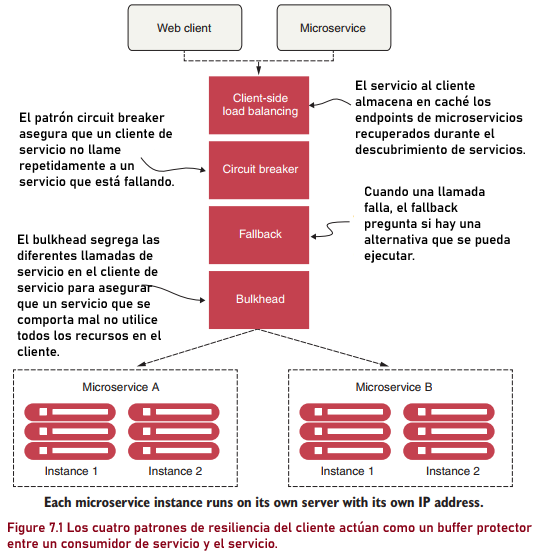
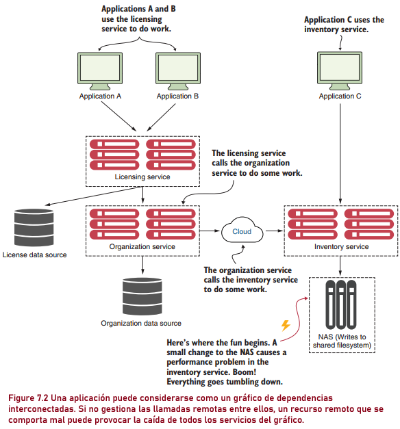
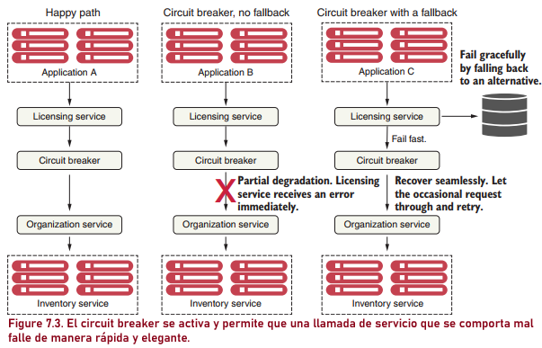

# Cuando suceden cosas malas: patrones de resiliencia con Spring Cloud y Resilience4j

Pág. 177

---

Cuando se trata de construir sistemas resilientes, la mayoría de los ingenieros de software solo tienen en cuenta la
falla total de una pieza de infraestructura o servicio crítico. Se centran en crear redundancia en cada capa de su
aplicación utilizando técnicas como la agrupación de servidores clave, el equilibrio de carga entre servicios y la
segregación de la infraestructura en múltiples ubicaciones.

Si bien estos enfoques tienen en cuenta la pérdida completa (y a menudo espectacular) de un componente del sistema,
**abordan solo una pequeña parte de la construcción de sistemas resilientes.** Cuando un servicio falla, es fácil
detectar que ya no está allí y la aplicación puede evitarlo. Sin embargo, cuando un servicio funciona con lentitud,
detectar ese rendimiento deficiente y solucionarlo es extremadamente difícil. Veamos algunas razones por las cuales:

- `La degradación del servicio puede comenzar de forma intermitente y luego cobrar impulso`. La degradación del servicio
  también puede ocurrir sólo en pequeñas ráfagas. Los primeros signos de falla pueden ser un pequeño grupo de usuarios
  quejándose de un problema hasta que, de repente, el contenedor de la aplicación agota su grupo de subprocesos y
  colapsa por completo.


- `Las llamadas a servicios remotos suelen ser sincrónicas y no interrumpen una llamada de larga duración`. El
  desarrollador de la aplicación normalmente llama a un servicio para realizar una acción y espera a que regrese el
  servicio. La persona que llama no tiene el concepto de tiempo de espera para evitar que la llamada de servicio se
  cuelgue.


- `Las aplicaciones suelen estar diseñadas para abordar fallos completos de recursos remotos, no degradaciones parciales`.
  A menudo, mientras el servicio no haya fallado por completo, una aplicación seguirá llamando a un servicio que se
  comporta mal y no fallará rápidamente. En este caso, la aplicación o el servicio que realiza la llamada puede
  degradarse sin problemas o, más probablemente, fallar debido al agotamiento de los recursos. El agotamiento de
  recursos se produce cuando un recurso limitado, como un grupo de subprocesos o una conexión de base de datos, llega al
  máximo y el cliente que llama debe esperar a que ese recurso vuelva a estar disponible.

Los patrones de resiliencia son uno de los aspectos más críticos de la arquitectura de microservicios. Este capítulo
explicará cuatro patrones de resiliencia y cómo utilizar `Spring Cloud` y `Resilience4j` para implementarlos en nuestro
servicio de licencias para que pueda fallar rápidamente cuando sea necesario.

## 7.1 ¿Qué son los patrones de resiliencia del lado del cliente?

**Los patrones de software de resiliencia del lado del cliente se centran en proteger a un cliente de un recurso
remoto** (otra llamada de microservicio o búsqueda de base de datos) contra fallas cuando el recurso remoto falla debido
a
errores o bajo rendimiento. **Estos patrones permiten que el cliente falle rápidamente y no consuma recursos valiosos,**
como conexiones de bases de datos y grupos de subprocesos. También evitan que el problema del mal rendimiento del
servicio remoto se propague `"ascendente"` a los consumidores del cliente. En este capítulo, veremos cuatro patrones de
resiliencia del cliente. La `Figura 7.1` demuestra cómo estos patrones se ubican entre el consumidor del servicio de
microservicio y el microservicio.



**Estos patrones (client-side load balancing, circuit breaker, fallback, and bulkhead) `se implementan en el cliente`
(microservicio) que llama al recurso remoto. La implementación de estos patrones se ubica lógicamente entre el cliente
que consume los recursos remotos y el recurso mismo.** Dediquemos un tiempo a cada uno de estos patrones.

## Client-side load balancing (Equilibrio de carga del lado del cliente)

Presentamos el patrón `client-side load balancing` en el capítulo 6 cuando hablamos sobre el
descubrimiento de servicios. El equilibrio de carga del lado del cliente implica que el cliente busque todas las
instancias individuales de un servicio desde un agente de descubrimiento de servicios (como Netflix Eureka) y luego
almacene en caché la ubicación física de dichas instancias de servicio.

Cuando un consumidor de servicios necesita llamar a una instancia de servicio, el `client-side load balancing`
devuelve una ubicación del conjunto de ubicaciones de servicios que mantiene. Debido a que el balanceador de
carga del lado del cliente se encuentra entre el cliente del servicio y el consumidor del servicio, el balanceador de
carga puede detectar si una instancia de servicio arroja errores o se comporta mal. Si el `client-side load balancing`
**detecta un problema, puede eliminar esa instancia de servicio del grupo de ubicaciones de servicio
disponibles y evitar que futuras llamadas lleguen a esa instancia de servicio.**

Este es precisamente el comportamiento que las bibliotecas `Spring Cloud Load Balancer` proporcionan de forma
inmediata (sin configuración adicional). Debido a que ya cubrimos el `client-side load balancing` con
`Spring Cloud Load Balancer` en el capítulo 6, no entraremos en más detalles sobre eso en este capítulo.

## Circuit breaker (Interruptor automático)

El patrón `circuit breaker` sigue el modelo de interrupción automática eléctrica. En un sistema eléctrico, un circuit
breaker detecta si fluye demasiada corriente a través del cable. Si el circuit breaker detecta un problema, corta la
conexión con el resto del sistema eléctrico y evita que el sistema fríe los componentes posteriores.

Con un `circuit breaker` de software, cuando se llama a un servicio remoto, el circuit breaker monitorea la llamada. Si
las llamadas tardan demasiado, el circuit breaker interviene y corta la llamada. El patrón circuit breaker también
monitorea todas las llamadas a un recurso remoto, y si fallan suficientes llamadas, la implementación del circuit
breaker `saltará`, fallando rápidamente y previniendo futuras llamadas al recurso remoto que está fallando.

## Fallback processing (Procesamiento alternativo)

Con el patrón `fallback`, cuando falla una llamada de servicio remoto, en lugar de generar una excepción, el consumidor
del servicio ejecuta una ruta de código alternativa e intenta llevar a cabo la acción por otros medios. Por lo general,
esto implica buscar datos de otra fuente de datos o poner en cola la solicitud del usuario para su procesamiento futuro.
La llamada del usuario no se muestra como una excepción que indica un problema, pero se le puede notificar que su
solicitud deberá intentarse más adelante.

Por ejemplo, supongamos que tiene un sitio de comercio electrónico que monitorea el comportamiento de sus usuarios y les
brinda recomendaciones sobre otros artículos que podrían querer comprar. Normalmente, llamaría a un microservicio para
ejecutar un análisis del comportamiento anterior del usuario y devolver una lista de recomendaciones adaptadas a ese
usuario específico. Sin embargo, si el servicio de preferencias falla, su alternativa podría ser recuperar una lista más
general de preferencias que se base en todas las compras de los usuarios, que es mucho más generalizada. Y estos datos
pueden provenir de un servicio y una fuente de datos completamente diferentes.

## Bulkheads (Mamparos)

El patrón `bulkheads` se basa en un concepto de la construcción de barcos. Un barco está dividido en compartimentos
llamados `mamparos`, que están totalmente segregados y estancos. Incluso si el casco del barco se perfora, un mamparo
mantiene el agua confinada al área del barco donde ocurrió el pinchazo y evita que todo el barco se llene de agua y se
hunda.

El mismo concepto se puede aplicar a un servicio que debe interactuar con múltiples recursos remotos. Cuando se utiliza
el patrón `bulkheads`, se dividen las llamadas a recursos remotos en sus propios grupos de subprocesos y se reduce el
riesgo de que un problema con una llamada lenta a un recurso remoto destruya toda la aplicación.

Los grupos de subprocesos actúan como `mamparos` para su servicio. Cada recurso remoto está segregado y asignado a un
grupo de subprocesos. Si un servicio responde lentamente, el grupo de subprocesos para ese tipo de llamada de servicio
puede saturarse y dejar de procesar solicitudes. Asignar servicios a grupos de subprocesos ayuda a evitar este tipo de
cuello de botella para que otros servicios no se saturen.

Veamos el siguiente ejemplo de cómo funciona el patrón `Bulkhead` en el contexto de los microservicios con `Spring Boot`
y `Resilience4j`.

Imagina que tienes un sistema de comercio electrónico compuesto por varios microservicios, incluido uno para procesar
pagos, otro para gestionar inventario y otro para enviar notificaciones por correo electrónico. Estos microservicios
interactúan entre sí para completar diferentes procesos, como realizar una compra.

Ahora, supongamos que el servicio de envío de notificaciones por correo electrónico experimenta un aumento repentino en
el tráfico debido a una promoción especial. Esto podría causar que el servicio de envío de notificaciones se ralentice o
incluso falle debido a la sobrecarga.

Si no se aplica el patrón `Bulkhead`, el aumento en el tráfico del servicio de envío de notificaciones podría afectar
negativamente a otros servicios, como el procesamiento de pagos o la gestión de inventario, ya que todos comparten los
mismos recursos, como hilos de ejecución.

Aquí es donde entra en juego el patrón `Bulkhead`. Al implementar el patrón `Bulkhead`, se divide el sistema en
compartimentos separados `(o "mamparos")`, donde cada compartimento tiene sus propios recursos asignados. Por ejemplo,
puedes configurar un `mamparo` para el servicio de envío de notificaciones, otro para el procesamiento de pagos y otro
para la gestión de inventario.

Si el servicio de envío de notificaciones experimenta una sobrecarga y comienza a ralentizarse, solo afectará al
compartimento de envío de notificaciones. Los otros servicios seguirán funcionando sin problemas, ya que tienen sus
propios recursos dedicados y no se ven afectados por los problemas en otros compartimentos.

Ahora, en términos de implementación con `Spring Boot` y `Resilience4j`, puedes configurar el patrón `Bulkhead`
utilizando la biblioteca `Resilience4j`. Por ejemplo, para el servicio de envío de notificaciones, puedes configurar un
Bulkhead específico que limite el número máximo de hilos que pueden manejar las solicitudes de envío de notificaciones
simultáneamente. Esto asegura que, incluso si el servicio de envío de notificaciones se ralentiza debido a la
sobrecarga, no afectará a otros servicios en el sistema.

En resumen, el patrón `Bulkhead` es crucial para garantizar la resiliencia de tus microservicios, ya que ayuda a
prevenir que los problemas en un servicio afecten a otros servicios en el sistema mediante la división de recursos en
compartimentos separados.

## 7.2 Por qué la resiliencia del cliente es importante

Aunque hemos hablado de estos diferentes patrones de resiliencia del cliente en abstracto, profundicemos en un ejemplo
más específico de dónde se pueden aplicar estos patrones. Analizaremos un escenario típico y veremos por qué los
patrones de resiliencia del cliente son fundamentales para implementar una arquitectura basada en microservicios que se
ejecuta en la nube.

La `Figura 7.2` muestra un escenario típico que involucra el uso de recursos remotos como una base de datos y un
servicio remoto. Este escenario no contiene ninguno de los patrones de resiliencia que hemos analizado anteriormente,
por lo que ilustra cómo una arquitectura completa (un ecosistema) puede dejar de funcionar debido a un único servicio
fallido. Vamos a ver.

En el escenario de la `figura 7.2`, tres aplicaciones se comunican de una forma u otra con tres servicios diferentes.
Las aplicaciones A y B se comunican directamente con el servicio de licencias. El servicio de licencias recupera datos
de una base de datos y llama al servicio de la organización para que realice algún trabajo. El servicio de la
organización recupera datos de una plataforma de base de datos completamente diferente y realiza llamadas a otro
servicio, el servicio de inventario, de un proveedor de nube de terceros, cuyo servicio depende en gran medida de un
dispositivo de almacenamiento conectado en red (NAS) interno para escribir datos en un sistema de archivos compartido.
La aplicación C llama directamente al servicio de inventario.

Durante el fin de semana, un administrador de red hizo lo que pensó que era un pequeño ajuste en la configuración del
NAS. Este cambio pareció funcionar bien, pero el lunes por la mañana, las lecturas de un subsistema de disco en
particular comenzaron a funcionar excepcionalmente lento.

Los desarrolladores que escribieron el servicio de organización nunca anticiparon que se producirían ralentizaciones con
las llamadas al servicio de inventario. Escribieron su código para que las escrituras en su base de datos y las lecturas
del servicio ocurran dentro de la misma transacción. Cuando el servicio de inventario comienza a ejecutarse lentamente,
no solo comienza a realizarse una copia de seguridad del grupo de subprocesos para solicitudes al servicio de
inventario, sino que también se agota la cantidad de conexiones de bases de datos en los grupos de conexiones del
contenedor de servicios. Estas conexiones se mantuvieron abiertas porque las llamadas al servicio de inventario nunca se
completaron.

Ahora el servicio de licencias comienza a quedarse sin recursos porque llama al servicio de la organización, que
funciona con lentitud debido al servicio de inventario. Finalmente, las tres aplicaciones dejan de responder porque se
quedan sin recursos mientras esperan que se completen las solicitudes. Todo este escenario podría haberse evitado si se
hubiera implementado un patrón `circuit breaker` en cada punto donde se llama a un recurso distribuido (ya sea una
llamada a la base de datos o una llamada al servicio).



En la `figura 7.2`, si la llamada al servicio de inventario se hubiera implementado con un `circuit breaker`, cuando ese
servicio comenzara a funcionar mal, el `circuit breaker` de esa llamada se habría disparado y fallado rápidamente sin
consumir un hilo. Si el servicio de la organización tuviera varios puntos finales, solo se verían afectados los puntos
finales que interactuaron con esa llamada específica al servicio de inventario. El resto de la funcionalidad del
servicio de la organización seguiría intacta y podría satisfacer las solicitudes de los usuarios.

Recuerde, un `circuit breaker` actúa como intermediario entre la aplicación y el servicio remoto. En el escenario que se
muestra en la `figura 7.2`, la implementación de un `circuit breaker` podría haber protegido las aplicaciones A, B y C
para que no fallaran por completo.

En la `figura 7.3`, el servicio de licencias nunca invoca directamente al servicio de la organización. En cambio, cuando
se realiza la llamada, el servicio de licencias delega la invocación real del servicio al `circuit breaker`, que toma la
llamada y la envuelve en un subproceso (generalmente administrado en un grupo de subprocesos) que es independiente de la
persona que llama. Al envolver la llamada en un hilo, el cliente ya no está esperando directamente a que se complete la
llamada. En cambio, el `circuit breaker` monitorea el hilo y puede cancelar la llamada si el hilo se prolonga demasiado.



En la `figura 7.3` se muestran tres escenarios. En el primer escenario, `"el camino feliz"`, el `circuit breaker`
mantiene un cronómetro y si la llamada al servicio remoto se completa antes de que se acabe el cronómetro, todo está
bien; el servicio de licencias puede continuar su trabajo.

En el segundo escenario, la degradación parcial, el servicio de licencias llama al servicio de la organización a través
del `circuit breaker`. Esta vez, sin embargo, el servicio de la organización funciona con lentitud, por lo que el
`circuit breaker` interrumpe la conexión al servicio remoto si no se completa antes de que expire el temporizador del
subproceso mantenido por el `circuit breaker`. Luego, el servicio de licencias devuelve un error de la llamada.
El servicio de licencias no tendrá sus recursos (su propio subproceso o grupo de conexiones) inmovilizados esperando
a que se complete el servicio de la organización.

Si la llamada al servicio de la organización excede el tiempo límite, el `circuit breaker` comienza a rastrear el número
de fallos que han ocurrido. Si se producen suficientes errores en el servicio dentro de un período de tiempo específico,
el `circuit breaker` ahora `se activa`, y todas las llamadas al servicio de la organización fallan sin intentar realizar
la llamada.

En el tercer escenario, el servicio de licencias sabe inmediatamente que hay un problema sin tener que esperar a que
expire el tiempo de espera del `circuit breaker`. Luego puede optar por fallar por completo o tomar medidas utilizando
un conjunto de código alternativo (un respaldo). El servicio de organización tiene la oportunidad de recuperarse porque
el servicio de licencias no lo estaba llamando cuando se disparó el `circuit breaker`. Esto permite que el servicio de
la organización tenga un poco de margen de maniobra y ayuda a evitar el cierre en cascada que se produce cuando se
produce la degradación del servicio.

El `circuit breaker` permitirá ocasionalmente que las llamadas pasen a un servicio degradado. Si esas llamadas tienen
éxito suficientes veces seguidas, el `circuit breaker` se reinicia. Los principales beneficios que ofrece el patrón
de `circuit breaker` son la capacidad para realizar llamadas remotas a.

- `Falla rápida`: cuando un servicio remoto experimenta una degradación, la aplicación fallará rápidamente y evitará
  problemas de agotamiento de recursos que generalmente cierran toda la aplicación. En la mayoría de situaciones de
  apagón, es mejor estar parcialmente inactivo que completamente inactivo.


- `Fallar con gracia`: al expirar el tiempo y fallar rápidamente, el patrón `circuit breaker` nos brinda la capacidad de
  fallar con gracia o buscar mecanismos alternativos para llevar a cabo la intención del usuario. Por ejemplo, si un
  usuario intenta recuperar datos de una fuente de datos y esa fuente de datos está experimentando una degradación del
  servicio, entonces nuestros servicios pueden recuperar esos datos desde otra ubicación.


- `Recuperarse sin problemas`: con el patrón `circuit breaker` actuando como intermediario, el `circuit breaker` puede
  verificar periódicamente si el recurso solicitado vuelve a estar en línea y volver a habilitar el acceso a él sin
  intervención humana.

En una aplicación de gran tamaño basada en la nube con cientos de servicios, esta recuperación elegante es fundamental
porque puede reducir significativamente la cantidad de tiempo necesario para restaurar un servicio. También disminuye
significativamente el riesgo de que un operador o ingeniero de aplicaciones "cansado" cause más problemas, permitiendo
que el `circuit breaker` intervenga directamente (reiniciando un servicio fallido) en la restauración del servicio.

Antes de `Resilience4j`, trabajamos con `Hystrix`, una de las bibliotecas de Java más comunes para implementar patrones
de resiliencia en microservicios. Debido a que Hystrix ahora está en modo de mantenimiento, lo que significa que ya no
se incluyen nuevas funciones, una de las bibliotecas más recomendadas para usar como sustituto es `Resilience4j`. Esa es
la razón principal por la que lo elegimos con fines de demostración en este capítulo. Con `Resilience4j`, tenemos
beneficios similares (y algunos adicionales) que veremos a lo largo de este capítulo.

## 7.3 Implementando Resilience4j

`Resilience4j` es una biblioteca de tolerancia a fallas inspirada en `Hystrix`. Ofrece los siguientes patrones para
aumentar la tolerancia a fallas debido a problemas de red o fallas de cualquiera de nuestros múltiples servicios:

- `Circuit breaker`: deja de realizar solicitudes cuando falla un servicio invocado
- `Retry`: reintenta un servicio cuando falla temporalmente
- `Bulkhead`: limita el número de solicitudes de servicio salientes simultáneas para evitar la sobrecarga.
- `Rate limit`: limita la cantidad de llamadas que un servicio recibe a la vez.
- `Fallback`: establece rutas alternativas para solicitudes fallidas.

Con `Resilience4j`, podemos aplicar varios patrones a la misma llamada a un método definiendo las anotaciones para ese
método. Por ejemplo, si queremos limitar el número de llamadas salientes con los patrones de `bulkhead`
y `circuit breaker`, podemos definir las anotaciones `@CircuitBreaker` y `@Bulkhead` para el método. Es importante tener
en cuenta que el orden de reintento de `Resilience4j` es el siguiente:

````
Retry(CircuitBreaker(RateLimiter(TimeLimiter(Bulkhead(Function)))))
````

El `retry` se aplica (si es necesario) al final de la llamada. Es valioso recordar esto al intentar combinar patrones,
pero también podemos usar los patrones como características individuales.

La creación de implementaciones de patrones `circuit breaker`, `retry`, `rate limit`, `fallback` y `bulkhead` requiere
un conocimiento profundo de los subprocesos y su gestión. Aplicar un conjunto de implementaciones de alta calidad para
estos patrones requiere una enorme cantidad de trabajo. Afortunadamente, podemos usar `Spring Boot` y la biblioteca
`Resilience4j` para proporcionarnos una herramienta probada en batalla que se usa a diario en varias arquitecturas de
microservicios. En las siguientes secciones, cubriremos cómo:

- Configurar el archivo de compilación Maven del servicio de licencias (pom.xml) para incluir los contenedores Spring
  Boot/Resilience4j.
- Utilice anotaciones Spring Boot/Resilience4j para envolver llamadas remotas con los
  patrones `circuit breaker`, `retry`, `rate limit` y `bulkhead`.
- Personalice los `circuit breakers` individuales en un recurso remoto para usar tiempos de espera personalizados para
  cada llamada.
- Implementar una estrategia de `fallback` en caso de que un `circuit breaker` tenga que interrumpir una llamada o la
  llamada falle.
- Utilice grupos de subprocesos individuales en nuestro servicio para aislar las llamadas de servicio y
  crear `bulkheads`entre diferentes recursos remotos.

## 7.4 Configuración del servicio de licencias para usar Spring Cloud y Resilience4j

Para comenzar nuestra exploración de `Resilience4j`, necesitamos configurar nuestro proyecto `pom.xml` para importar las
dependencias. Para lograrlo, tomaremos el `licensing-service` que estamos creando y modificaremos su `pom.xml`
agregando las dependencias de Maven para `Resilience4j`. La siguiente lista indica cómo hacer esto.

````xml

<dependency>
    <groupId>org.springframework.cloud</groupId>
    <artifactId>spring-cloud-starter-circuitbreaker-resilience4j</artifactId>
</dependency>
````
