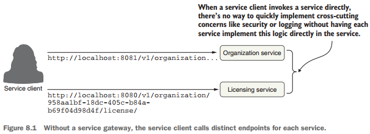
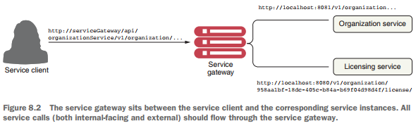

# Service Routing con Spring Cloud Gateway

Pág. 208

---

En una arquitectura distribuida como un microservicio, llegará un punto en el que necesitaremos garantizar que se
produzcan comportamientos críticos como la `security`, el `logging` y el `tracking` de los usuarios en múltiples
llamadas de servicio. Para implementar esta funcionalidad, queremos que estos atributos se apliquen de manera
consistente en todos nuestros servicios sin la necesidad de que cada equipo de desarrollo individual cree su propia
solución. Si bien es posible utilizar una librería o framework común para ayudar a crear estas capacidades directamente
en un servicio individual, hacerlo tiene estas implicaciones:

- **Es un desafío implementar estas capacidades en cada servicio de manera consistente.** Los desarrolladores se centran
  en ofrecer funcionalidad y, en el torbellino de la actividad diaria, pueden olvidarse fácilmente de implementar el
  `logging` o `tracking` de servicios a menos que trabajen en una industria regulada donde sea necesario.


- **Impulsar las responsabilidades para implementar preocupaciones transversales como el `security` y el `logging` en
  los equipos de desarrollo individuales aumenta en gran medida las probabilidades de que alguien no las implemente
  correctamente o se olvide de hacerlo.** Las preocupaciones transversales se refieren a partes o características del
  diseño del programa que son aplicables en toda la aplicación y pueden afectar otras partes de la aplicación.


- **Es posible crear una fuerte dependencia en todos nuestros servicios.** Cuantas más capacidades construyamos en un
  framework común compartido en todos nuestros servicios, más difícil será cambiar o agregar comportamiento en nuestro
  código común sin tener que volver a compilar y volver a implementar todos nuestros servicios. De repente, una
  actualización de las capacidades principales integradas en una biblioteca compartida se convierte en un largo proceso
  de migración.

Para resolver este problema, necesitamos abstraer estas preocupaciones transversales en un servicio que pueda funcionar
de forma independiente y actuar como filtro y enrutador para todas las llamadas de microservicios en nuestra
arquitectura. A este servicio lo llamamos `gateway (puerta de enlace)`. Nuestros clientes de servicios ya no llaman
directamente a un microservicio. En cambio, todas las llamadas se enrutan a través del `gateway`, que actúa como
un único punto de aplicación de políticas `Policy Enforcement Point (PEP)`, y luego se enrutan a un destino final.

En este capítulo, veremos cómo utilizar `Spring Cloud Gateway` para implementar una `puerta de enlace` de servicios.
Específicamente, veremos cómo usar `Spring Cloud Gateway` para:

- Coloque todas las llamadas de servicio detrás de una única URL y asigne esas llamadas mediante el descubrimiento de
  servicios a sus instancias de servicio reales.
- Inyecte ID de correlación en cada llamada de servicio que fluye a través del gateway de servicio.
- Inyecte el ID de correlación devuelto por la respuesta HTTP y envíelo de vuelta al cliente.

Profundicemos en más detalles sobre cómo encaja una puerta de enlace de servicios en los microservicios generales que
estamos creando en este libro.

## 8.1 ¿Qué es un servicio gateway (puerta de enlace)?

Hasta ahora, con los microservicios que creamos en capítulos anteriores, hemos llamado directamente a los servicios
individuales a través de un cliente web o los hemos llamado mediante programación a través de un motor de descubrimiento
de servicios como `Eureka`. La `figura 8.1` ilustra este enfoque.



Un `service gateway` actúa como intermediario entre el cliente del servicio y un servicio invocado. El cliente del
servicio habla únicamente con una única URL administrada por el servicio `gateway`. El `gateway` separa la ruta que
viene de la llamada del cliente de servicio y determina qué servicio está intentando invocar el cliente de servicio.
La `Figura 8.2` ilustra cómo el `gateway` dirige al usuario a un microservicio de destino y a la instancia
correspondiente, como un policía de tráfico que dirige el tráfico.



El `service gateway` actúa como guardián de todo el tráfico entrante a las llamadas de microservicio dentro de nuestra
aplicación. Con `service gateway` implementado, nuestros clientes de servicios nunca llaman directamente a la URL
de un servicio individual, sino que realizan todas las llamadas `service gateway`.

Debido a que un `service gateway` se ubica entre todas las llamadas del cliente a los servicios individuales, también
actúa como un único punto de aplicación de políticas `(PEP)` central para las llamadas de servicio. El uso de un `PEP`
centralizado significa que las inquietudes de servicios transversales se pueden llevar a cabo en un solo lugar sin que
los equipos de desarrollo individuales tengan que implementar esas inquietudes. Ejemplos de preocupaciones
transversales que se pueden implementar en un `service gateway` incluyen los siguientes:

- `Enrutamiento estático`: un service gateway coloca todas las llamadas de servicio detrás de una única
  ruta URL y API. Esto simplifica el desarrollo, ya que solo tenemos que conocer un punto final de servicio para todos
  nuestros servicios.


- `Enrutamiento dinámico`: un service gateway puede inspeccionar las solicitudes de servicio entrantes y, en función de
  los datos de la solicitud entrante, realizar un enrutamiento inteligente para la persona que llama al servicio. Por
  ejemplo, los clientes que participan en un programa beta pueden tener todas las llamadas a un servicio enrutadas a un
  grupo específico de servicios que ejecutan una versión de código diferente a la que usan todos los demás.


- `Autenticación y autorización`: debido a que todas las llamadas de servicio se enrutan a través del `service gateway`,
  el `service gateway` es un lugar natural para verificar si las personas que llaman a un servicio se han autenticado.


- `Metric collection y logging`: se puede utilizar un `service gateway` para recopilar métricas y registrar información
  a medida que una llamada de servicio pasa a través de ella. También puede utilizar el `service gateway` para
  confirmar que la información crítica esté disponible para las solicitudes de los usuarios, garantizando así que el
  `logging` sea uniforme. Esto no significa que no deba recopilar métricas de sus servicios individuales. Más bien, un
  `service gateway` le permite centralizar la recopilación de muchas de sus métricas básicas, como la
  cantidad de veces que se invoca el servicio y los tiempos de respuesta del servicio.

### Espere, ¿no es un service gateway un punto único de falla y un cuello de botella potencial?

Anteriormente en el capítulo 6, cuando presentamos `Eureka`, hablamos de cómo los balanceadores de carga centralizados
pueden ser un punto único de falla y un cuello de botella para sus servicios. Un `service gateway`, si no se implementa
correctamente, puede conllevar el mismo riesgo. Tenga en cuenta lo siguiente al crear la implementación de
`service gateway`:

- Los balanceadores de carga son útiles cuando se colocan frente a grupos individuales de servicios. En este caso, un
  balanceador de carga situado frente a múltiples instancias del gateway de servicios es un diseño apropiado y asegura
  que la implementación de tu `service gateway` pueda escalar según sea necesario. Pero tener un balanceador de carga
  frente a todas tus instancias de servicio no es una buena idea porque se convierte en un cuello de botella.


- Mantenga cualquier código que escriba para su `service gateway` sin estado. No almacene ninguna información en la
  memoria para el `service gateway`. Si no tiene cuidado, puede limitar la escalabilidad del `gateway`. Luego, deberá
  asegurarse de que los datos se repliquen en todas las instancias del `service gateway`.

Veamos ahora cómo implementar un `service gateway` utilizando `Spring Cloud Gateway`. Usaremos `Spring Cloud Gateway`
porque es la `API Gateway` preferida del equipo de `Spring Cloud`. Esta implementación se basa en un `gateway`
`sin bloqueo` que se integra mucho más fácilmente con los otros proyectos de `Spring Cloud` que hemos utilizado
a lo largo del libro.

## 8.2 Introduciéndonos a Spring Cloud Gateway

`Spring Cloud Gateway` es la implementación de la `API Gateway` construida en `Spring framework 5`, `Project Reactor`
y `Spring Boot 2.0`. Este `gateway` es un `gateway sin bloqueo`. ¿Qué significa no bloqueo? Las aplicaciones sin
bloqueo están escritas de tal manera que los hilos principales nunca se bloquean. En cambio, estos subprocesos siempre
están disponibles para atender solicitudes y procesarlas de forma asincrónica en segundo plano para devolver una
respuesta una vez finalizado el procesamiento. `Spring Cloud Gateway` ofrece varias capacidades, que incluyen:

**NOTA**

> -> Nosotros trabajaremos con una versión distinta al del libro: con Spring Framework 6 y Spring Boot 3.
>
> -> En Spring Boot 3 existe la versión de gateway para trabajar con aplicaciones basadas en Servlet, esta dependencia
> tiene el `artifactId: spring-cloud-starter-gateway-mv`. Esta dependencia proporciona una forma sencilla pero eficaz de
> enrutar a API en aplicaciones basadas en Servlet. Proporciona preocupaciones transversales a esas API, como seguridad,
> monitoreo/métricas y resiliencia.
>
> -> Para nuestro proyecto, no trabajaremos con la dependencia basada en servlet, sino más bien con la dependencia para
> aplicaciones reactivas, tal como se está trabajando en el libro, es decir, un `gateway sin bloqueo`.

- `Mapear las rutas para todos los servicios en su aplicación a una única URL`. Sin embargo, Spring Cloud Gateway no se
  limita a una única URL. En realidad, con él podemos definir múltiples puntos de entrada de ruta, lo que hace que el
  mapeo de rutas sea extremadamente detallado (cada punto final de servicio obtiene su propio mapeo de rutas). Pero el
  primer caso de uso, y el más común, es crear un único punto de entrada a través del cual fluirán todas las llamadas de
  los clientes del servicio.


- `Construir filtros que puedan inspeccionar y actuar sobre las solicitudes y respuestas que llegan a través del gateway`.
  Estos filtros nos permiten inyectar puntos de cumplimiento de políticas en nuestro código y realizar una amplia
  cantidad de acciones en todas nuestras llamadas de servicio de manera consistente. Es decir, estos filtros nos
  permiten modificar las solicitudes y respuestas HTTP entrantes y salientes.


- `Construir predicados, que son objetos que nos permiten comprobar si las solicitudes cumplen un conjunto de
  condiciones dadas antes de ejecutar o procesar una solicitud`. Spring Cloud Gateway incluye un conjunto de fábricas de
  predicados de ruta integradas.

Para comenzar con `Spring Cloud Gateway`, veamos

1. Configure un proyecto Spring Boot para Spring Cloud Gateway y configure las dependencias de Maven apropiadas.
2. Configurar la puerta de enlace para comunicarse con Eureka.

## Configurando el proyecto Spring Boot Gateway

En esta sección, configuraremos nuestro servicio `Spring Cloud Gateway` usando `Spring Boot`. Al igual que el
servicio `Spring Cloud Config` y el servicio `Eureka` que ya creamos en capítulos anteriores, la configuración de un
servicio `Spring Cloud Gateway` comienza con la creación de un nuevo proyecto `Spring Boot` y luego aplicando
anotaciones y configuraciones.

## Dependencias

````xml
<!--Spring Boot 3.2.5-->
<!--Java 21-->
<!--spring-cloud.version 2023.0.1-->
<dependencies>
    <dependency>
        <groupId>org.springframework.boot</groupId>
        <artifactId>spring-boot-starter-actuator</artifactId>
    </dependency>
    <dependency>
        <groupId>org.springframework.cloud</groupId>
        <artifactId>spring-cloud-starter-config</artifactId>
    </dependency>
    <dependency>
        <groupId>org.springframework.cloud</groupId>
        <artifactId>spring-cloud-starter-gateway</artifactId>
    </dependency>
    <dependency>
        <groupId>org.springframework.cloud</groupId>
        <artifactId>spring-cloud-starter-netflix-eureka-client</artifactId>
    </dependency>

    <dependency>
        <groupId>org.springframework.boot</groupId>
        <artifactId>spring-boot-starter-test</artifactId>
        <scope>test</scope>
    </dependency>
    <dependency>
        <groupId>io.projectreactor</groupId>
        <artifactId>reactor-test</artifactId>
        <scope>test</scope>
    </dependency>
</dependencies>
````

El siguiente paso es configurar el archivo `gateway-server/src/main/resources/application.yml` con la configuración
necesaria para recuperar la configuración del `Spring Config Server` que creamos previamente en el capítulo 5. La
siguiente lista muestra cómo debería ser su archivo `application.yml`.

````yml
server:
  error:
    include-message: always

spring:
  application:
    name: gateway-server

  config:
    import: optional:configserver:http://localhost:8888
````

## Configurando Spring Cloud Gateway para comunicarse con Eureka

`Spring Cloud Gateway` se puede integrar con el servicio `Netflix Eureka Discovery` que creamos en el capítulo 6. Para
lograr esta integración, debemos agregar la configuración de Eureka en el `servidor de configuración` para el servicio
`Gateway` que acabamos de crear. Esto puede parecer algo complicado, pero no te preocupes. Es algo que ya logramos en el
capítulo anterior.

Para agregar un nuevo servicio Gateway, el primer paso es crear un archivo de configuración para este servicio en el
repositorio de `Spring Configuration Server`. **(Recuerde, esto puede ser Vault, Git, o sistema de archivos o
classpath).** Para este ejemplo, hemos creado el archivo `gateway-server.yml` en la `classpath` del proyecto. Lo
encontrará aquí: `config-server/src/main/resources/config/gateway-server.yml`.

**NOTA**
> El nombre del archivo se establece con la propiedad `spring.application.name` que definió en `application.yml`
> para el servicio. Por ejemplo, para el servicio Gateway, definimos `spring.application.name` como `gateway-server`,
> por lo que el archivo de configuración también debe llamarse `gateway-server`. En cuanto a la extensión, puedes
> elegir entre `.properties` o `.yml`.

A continuación, agregaremos los datos de configuración de `Eureka` al archivo de configuración `gateway-server.yml` que
acabamos de crear en el `Spring Configuration Server`. La siguiente lista muestra cómo.

````yml
server:
  port: 8090

eureka:
  instance:
    prefer-ip-address: true
  client:
    service-url:
      defaultZone: http://localhost:8761/eureka/
````

Ahora que hemos creado la configuración básica para nuestro `Spring Cloud Gateway`, comencemos a enrutar nuestros
servicios.

