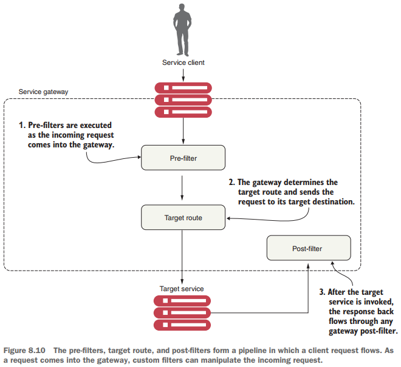

# Service Routing con Spring Cloud Gateway

Pág. 208

---

En una arquitectura distribuida como un microservicio, llegará un punto en el que necesitaremos garantizar que se
produzcan comportamientos críticos como la `security`, el `logging` y el `tracking` de los usuarios en múltiples
llamadas de servicio. Para implementar esta funcionalidad, queremos que estos atributos se apliquen de manera
consistente en todos nuestros servicios sin la necesidad de que cada equipo de desarrollo individual cree su propia
solución. Si bien es posible utilizar una librería o framework común para ayudar a crear estas capacidades directamente
en un servicio individual, hacerlo tiene estas implicaciones:

- **Es un desafío implementar estas capacidades en cada servicio de manera consistente.** Los desarrolladores se centran
  en ofrecer funcionalidad y, en el torbellino de la actividad diaria, pueden olvidarse fácilmente de implementar el
  `logging` o `tracking` de servicios a menos que trabajen en una industria regulada donde sea necesario.


- **Impulsar las responsabilidades para implementar preocupaciones transversales como el `security` y el `logging` en
  los equipos de desarrollo individuales aumenta en gran medida las probabilidades de que alguien no las implemente
  correctamente o se olvide de hacerlo.** Las preocupaciones transversales se refieren a partes o características del
  diseño del programa que son aplicables en toda la aplicación y pueden afectar otras partes de la aplicación.


- **Es posible crear una fuerte dependencia en todos nuestros servicios.** Cuantas más capacidades construyamos en un
  framework común compartido en todos nuestros servicios, más difícil será cambiar o agregar comportamiento en nuestro
  código común sin tener que volver a compilar y volver a implementar todos nuestros servicios. De repente, una
  actualización de las capacidades principales integradas en una biblioteca compartida se convierte en un largo proceso
  de migración.

Para resolver este problema, necesitamos abstraer estas preocupaciones transversales en un servicio que pueda funcionar
de forma independiente y actuar como filtro y enrutador para todas las llamadas de microservicios en nuestra
arquitectura. A este servicio lo llamamos `gateway (puerta de enlace)`. Nuestros clientes de servicios ya no llaman
directamente a un microservicio. En cambio, todas las llamadas se enrutan a través del `gateway`, que actúa como
un único punto de aplicación de políticas `Policy Enforcement Point (PEP)`, y luego se enrutan a un destino final.

En este capítulo, veremos cómo utilizar `Spring Cloud Gateway` para implementar una `puerta de enlace` de servicios.
Específicamente, veremos cómo usar `Spring Cloud Gateway` para:

- Coloque todas las llamadas de servicio detrás de una única URL y asigne esas llamadas mediante el descubrimiento de
  servicios a sus instancias de servicio reales.
- Inyecte ID de correlación en cada llamada de servicio que fluye a través del gateway de servicio.
- Inyecte el ID de correlación devuelto por la respuesta HTTP y envíelo de vuelta al cliente.

Profundicemos en más detalles sobre cómo encaja una puerta de enlace de servicios en los microservicios generales que
estamos creando en este libro.

## 8.1 ¿Qué es un servicio gateway (puerta de enlace)?

Hasta ahora, con los microservicios que creamos en capítulos anteriores, hemos llamado directamente a los servicios
individuales a través de un cliente web o los hemos llamado mediante programación a través de un motor de descubrimiento
de servicios como `Eureka`. La `figura 8.1` ilustra este enfoque.


Un `service gateway` actúa como intermediario entre el cliente del servicio y un servicio invocado. El cliente del
servicio habla únicamente con una única URL administrada por el servicio `gateway`. El `gateway` separa la ruta que
viene de la llamada del cliente de servicio y determina qué servicio está intentando invocar el cliente de servicio.
La `Figura 8.2` ilustra cómo el `gateway` dirige al usuario a un microservicio de destino y a la instancia
correspondiente, como un policía de tráfico que dirige el tráfico.


El `service gateway` actúa como guardián de todo el tráfico entrante a las llamadas de microservicio dentro de nuestra
aplicación. Con `service gateway` implementado, nuestros clientes de servicios nunca llaman directamente a la URL
de un servicio individual, sino que realizan todas las llamadas `service gateway`.

Debido a que un `service gateway` se ubica entre todas las llamadas del cliente a los servicios individuales, también
actúa como un único punto de aplicación de políticas `(PEP)` central para las llamadas de servicio. El uso de un `PEP`
centralizado significa que las inquietudes de servicios transversales se pueden llevar a cabo en un solo lugar sin que
los equipos de desarrollo individuales tengan que implementar esas inquietudes. Ejemplos de preocupaciones
transversales que se pueden implementar en un `service gateway` incluyen los siguientes:

- `Enrutamiento estático`: un service gateway coloca todas las llamadas de servicio detrás de una única
  ruta URL y API. Esto simplifica el desarrollo, ya que solo tenemos que conocer un punto final de servicio para todos
  nuestros servicios.


- `Enrutamiento dinámico`: un service gateway puede inspeccionar las solicitudes de servicio entrantes y, en función de
  los datos de la solicitud entrante, realizar un enrutamiento inteligente para la persona que llama al servicio. Por
  ejemplo, los clientes que participan en un programa beta pueden tener todas las llamadas a un servicio enrutadas a un
  grupo específico de servicios que ejecutan una versión de código diferente a la que usan todos los demás.


- `Autenticación y autorización`: debido a que todas las llamadas de servicio se enrutan a través del `service gateway`,
  el `service gateway` es un lugar natural para verificar si las personas que llaman a un servicio se han autenticado.


- `Metric collection y logging`: se puede utilizar un `service gateway` para recopilar métricas y registrar información
  a medida que una llamada de servicio pasa a través de ella. También puede utilizar el `service gateway` para
  confirmar que la información crítica esté disponible para las solicitudes de los usuarios, garantizando así que el
  `logging` sea uniforme. Esto no significa que no deba recopilar métricas de sus servicios individuales. Más bien, un
  `service gateway` le permite centralizar la recopilación de muchas de sus métricas básicas, como la
  cantidad de veces que se invoca el servicio y los tiempos de respuesta del servicio.

### Espere, ¿no es un service gateway un punto único de falla y un cuello de botella potencial?

Anteriormente en el capítulo 6, cuando presentamos `Eureka`, hablamos de cómo los balanceadores de carga centralizados
pueden ser un punto único de falla y un cuello de botella para sus servicios. Un `service gateway`, si no se implementa
correctamente, puede conllevar el mismo riesgo. Tenga en cuenta lo siguiente al crear la implementación de
`service gateway`:

- Los balanceadores de carga son útiles cuando se colocan frente a grupos individuales de servicios. En este caso, un
  balanceador de carga situado frente a múltiples instancias del gateway de servicios es un diseño apropiado y asegura
  que la implementación de tu `service gateway` pueda escalar según sea necesario. Pero tener un balanceador de carga
  frente a todas tus instancias de servicio no es una buena idea porque se convierte en un cuello de botella.


- Mantenga cualquier código que escriba para su `service gateway` sin estado. No almacene ninguna información en la
  memoria para el `service gateway`. Si no tiene cuidado, puede limitar la escalabilidad del `gateway`. Luego, deberá
  asegurarse de que los datos se repliquen en todas las instancias del `service gateway`.

Veamos ahora cómo implementar un `service gateway` utilizando `Spring Cloud Gateway`. Usaremos `Spring Cloud Gateway`
porque es la `API Gateway` preferida del equipo de `Spring Cloud`. Esta implementación se basa en un `gateway`
`sin bloqueo` que se integra mucho más fácilmente con los otros proyectos de `Spring Cloud` que hemos utilizado
a lo largo del libro.

## 8.2 Introduciéndonos a Spring Cloud Gateway

`Spring Cloud Gateway` es la implementación de la `API Gateway` construida en `Spring framework 5`, `Project Reactor`
y `Spring Boot 2.0`. Este `gateway` es un `gateway sin bloqueo`. ¿Qué significa no bloqueo? Las aplicaciones sin
bloqueo están escritas de tal manera que los hilos principales nunca se bloquean. En cambio, estos subprocesos siempre
están disponibles para atender solicitudes y procesarlas de forma asincrónica en segundo plano para devolver una
respuesta una vez finalizado el procesamiento. `Spring Cloud Gateway` ofrece varias capacidades, que incluyen:

**NOTA**

> -> Nosotros trabajaremos con una versión distinta al del libro: con Spring Framework 6 y Spring Boot 3.
>
> -> En Spring Boot 3 existe la versión de gateway para trabajar con aplicaciones basadas en Servlet, esta dependencia
> tiene el `artifactId: spring-cloud-starter-gateway-mv`. Esta dependencia proporciona una forma sencilla pero eficaz de
> enrutar a API en aplicaciones basadas en Servlet. Proporciona preocupaciones transversales a esas API, como seguridad,
> monitoreo/métricas y resiliencia.
>
> -> Para nuestro proyecto, no trabajaremos con la dependencia basada en servlet, sino más bien con la dependencia para
> aplicaciones reactivas, tal como se está trabajando en el libro, es decir, un `gateway sin bloqueo`.

- `Mapear las rutas para todos los servicios en su aplicación a una única URL`. Sin embargo, Spring Cloud Gateway no se
  limita a una única URL. En realidad, con él podemos definir múltiples puntos de entrada de ruta, lo que hace que el
  mapeo de rutas sea extremadamente detallado (cada punto final de servicio obtiene su propio mapeo de rutas). Pero el
  primer caso de uso, y el más común, es crear un único punto de entrada a través del cual fluirán todas las llamadas de
  los clientes del servicio.


- `Construir filtros que puedan inspeccionar y actuar sobre las solicitudes y respuestas que llegan a través del gateway`.
  Estos filtros nos permiten inyectar puntos de cumplimiento de políticas en nuestro código y realizar una amplia
  cantidad de acciones en todas nuestras llamadas de servicio de manera consistente. Es decir, estos filtros nos
  permiten modificar las solicitudes y respuestas HTTP entrantes y salientes.


- `Construir predicados, que son objetos que nos permiten comprobar si las solicitudes cumplen un conjunto de
  condiciones dadas antes de ejecutar o procesar una solicitud`. Spring Cloud Gateway incluye un conjunto de fábricas de
  predicados de ruta integradas.

Para comenzar con `Spring Cloud Gateway`, veamos

1. Configure un proyecto Spring Boot para Spring Cloud Gateway y configure las dependencias de Maven apropiadas.
2. Configurar la puerta de enlace para comunicarse con Eureka.

## Configurando el proyecto Spring Boot Gateway

En esta sección, configuraremos nuestro servicio `Spring Cloud Gateway` usando `Spring Boot`. Al igual que el
servicio `Spring Cloud Config` y el servicio `Eureka` que ya creamos en capítulos anteriores, la configuración de un
servicio `Spring Cloud Gateway` comienza con la creación de un nuevo proyecto `Spring Boot` y luego aplicando
anotaciones y configuraciones.

## Dependencias

````xml
<!--Spring Boot 3.2.5-->
<!--Java 21-->
<!--spring-cloud.version 2023.0.1-->
<dependencies>
    <dependency>
        <groupId>org.springframework.boot</groupId>
        <artifactId>spring-boot-starter-actuator</artifactId>
    </dependency>
    <dependency>
        <groupId>org.springframework.cloud</groupId>
        <artifactId>spring-cloud-starter-config</artifactId>
    </dependency>
    <dependency>
        <groupId>org.springframework.cloud</groupId>
        <artifactId>spring-cloud-starter-gateway</artifactId>
    </dependency>
    <dependency>
        <groupId>org.springframework.cloud</groupId>
        <artifactId>spring-cloud-starter-netflix-eureka-client</artifactId>
    </dependency>

    <dependency>
        <groupId>org.springframework.boot</groupId>
        <artifactId>spring-boot-starter-test</artifactId>
        <scope>test</scope>
    </dependency>
    <dependency>
        <groupId>io.projectreactor</groupId>
        <artifactId>reactor-test</artifactId>
        <scope>test</scope>
    </dependency>
</dependencies>
````

El siguiente paso es configurar el archivo `gateway-server/src/main/resources/application.yml` con la configuración
necesaria para recuperar la configuración del `Spring Config Server` que creamos previamente en el capítulo 5. La
siguiente lista muestra cómo debería ser su archivo `application.yml`.

````yml
server:
  error:
    include-message: always

spring:
  application:
    name: gateway-server

  config:
    import: optional:configserver:http://localhost:8888
````

## Configurando Spring Cloud Gateway para comunicarse con Eureka

`Spring Cloud Gateway` se puede integrar con el servicio `Netflix Eureka Discovery` que creamos en el capítulo 6. Para
lograr esta integración, debemos agregar la configuración de Eureka en el `servidor de configuración` para el servicio
`Gateway` que acabamos de crear. Esto puede parecer algo complicado, pero no te preocupes. Es algo que ya logramos en el
capítulo anterior.

Para agregar un nuevo servicio Gateway, el primer paso es crear un archivo de configuración para este servicio en el
repositorio de `Spring Configuration Server`. **(Recuerde, esto puede ser Vault, Git, o sistema de archivos o
classpath).** Para este ejemplo, hemos creado el archivo `gateway-server.yml` en la `classpath` del proyecto. Lo
encontrará aquí: `config-server/src/main/resources/config/gateway-server.yml`.

**NOTA**
> El nombre del archivo se establece con la propiedad `spring.application.name` que definió en `application.yml`
> para el servicio. Por ejemplo, para el servicio Gateway, definimos `spring.application.name` como `gateway-server`,
> por lo que el archivo de configuración también debe llamarse `gateway-server`. En cuanto a la extensión, puedes
> elegir entre `.properties` o `.yml`.

A continuación, agregaremos los datos de configuración de `Eureka` al archivo de configuración `gateway-server.yml` que
acabamos de crear en el `Spring Configuration Server`. La siguiente lista muestra cómo.

````yml
server:
  port: 8072

eureka:
  instance:
    prefer-ip-address: true
  client:
    service-url:
      defaultZone: http://localhost:8761/eureka/
````

Ahora que hemos creado la configuración básica para nuestro `Spring Cloud Gateway`, comencemos a enrutar nuestros
servicios.

## 8.3 Configurar rutas en Spring Cloud Gateway

En esencia, `Spring Cloud Gateway` es un `reverse proxy`. Un `proxy inverso` es un servidor intermedio que se encuentra
entre el cliente que intenta acceder a un recurso y el recurso mismo. El cliente ni siquiera tiene idea de que se está
comunicando con un servidor. El `proxy inverso` se encarga de capturar la solicitud del cliente y luego llama al
recurso remoto en nombre del cliente.

En el caso de una arquitectura de microservicio, `Spring Cloud Gateway` **(nuestro proxy inverso)** toma una llamada
de microservicio de un cliente y la reenvía al servicio ascendente. El cliente del servicio cree que solo se está
comunicando con el `gateway`. Pero en realidad no es tan simple como eso. Para comunicarse con los servicios
ascendentes, el `gateway` debe saber cómo asignar la llamada entrante a la ruta ascendente. `Spring Cloud Gateway` tiene
varios mecanismos para hacer esto, incluido

- Mapeo automatizado de rutas mediante descubrimiento de servicios.
- Mapeo manual de rutas mediante descubrimiento de servicios.

## Mapeo automatizado de rutas mediante descubrimiento de servicios

Todas las asignaciones de rutas para el `gateway` se realizan definiendo las rutas en el archivo
`config-server/src/main/resources/config/gateway-server.yml`. Sin embargo, `Spring Cloud Gateway` puede enrutar
automáticamente solicitudes en función de sus `ID de servicio` agregando las siguientes configuraciones al archivo
de configuración del `gateway-server.yml` como se muestra en la siguiente lista.

````yml
spring:
  cloud:
    gateway:
      discovery:
        locator:
          enabled: true
          lower-case-service-id: true
````

- `locator.enabled=true`, permite que el gateway cree rutas basadas en los servicios registrados con el service
  discovery.
- `lower-case-service-id=true`, opción para poner `serviceId` en minúsculas en predicados y filtros, el valor
  predeterminado es `false`. Útil con `eureka` cuando automáticamente pone en mayúsculas serviceId.
  Entonces `MYSERIVCE`, coincidiría con `/myservice/**`.

Al agregar las líneas de la configuración anterior, `Spring Cloud Gateway` utiliza automáticamente el
`ID del servicio Eureka` del servicio al que se llama y lo asigna a una instancia de servicio descendente.
Por ejemplo, si queremos llamar al `organization-service` y utilizar el enrutamiento automatizado a
través de `Spring Cloud Gateway`, le pediríamos a nuestro cliente que llame a la instancia del servicio `Gateway`
usando la siguiente URL como endpoint:

````bash
$ http://localhost:8072/organization-service/v1/organization/optimaGrowth
````

Se accede al `gatewey server` a través del endpoint `http://localhost:8072`. El servicio que queremos invocar
(el servicio de organización) está representado por la primera parte de la ruta del punto final del servicio.
La `figura 8.5` ilustra este mapeo en acción.


Lo bueno de usar `Spring Cloud Gateway` con `Eureka` es que ahora no solo tenemos un único endpoint a través del cual
podemos realizar llamadas, sino que también podemos agregar y eliminar instancias de un servicio sin tener que
modificar el `gateway`. Por ejemplo, podemos agregar un nuevo servicio a `Eureka` y el `Gateway` enruta automáticamente
las llamadas porque se comunica con `Eureka` sobre dónde se encuentran los endpoint del servicio físico real.

Si queremos ver las rutas administradas por el servidor `Gateway`, podemos enumerar las rutas a través del endpoint
`actuador/gateway/routes` en el `Gateway Server`. Esto devolverá una lista de todas las asignaciones de nuestro
servicio.

Antes de poder ver las rutas administradas por `Gateway` debemos agregar la configuración de `Actuator` en el archivo
`config-server/src/main/resources/config/gateway-server.yml`. La configuración se muestra a continuación:

````yml
management:
  endpoints:
    web:
      exposure:
        include: '*'
  endpoint:
    gateway:
      enabled: true
````

**DONDE**

- Con el `include: '*'` exponemos todos los endpoints disponibles.
- Además, es necesario agregar la configuración `management.endpoint.gateway.enabled=true`, sino no se va a habilitar
  el endpoint `/gateway`.

La Figura 8.6 muestra el resultado de seleccionar http://localhost:8072/actuator/gateway/routes.

````bash
$ curl -v http://localhost:8072/actuator/gateway/routes | jq
>
< HTTP/1.1 200 OK
< transfer-encoding: chunked
< Content-Type: application/json
<
[
  {
    "predicate": "Paths: [/licensing-service/**], match trailing slash: true",
    "metadata": {
      "management.port": "8080"
    },
    "route_id": "ReactiveCompositeDiscoveryClient_LICENSING-SERVICE",
    "filters": [
      "[[RewritePath /licensing-service/?(?<remaining>.*) = '/${remaining}'], order = 1]"
    ],
    "uri": "lb://LICENSING-SERVICE",
    "order": 0
  },
  {
    "predicate": "Paths: [/organization-service/**], match trailing slash: true",
    "route_id": "ReactiveCompositeDiscoveryClient_ORGANIZATION-SERVICE",
    "filters": [
      "[[RewritePath /organization-service/?(?<remaining>.*) = '/${remaining}'], order = 1]"
    ],
    "uri": "lb://ORGANIZATION-SERVICE",
    "order": 0
  }
]
````

**DONDE**

- `"predicate": "Paths: [/licensing-service/**]...`, el `licensing-service` es el `Eureka Service ID` de nuestro
  microservicio de licencias.
- `"predicate": "Paths: [/organization-service/**]...`, el `organization-service` es el `Eureka Service ID` de nuestro
  microservicio de organización.

El resultado anterior muestra las asignaciones de los servicios registrados con `Spring Cloud Gateway`. También notará
datos adicionales como `predicate`, `management port`, `route ID`, `filters` y otros.

Antes de pasar al siguiente tema, mostraré cómo es que tenemos actualmente el archivo
`config-server/src/main/resources/config/gateway-server.yml` con todas las configuraciones, eso incluye el mapeo
automatizado de rutas:

````yml
server:
  port: 8072

eureka:
  instance:
    prefer-ip-address: true
  client:
    service-url:
      defaultZone: http://localhost:8761/eureka/

spring:
  cloud:
    gateway:
      discovery:
        locator:
          enabled: true
          lower-case-service-id: true

management:
  endpoints:
    web:
      exposure:
        include: '*'
  endpoint:
    gateway:
      enabled: true
````

## Mapeo manual de rutas mediante el descubrimiento de servicios

`Spring Cloud Gateway` permite que nuestro código sea más detallado al permitirnos definir explícitamente mapeos de
rutas en lugar de depender únicamente de las rutas automatizadas creadas con el `ID del servicio Eureka`. Supongamos
que queremos simplificar la ruta acortando el nombre de la organización en lugar de acceder al servicio de nuestra
organización en el `gateway` a través de la ruta predeterminada,
`/organization-service/v1/organization/{organization-id}`. Puede hacer esto definiendo manualmente la asignación de
la ruta en el archivo de configuración `config-server/src/main/resources/config/gateway-server.yml`, que se encuentra
en el repositorio de `Spring Cloud Configuration Server`. La siguiente lista le muestra cómo.

````yml
spring:
  cloud:
    gateway:
      discovery:
        locator:
          enabled: true
          lower-case-service-id: true
      routes:
        - id: organization-service
          uri: lb://organization-service
          predicates:
            - Path=/organization/**
          filters:
            - RewritePath=/organization/(?<path>.*), /$\{path}

        - id: licensing-service
          uri: lb://licensing-service
          predicates:
            - Path=/license/**
          filters:
            - RewritePath=/license/(?<path>.*), /$\{path}
````

- `id: organization-service`, le asignamos un identificador único a la ruta.
- `uri: lb://organization-service`, establece el URI de destino de la ruta.
- `predicates`, define las condiciones que se deben cumplir para activar esta ruta.
- `Path=/organization/**`, es un tipo de predicado que verifica si la ruta de la solicitud coincide con el patrón
  proporcionado.
- `RewritePath=/license/(?<path>.*), /$\{path}`, el filtro `RewritePath` que has configurado se utiliza para reescribir
  la URL de la solicitud antes de que sea enviada al servicio backend. En nuestro caso reescribe la ruta de la
  solicitud, de `/license/**` a `/**`, tomando la expresión regular de la ruta como parámetro y un orden de reemplazo.

Veamos en detalle el filtro `RewritePath`:

````yml
RewritePath=/license/(?<path>.*), /$\{path}
````

- `/license/(?<path>.*)`: Esta es una expresión regular que captura la parte de la URL después de `/license/`. Ahora,
  el `(?<path>.*)` utiliza una expresión regular para capturar cualquier cosa (`.*`) después del `/license/` y la asigna
  a un grupo llamado `path`.
- `/$\{path}`: Este es el reemplazo que se aplica a la URL de la solicitud. `${path}` es una referencia al grupo
  capturado en la expresión regular anterior.

**Ejemplo de transformación de URL**

Si un request tiene la siguiente URL:

````bash
/license/verification/123
````

El filtro `RewritePath` transformará esta URL en:

````bash
/verification/123
````

**NOTA**
> Una advertencia sobre la forma en que Spring maneja los archivos de configuración es que no podemos usar la expresión
> de reemplazo estándar `${group}`, ya que Spring pensará que es una referencia de propiedad e intentará reemplazar su
> valor. Para evitar esto, debemos agregar una barra invertida entre los caracteres `$` y `{` que la implementación del
> filtro eliminará antes de usarlo como expresión de reemplazo real.

Al agregar esta configuración, ahora podemos acceder, por ejemplo, al servicio de la organización ingresando a la ruta
`/organización/v1/organización/{organization-id}`. Ahora, si volvemos a verificar el endpoint del `servidor Gateway`,
deberíamos ver los resultados que se muestran a continuación:

````bash
$ curl -v http://localhost:8072/actuator/gateway/routes | jq
>
< HTTP/1.1 200 OK
< transfer-encoding: chunked
< Content-Type: application/json
<
[
  {
    "predicate": "Paths: [/licensing-service/**], match trailing slash: true",
    "metadata": {
      "management.port": "8080"
    },
    "route_id": "ReactiveCompositeDiscoveryClient_LICENSING-SERVICE",
    "filters": [
      "[[RewritePath /licensing-service/?(?<remaining>.*) = '/${remaining}'], order = 1]"
    ],
    "uri": "lb://LICENSING-SERVICE",
    "order": 0
  },
  {
    "predicate": "Paths: [/gateway-server/**], match trailing slash: true",
    "metadata": {
      "management.port": "8072"
    },
    "route_id": "ReactiveCompositeDiscoveryClient_GATEWAY-SERVER",
    "filters": [
      "[[RewritePath /gateway-server/?(?<remaining>.*) = '/${remaining}'], order = 1]"
    ],
    "uri": "lb://GATEWAY-SERVER",
    "order": 0
  },
  {
    "predicate": "Paths: [/organization-service/**], match trailing slash: true",
    "route_id": "ReactiveCompositeDiscoveryClient_ORGANIZATION-SERVICE",
    "filters": [
      "[[RewritePath /organization-service/?(?<remaining>.*) = '/${remaining}'], order = 1]"
    ],
    "uri": "lb://ORGANIZATION-SERVICE",
    "order": 0
  },
  {
    "predicate": "Paths: [/organization/**], match trailing slash: true",
    "route_id": "organization-service",
    "filters": [
      "[[RewritePath /organization/(?<path>.*) = '/${path}'], order = 1]"
    ],
    "uri": "lb://organization-service",
    "order": 0
  },
  {
    "predicate": "Paths: [/license/**], match trailing slash: true",
    "route_id": "licensing-service",
    "filters": [
      "[[RewritePath /license/(?<path>.*) = '/${path}'], order = 1]"
    ],
    "uri": "lb://licensing-service",
    "order": 0
  }
]
````

Si observa detenidamente el resultado anterior (analicemos las rutas para el servicio de organización), **notará que hay
dos entradas para el servicio de organización.** Una entrada de servicio es la `asignación manual` que definimos en el
archivo `gateway-server.yml`, que es `organization/**: organization-service`. La otra entrada de servicio es la
`asignación automática` creada por el gateway basada en el ID de Eureka para el servicio de la organización, que es
`/organization-service/**: organization-service`.

**NOTA**

> Cuando utilizamos el mapeo de rutas automatizado donde la puerta de enlace expone el servicio basándose únicamente en
> el ID del servicio Eureka, si no se están ejecutando instancias de servicio, la puerta de enlace no expondrá la ruta
> del servicio. Sin embargo, si asignamos manualmente una ruta a un ID de descubrimiento de servicio y no hay instancias
> registradas en Eureka, el gateway seguirá mostrando la ruta. Si intentamos llamar a la ruta del servicio
> inexistente, devolverá un error HTTP 500.

**Si queremos excluir la asignación automática (mapeo automático)** de la ruta del ID del servicio Eureka **y solo tener
la ruta del servicio de la organización que hemos definido (mapeo manual)**, podemos eliminar las entradas
de `spring.cloud.gateway.discovery.locator` que agregamos en el archivo `gateway-server.yml`, luego, veremos que
el archivo quedará de la siguiente manera (se muestran todas las configuraciones finales de este archivo):

````yml
server:
  port: 8072

eureka:
  instance:
    prefer-ip-address: true
  client:
    service-url:
      defaultZone: http://localhost:8761/eureka/

spring:
  cloud:
    gateway:
      routes:
        - id: organization-service
          uri: lb://organization-service
          predicates:
            - Path=/organization/**
          filters:
            - RewritePath=/organization/(?<path>.*), /$\{path}

        - id: licensing-service
          uri: lb://licensing-service
          predicates:
            - Path=/license/**
          filters:
            - RewritePath=/license/(?<path>.*), /$\{path}

management:
  endpoints:
    web:
      exposure:
        include: '*'
  endpoint:
    gateway:
      enabled: true
````

**NOTA**
> La decisión de utilizar o no el enrutamiento automatizado debe considerarse cuidadosamente. En un entorno estable
> donde no se agregan muchos servicios nuevos, tener que agregar la ruta manualmente es una tarea sencilla. Sin embargo,
> en un entorno grande con muchos servicios nuevos, esto resulta un poco tedioso.

Ahora, cuando llamamos al endpoint `/actuator/gateway/routes` en el `Gateway Server`, solo deberíamos ver el mapeo del
servicio de la organización y el de licencias que hemos definido. El siguiente resultado muestra esos mapeos:

````bash
$ curl -v http://localhost:8072/actuator/gateway/routes | jq
>
< HTTP/1.1 200 OK
< transfer-encoding: chunked
< Content-Type: application/json
<
[
  {
    "predicate": "Paths: [/organization/**], match trailing slash: true",
    "route_id": "organization-service",
    "filters": [
      "[[RewritePath /organization/(?<path>.*) = '/${path}'], order = 1]"
    ],
    "uri": "lb://organization-service",
    "order": 0
  },
  {
    "predicate": "Paths: [/license/**], match trailing slash: true",
    "route_id": "licensing-service",
    "filters": [
      "[[RewritePath /license/(?<path>.*) = '/${path}'], order = 1]"
    ],
    "uri": "lb://licensing-service",
    "order": 0
  }
]
````

## Probando acceder a microservicio de licencias usando el gateway server

Antes de utilizar el `Gateway Server` como el punto de entrada, veamos cómo es que normalmente lo hacíamos
haciendo la petición directamente hacia el microservicio de destino, en nuestro caso, hacer la llamada directamente
al microservicio de licencias cuyo puerto es el `8080`:

````bash
$ curl -v http://localhost:8080/v1/organization/optimaGrowth/license/a9c7901b-6f0c-4ec7-b42c-fcb483062c17/restClient | jq
>
< HTTP/1.1 200
< Content-Type: application/hal+json
< Transfer-Encoding: chunked
< Date: Tue, 21 May 2024 05:35:09 GMT
<
{
  "licenseId": "a9c7901b-6f0c-4ec7-b42c-fcb483062c17",
  "description": "Licencia full",
  "organizationId": "optimaGrowth",
  "productName": "Spring Boot v3.2.5",
  "licenseType": "full",
  "comment": "[classpath:/config] licensing-service-dev.yml: DEV",
  "organizationName": "Casa de la mujer",
  "contactName": "Paul Herrera",
  "contactPhone": "943857458",
  "contactEmail": "paul@gmail.com",
  "port": 56447
}
````

Ahora, utilicemos el `Gateway Server` como punto de entrada cuyo puerto es `8072`, haremos la llamada a este servidor y
será él quien se encargue de redireccionar al microservicio correspondiente:

````bash
$ curl -v http://localhost:8072/license/v1/organization/optimaGrowth/license/a9c7901b-6f0c-4ec7-b42c-fcb483062c17/restClient | jq
>
< HTTP/1.1 200 OK
< transfer-encoding: chunked
< Content-Type: application/hal+json
< Date: Tue, 21 May 2024 05:35:58 GMT
<
{
  "licenseId": "a9c7901b-6f0c-4ec7-b42c-fcb483062c17",
  "description": "Licencia full",
  "organizationId": "optimaGrowth",
  "productName": "Spring Boot v3.2.5",
  "licenseType": "full",
  "comment": "[classpath:/config] licensing-service-dev.yml: DEV",
  "organizationName": "Casa de la mujer",
  "contactName": "Paul Herrera",
  "contactPhone": "943857458",
  "contactEmail": "paul@gmail.com",
  "port": 56447
}
````

## Recargando dinámicamente la configuración de ruta

Lo siguiente que veremos al configurar rutas en `Spring Cloud Gateway` es cómo actualizar las rutas dinámicamente.
La capacidad de recargar rutas dinámicamente es útil porque nos permite cambiar el mapeo de rutas sin tener que
reiniciar los `Gateway Servers`. Las rutas existentes se pueden modificar rápidamente y las nuevas rutas tendrán que
pasar por el acto de reciclar cada servidor Gateway en nuestro entorno.

Si ingresamos al endpoint `/actuator/gateway/routes`, deberíamos ver el servicio de nuestra organización mostrado
actualmente en el `gateway`. Ahora, si queremos agregar nuevas asignaciones de rutas sobre la marcha, todo lo que
tenemos que hacer es realizar los cambios en el archivo de configuración y enviar esos cambios nuevamente al
repositorio de `Git` donde `Spring Cloud Config` extrae sus datos de configuración. Luego podemos enviar los cambios
a `GitHub`.

`Spring Actuator` expone una ruta de endpoint basada en POST, `/actuator/gateway/refresh`, que hará que se recargue su
configuración de rutas. Una vez que se alcanza `/actuator/gateway/refresh`, si luego ingresas al endpoint
`/routes`, verás que se exponen dos nuevas rutas. La respuesta de `/actuator/gateway/refresh` devuelve un código de
estado `HTTP 200` sin un cuerpo de respuesta.

## 8.4 El verdadero poder de Spring Cloud Gateway: fábricas de predicados y filtros

Debido a que podemos enviar todas las solicitudes a través de `gateway`, nos permite simplificar nuestras invocaciones
de servicios. Pero el verdadero poder de `Spring Gateway` entra en juego cuando queremos escribir una lógica
personalizada que se aplicará a todas las llamadas de servicio que fluyen a través del `gateway`. La mayoría de las
veces, usaremos esta lógica personalizada para aplicar un conjunto coherente de políticas de aplicaciones, como
`security`, `logging` y `tracking`, entre todos los servicios.

Estas políticas de aplicación se consideran preocupaciones transversales porque queremos que estas estrategias se
apliquen a todos los servicios de nuestra aplicación sin tener que modificar cada uno para implementarlas. De esta
manera, `las fábricas de filtros y predicados de Spring Cloud Gateway` se pueden usar de manera similar a las clases
de aspecto de Spring. Estos pueden coincidir o interceptar una amplia gama de comportamientos y decorar o cambiar el
comportamiento de la llamada sin que el codificador original se dé cuenta del cambio. Si bien un filtro de servlet
o un aspecto Spring está localizado en un servicio específico, el uso de `Gateway` y sus fábricas de predicados y
filtros nos permite implementar preocupaciones transversales en todos los servicios que se enrutan a través del
gateway. Recuerde, **`los predicados` nos permiten comprobar si las solicitudes cumplen un conjunto de condiciones antes
de procesar la solicitud.** La `Figura 8.9` muestra la arquitectura que utiliza `Spring Cloud Gateway` al aplicar
predicados y filtros cuando llega una solicitud a través del `gateway`.


Primero, el `cliente del gateway` (navegadores, aplicaciones, etc.) envía una solicitud a `Spring Cloud Gateway`.
Una vez recibida esa solicitud, va directamente al `Gateway Handler` que se encarga de verificar que la ruta solicitada
coincida con la configuración de la ruta específica a la que intenta acceder. Si todo coincide, ingresa al
`Gateway Web Handler` que se encarga de leer los filtros y enviar la solicitud a esos filtros para su posterior
procesamiento. Una vez que la solicitud pasa todos los filtros, se reenvía a la configuración de enrutamiento:
un microservicio.

## Fábricas de predicados integrados

Los predicados integrados son objetos que nos permiten verificar si las solicitudes cumplen un conjunto de condiciones
antes de ejecutarlas o procesarlas. Para cada ruta, podemos establecer múltiples fábricas de predicados, que se
utilizan y combinan mediante el `AND` lógico. La `Tabla 8.1` enumera todas las fábricas de predicados integradas en
`Spring Cloud Gateway`.


Estos predicados se pueden aplicar en el código mediante programación o mediante configuraciones, como las que creamos
en las secciones anteriores. En este libro, solo los usamos a través del archivo de configuración en la sección de
predicates, así:

````yml
predicates:
  - Path=/organization/**
````

## Fábricas de filtros integrados

Las fábricas de filtros integrados nos permiten inyectar puntos de aplicación de políticas en nuestro código y realizar
una amplia cantidad de acciones en todas las llamadas de servicio de manera consistente. Es decir, estos filtros nos
permiten modificar las solicitudes y respuestas HTTP entrantes y salientes.
La `Tabla 8.2` contiene una lista de todos los filtros integrados en `Spring Cloud Gateway`.


## Filtros personalizados

La capacidad de enviar todos los `requests` a través del `gateway` nos permite simplificar nuestras
invocaciones de servicios. Pero el verdadero poder de `Spring Cloud Gateway` entra en juego cuando queremos escribir una
lógica personalizada que pueda aplicarse a todas las llamadas de servicio que fluyen a través del `gateway`. En
la mayoría de los casos, esta lógica personalizada se utiliza para aplicar un conjunto coherente de políticas de
aplicaciones, como `security`, `logging` y `tracking`, entre todos los servicios.



`Spring Cloud Gateway` nos permite crear una lógica personalizada utilizando un filtro dentro del `gateway`.
Recuerde, un filtro nos permite implementar una cadena de lógica empresarial por la que pasa cada solicitud de
servicio a medida que se implementa. `Spring Cloud Gateway` admite los siguientes dos tipos de filtros.
La `Figura 8.10` muestra cómo encajan los `pre-filters` y `post-filters` al procesar la solicitud de un cliente de
servicio.

- `Pre-filters`, se invoca un prefiltro antes de que la solicitud real se envíe al destino objetivo. Un prefiltro
  generalmente lleva a cabo la tarea de garantizar que el servicio tenga un formato de mensaje consistente (por ejemplo,
  hay encabezados HTTP clave) o actúa como un guardián para garantizar que el usuario que llama al servicio esté
  autenticado (es quien dicen que lo son).

- `Post-filters`, se invoca un postfiltro después del servicio de destino y se envía una respuesta al cliente. Por lo
  general, implementamos un post filter para registrar la respuesta del servicio de destino, manejar errores o
  auditar la respuesta en busca de información confidencial.


Si seguimos el flujo establecido en la figura 8.10, todo comienza con un cliente de servicio que realiza una llamada a
un servicio que está expuesto a través del service gateway. A partir de ahí se produce lo siguiente:

1. Todos los pre-filters definidos en el gateway se invocan cuando una solicitud ingresa a la puerta de enlace. Los
   pre-filters inspeccionan y modifican una solicitud HTTP antes de que llegue al servicio real. Sin embargo, un
   pre-filter no puede redirigir al usuario a un punto final o servicio diferente.


2. Después de que el gateway ejecuta los pre-filters contra la solicitud entrante, el gateway
   determina el destino (hacia dónde se dirige el servicio).


3. Después de invocar el servicio de destino, se invocan los post-filters del gateway. Los post-filters
   inspeccionan y modifican la respuesta del servicio invocado.

La mejor manera de entender cómo implementar los filtros del gateway es verlos en acción. Con este fin, en las
siguientes secciones, crearemos pre-filters y post-filters y luego ejecutaremos las solicitudes de los clientes a
través de ellos. La `Figura 8.11` muestra cómo estos filtros encajarán en el procesamiento de solicitudes para nuestros
servicios O-stock.

Siguiendo el flujo de la figura 8.11, podemos ver los siguientes filtros personalizados en uso:

- `Tracking filter`: el filtro de seguimiento es un filtro previo que garantiza que cada solicitud que fluye desde
  la puerta de enlace tenga un ID de correlación asociado. Un ID de correlación es un ID único que se transmite a todos
  los microservicios que se ejecutan al realizar una solicitud de cliente. Un ID de correlación nos permite rastrear la
  cadena de eventos que ocurren cuando una llamada pasa por una serie de llamadas de microservicio.
- `Target service`: el servicio de destino puede ser una organización o el servicio de licencia. Ambos servicios
  reciben el ID de correlación en el encabezado de la solicitud HTTP.
- `ResponseFilter`: el filtro de respuesta es un filtro posterior que inyecta el ID de correlación asociado con la
  llamada de servicio en el encabezado de respuesta HTTP enviado al cliente. De esta manera, el cliente tendrá acceso al
  ID de correlación asociado al request.
  

