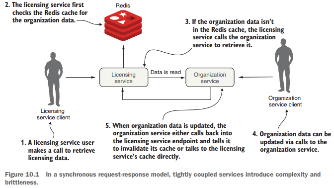
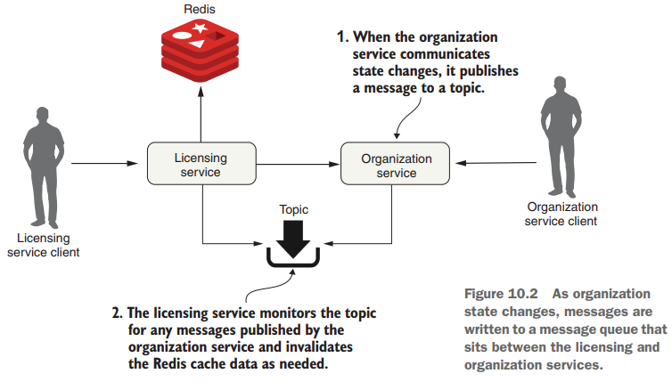
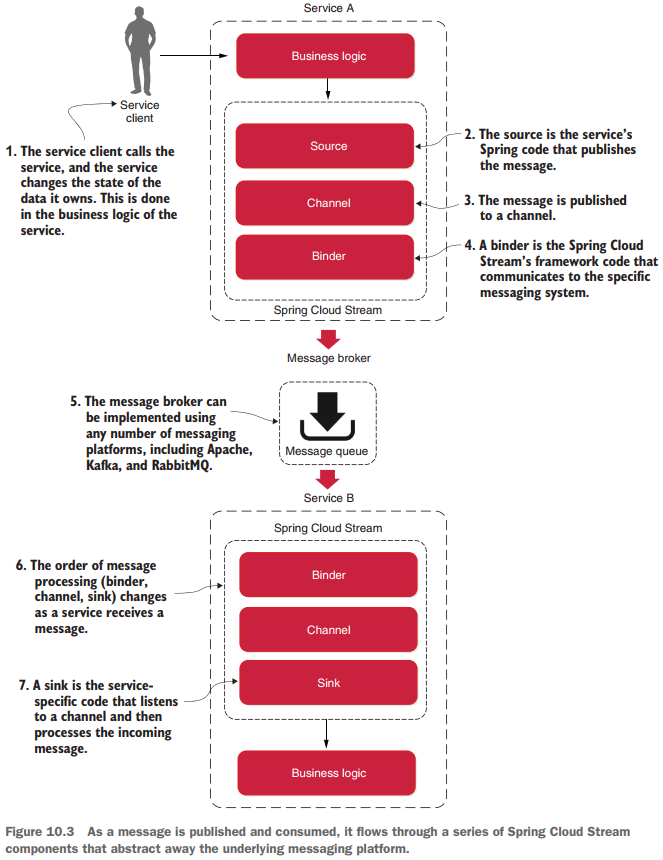
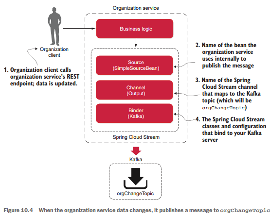

# Event-driven architecture with Spring Cloud Stream

Pág. 275

---

Este capítulo trata sobre cómo diseñar e implementar nuestros microservicios basados en Spring para comunicarse con
otros microservicios mediante mensajes asincrónicos. El uso de mensajes asincrónicos para comunicarse entre aplicaciones
no es nuevo. Lo nuevo es el concepto de utilizar mensajes para comunicar eventos que representan cambios de estado. Este
concepto se llama `arquitectura basada en eventos (EDA)`. También se conoce
como `arquitectura basada en mensajes (MDA).` Lo que nos permite hacer un enfoque basado en EDA es construir sistemas
altamente desacoplados que puedan reaccionar a los cambios sin estar estrechamente acoplados a bibliotecas o servicios
específicos. Cuando se combina con microservicios, EDA nos permite agregar rápidamente nuevas funciones a nuestra
aplicación simplemente haciendo que el servicio escuche el flujo de eventos (mensajes) que emite nuestra aplicación.

El proyecto Spring Cloud hace que sea trivial crear soluciones basadas en mensajes a través del subproyecto
`Spring Cloud Stream`. `Spring Cloud Stream` nos permite implementar fácilmente la publicación y el consumo de mensajes
mientras protegemos nuestros servicios de los detalles de implementación asociados con la plataforma de mensajería
subyacente.

## 10.1 El caso de la mensajería, EDA y los microservicios

Para implementar una solución en caché, necesitamos considerar los siguientes tres requisitos básicos:

1. `Los datos almacenados en caché deben ser coherentes en todas las instancias del servicio de licencias`. Esto
   significa que no podemos almacenar en caché los datos localmente dentro del servicio de licencia porque queremos
   garantizar que se lean los mismos datos de la organización independientemente de la instancia de servicio que los
   reciba.


2. `No podemos almacenar en caché los datos de la organización en la memoria del contenedor que aloja el servicio de licencias`.
   El contenedor de tiempo de ejecución que aloja nuestro servicio suele tener un tamaño restringido y puede obtener
   datos utilizando diferentes patrones de acceso. Un caché local puede introducir complejidad porque tenemos que
   garantizar que nuestro caché local esté sincronizado con todos los demás servicios del clúster.


3. `Cuando el registro de una organización cambia mediante una actualización o eliminación, queremos que el servicio de licencias reconozca que ha habido un cambio de estado en el servicio de la organización`.
   Luego, el servicio de licencias debería invalidar cualquier dato almacenado en caché que tenga para esa organización
   específica y expulsarlo del caché.

Veamos dos enfoques para implementar estos requisitos. `El primer enfoque` implementará los requisitos establecidos
anteriormente utilizando un modelo de solicitud-respuesta sincrónica. Cuando el estado de la organización cambia, los
servicios de organización y licencias se comunicarán entre sí a través de sus puntos finales REST.

Para `el segundo enfoque`, el servicio de la organización emitirá un evento asincrónico (mensaje) para comunicar que
los datos de su organización han cambiado. Luego, el servicio de la organización publicará un mensaje en una cola, que
indicará que un registro de la organización se actualizó o eliminó: un cambio de estado. El servicio de licencias
escuchará a un intermediario (agente de mensajes o cola) para determinar si ocurrió un evento de la organización y, de
ser así, borrará los datos de la organización de su caché.

## Uso del enfoque request-response síncrono para comunicar cambios de estado

Para la caché de datos de nuestra organización, usaremos `Redis` (https://redis.io/), un almacén de `key-value`
distribuido que se utiliza como `base de datos, caché o message broker`. La `Figura 10.1` proporciona una
descripción general de alto nivel de cómo construir una solución de `almacenamiento en caché` utilizando un modelo de
programación de `request-response síncrono` tradicional como `Redis`.



En la `figura 10.1`, cuando un usuario llama al servicio de licencias, el servicio de licencias deberá buscar los datos
de la organización. Para hacerlo, el servicio de licencias primero recuperará la organización deseada por su ID de un
clúster de Redis. Si el servicio de licencias no puede encontrar los datos de la organización, llamará al servicio de la
organización utilizando un punto final basado en REST, almacenando los datos devueltos en Redis antes de devolver los
datos de la organización al usuario.

Si alguien actualiza o elimina el registro de la organización utilizando el punto final REST del servicio de la
organización, el servicio de la organización deberá llamar a un punto final expuesto en el servicio de licencias y
decirle que invalide los datos de la organización en su caché. En la `figura 10.1`, si observamos dónde el servicio de
la organización vuelve a llamar al servicio de licencias para indicarle que invalide el caché de Redis, podemos ver al
menos tres problemas:

- Los servicios de organización y de licencias están estrechamente vinculados. Este acoplamiento introduce fragilidad
  entre los servicios.
- Si el punto final del servicio de licencias para invalidar la caché cambia, el servicio de la organización tiene que
  cambiar. Este enfoque es inflexible.
- No podemos agregar nuevos consumidores de los datos de la organización sin modificar el código en el servicio de la
  organización para verificar que llame al servicio de licencias para informarle sobre cualquier cambio.

### Acoplamiento estrecho entre servicios

Para recuperar datos, el servicio de licencia depende del servicio de la organización. Sin embargo, al hacer que el
servicio de la organización se comunique directamente con el servicio de licencias cuando se actualiza o elimina un
registro de la organización, hemos introducido el acoplamiento del servicio de la organización al servicio de
licencias (`figura 10.1`). Para que los datos en el caché de Redis se invaliden, el servicio de la organización
necesita un punto final expuesto en el servicio de licencias al que se pueda llamar para invalidar su caché de Redis, o
el servicio de la organización necesita comunicarse directamente con el servidor de Redis propiedad del servicio de
licencias. para borrar los datos que contiene.

Hacer que el servicio de la organización se comunique con Redis tiene sus propios problemas porque estamos hablando con
un almacén de datos que pertenece directamente a otro servicio. En un entorno de microservicios, esto es un gran no-no.
Si bien se puede argumentar que los datos de la organización pertenecen legítimamente al servicio de la organización, el
servicio de licencia los utiliza en un contexto específico y potencialmente podría transformar los datos o crear reglas
comerciales en torno a ellos. Si el servicio de la organización habla directamente con el servicio Redis,
accidentalmente puede infringir las reglas implementadas por el equipo propietario del servicio de licencias.

### Fragilidad entre los servicios

El estrecho vínculo entre el servicio de licencias y el servicio de organización también introdujo fragilidad entre los
dos servicios. Si el servicio de licencias no funciona o funciona con lentitud, el servicio de la organización puede
verse afectado ya que el servicio de la organización ahora se comunica directamente con el servicio de licencias.
Nuevamente, si el servicio de la organización se comunica directamente con el almacén de datos de Redis del servicio de
licencias, creamos una dependencia entre el servicio de la organización y Redis. En este escenario, cualquier problema
con el servidor Redis compartido ahora tiene el potencial de desactivar ambos servicios.

### Inflexibilidad para sumar nuevos consumidores a los cambios en el servicio de la organización

Con el modelo de la `figura 10.1`, si tuviéramos otro servicio interesado en los cambios de datos de la organización,
necesitaríamos agregar otra llamada del servicio de la organización al otro servicio. Esto significa un cambio de código
y una nueva implementación del servicio de la organización, lo que puede introducir un estado de inflexibilidad en
nuestro código.

Si utilizamos el modelo sincrónico de solicitud-respuesta para comunicar el cambio de estado, comenzamos a ver un patrón
de dependencia similar a una web entre nuestros servicios principales en nuestra aplicación y otros servicios. Los
centros de estas webs se convierten en nuestros principales puntos de fallo dentro de nuestra aplicación.

## Uso de mensajería para comunicar cambios de estado entre servicios

Vamos a inyectar un `topic` entre el servicio de licencias y organización con un enfoque de mensajería. El sistema de
mensajería no se utilizará para leer datos del servicio de la organización, sino que el servicio de la organización lo
utilizará para publicar cualquier cambio de estado dentro de los datos administrados por el servicio de la organización
cuando estos ocurran. La `figura 10.2` demuestra este enfoque.



En el modelo de la `figura 10.2`, cuando los datos de la organización cambian, el servicio de la organización publica un
mensaje en un topic. El servicio de licencias monitorea el topic en busca de mensajes y, cuando llega un mensaje, borra
el registro de la organización correspondiente de la caché de Redis. Cuando se trata del estado de comunicación, la cola
de mensajes actúa como intermediaria entre los servicios de licencia y organización. Este enfoque ofrece cuatro
beneficios: acoplamiento flexible, durabilidad, escalabilidad y flexibilidad.

### Bajo acoplamiento

Una aplicación de microservicios puede estar compuesta por docenas de servicios pequeños y distribuidos que interactúan
entre sí y con los datos administrados entre sí. Como vimos con el diseño síncrono propuesto anteriormente, una
respuesta HTTP síncrona crea una fuerte dependencia entre los servicios de licencia y de organización. No podemos
eliminar estas dependencias por completo, pero podemos intentar minimizarlas exponiendo solo los puntos finales que
administran directamente los datos propiedad del servicio.

Un enfoque de mensajería nos permite desacoplar los dos servicios porque, cuando se trata de comunicar cambios de
estado, ninguno de los servicios conoce al otro. Cuando el servicio de la organización necesita publicar un cambio de
estado, escribe un mensaje en una cola. El servicio de licencias sólo sabe que recibe un mensaje; no tiene idea quien ha
publicado el mensaje.

### Durabilidad

La presencia de la cola nos permite garantizar que se entregará un mensaje incluso si el consumidor del servicio está
caído. Por ejemplo, el servicio de la organización puede seguir publicando mensajes incluso si el servicio de licencia
no está disponible. Los mensajes se almacenan en la cola y permanecen allí hasta que el servicio de licencia esté
disponible. Por el contrario, con la combinación de caché y cola, si el servicio de la organización no funciona, el
servicio de licencias puede degradarse sin problemas porque al menos parte de los datos de la organización estarán en su
caché. A veces, los datos antiguos son mejores que ningún dato.

### Escalabilidad

Debido a que los mensajes se almacenan en una cola, el remitente del mensaje no tiene que esperar una respuesta del
consumidor del mensaje. El remitente puede seguir su camino y seguir trabajando. Del mismo modo, si un consumidor que
lee un mensaje de la cola no procesa los mensajes lo suficientemente rápido, es una tarea trivial atraer a más
consumidores y hacer que procesen los mensajes. Este enfoque de escalabilidad encaja bien dentro de un modelo de
microservicios.

Una de las cosas que hemos enfatizado a lo largo de este libro es que debería ser trivial generar nuevas instancias de
un microservicio. Luego, el microservicio adicional puede convertirse en otro servicio para procesar la cola de
mensajes. Este es un ejemplo de escalamiento horizontal.

Los mecanismos de escalado tradicionales para leer mensajes en una cola implicaban aumentar la cantidad de subprocesos
que un consumidor de mensajes podía procesar al mismo tiempo. Desafortunadamente, con este enfoque, en última instancia
estábamos limitados por la cantidad de CPU disponibles para el consumidor de mensajes. Un modelo de microservicio no
tiene esta limitación porque podemos escalar aumentando la cantidad de máquinas que alojan el servicio y consumen los
mensajes.

### Flexibilidad

El remitente de un mensaje no tiene idea de quién lo va a consumir. Esto significa que podemos agregar fácilmente nuevos
consumidores de mensajes (y nuevas funciones) sin afectar el servicio de envío original. Este es un concepto
extremadamente poderoso porque se pueden agregar nuevas funciones a una aplicación sin tener que tocar los servicios
existentes. En cambio, el nuevo código puede escuchar los eventos que se publican y reaccionar en consecuencia.

## Desventajas de una arquitectura de mensajería

Como cualquier modelo arquitectónico, una arquitectura basada en mensajes tiene sus ventajas y desventajas. Una
arquitectura basada en mensajes puede ser complicada y requiere que el equipo de desarrollo preste mucha atención a
varios aspectos clave, incluida la semántica del manejo de mensajes, la visibilidad de los mensajes y la coreografía de
los mensajes. Veámoslos con más detalle.

### Semántica del manejo de mensajes

El uso de mensajes en una aplicación basada en microservicios requiere más que comprender cómo publicar y consumir
mensajes. Requiere que comprendamos cómo se comportará nuestra aplicación según el orden en que se consumen los mensajes
y qué sucede si un mensaje se procesa fuera de orden. Por ejemplo, si tenemos requisitos estrictos de que todos los
pedidos de un solo cliente deben procesarse en el orden en que se reciben, necesitaremos configurar y estructurar
nuestro manejo de mensajes de manera diferente que si cada mensaje pudiera consumirse independientemente uno del otro.

También significa que si utilizamos la mensajería para imponer transiciones de estado estrictas de nuestros datos,
debemos pensar en diseñar nuestras aplicaciones para tener en cuenta escenarios en los que un mensaje genera una
excepción o un error se procesa fuera de orden. Si un mensaje falla, ¿volvemos a intentar procesar el error o dejamos
que falle? ¿Cómo manejamos los mensajes futuros relacionados con ese cliente si uno de los mensajes del cliente falla?
Éstas son preguntas importantes para reflexionar.

### Visibilidad del mensaje

El uso de mensajes en nuestros microservicios a menudo significa una combinación de llamadas de servicio sincrónicas y
procesamiento de servicios asincrónicos. La naturaleza asincrónica de los mensajes significa que es posible que no se
reciban ni procesen cerca del momento en que se publica o consume el mensaje. Además, tener elementos como ID de
correlación para rastrear las transacciones de un usuario a través de invocaciones y mensajes de servicios web es
fundamental para comprender y depurar lo que sucede en nuestra aplicación. Como recordará del capítulo 8, una ID de
correlación es un número único que se genera al inicio de la transacción de un usuario y se transmite con cada llamada
de servicio. También debe transmitirse junto con cada mensaje que se publique y consuma.

## Coreografía del mensaje

Como se mencionó en la sección sobre visibilidad de mensajes, una aplicación basada en mensajes hace que sea más difícil
razonar a través de su lógica de negocios porque su código ya no se procesa de manera lineal con un modelo de bloque
simple de solicitud-respuesta. En cambio, depurar aplicaciones basadas en mensajes puede implicar revisar los registros
de varios servicios diferentes, donde las transacciones de los usuarios pueden ejecutarse fuera de orden y en diferentes
momentos.

**NOTA**

> La mensajería puede ser complicada pero poderosa. En las secciones anteriores, no pretendíamos asustarte para que no
> uses la mensajería en tus aplicaciones. En cambio, nuestro objetivo era resaltar que el uso de la mensajería en sus
> servicios requiere previsión. Un lado positivo de la mensajería es que las propias empresas funcionan de forma
> asíncrona, por lo que, al final, modelamos nuestro negocio más de cerca.

## 10.2 Presentamos Spring Cloud Stream

`Spring Cloud` facilita la integración de mensajes en nuestros microservicios basados en Spring. Lo hace a través del
proyecto `Spring Cloud Stream` (https://spring.io/projects/spring-cloud-stream), que es un marco basado en anotaciones
que nos permite crear fácilmente publicadores y consumidores de mensajes en nuestras aplicaciones Spring.

`Spring Cloud Stream` también nos permite abstraer los detalles de implementación de la plataforma de mensajería que
estamos usando. Podemos usar múltiples plataformas de mensajes con `Spring Cloud Stream`, incluido el
proyecto `Apache Kafka` y `RabbitMQ`, y los detalles específicos de la implementación de la plataforma se mantienen
fuera del código de la aplicación. La implementación de la publicación y el consumo de mensajes en su aplicación se
realiza a través de interfaces Spring neutrales para la plataforma.

**NOTA**
> Para este capítulo, usaremos un bus de mensajes llamado Kafka (https://kafka.apache.org/). Kafka es un bus de mensajes
> de alto rendimiento que nos permite enviar flujos de mensajes de forma asincrónica desde una aplicación a una o más
> aplicaciones. Escrito en Java, Kafka es el bus de mensajes de facto para muchas aplicaciones basadas en la nube porque
> es altamente confiable y escalable. Spring Cloud Stream también admite el uso de RabbitMQ como bus de mensajes.

Para comprender `Spring Cloud Stream`, comencemos con una discusión de su arquitectura y familiaricémonos con cierta
terminología. La nueva terminología puede resultar algo abrumadora si nunca antes ha trabajado con una plataforma basada
en mensajes, así que comencemos nuestra discusión observando la arquitectura `Spring Cloud Stream` a través de la lente
de dos servicios que se comunican a través de mensajería. Un servicio es el publicador del mensaje y el otro servicio es
el consumidor del mensaje. La `Figura 10.3` muestra cómo se utiliza `Spring Cloud Stream` para facilitar el paso de este
mensaje.



Con `Spring Cloud`, cuatro componentes participan en la publicación y el consumo de un mensaje:

- Source
- Channel
- Binder
- Sink

Cuando un servicio se prepara para publicar un mensaje, lo publicará utilizando una fuente. `Una fuente` es una interfaz
anotada por Spring que toma un `Plain Old Java Object (POJO), que representa el mensaje que se publicará`. La fuente
toma el mensaje, lo serializa (la serialización predeterminada es JSON) y publica el mensaje en un canal.

`Un canal` es una abstracción de la cola que contendrá el mensaje después de que lo publique un productor de mensajes o
lo consuma un consumidor de mensajes. En otras palabras, podemos describir `un canal` como una cola que envía y recibe
mensajes. Un nombre de canal siempre está asociado con un nombre de cola de destino, pero ese nombre de cola nunca está
expuesto directamente al código. En cambio, el nombre del canal se usa en el código, lo que significa que podemos
cambiar las colas desde las que lee o escribe el canal cambiando la configuración de la aplicación, no el código de la
aplicación.

El `binder` es parte del marco de trabajo `Spring Cloud Stream`. Es el código de Spring que se comunica con una
plataforma de mensajes específica. La parte del "binder" del marco de trabajo Spring Cloud Stream nos permite trabajar
con mensajes sin tener que estar expuestos a las bibliotecas y APIs específicas de la plataforma para publicar y
consumir mensajes.

En `Spring Cloud Stream`, cuando un servicio recibe un mensaje de una cola, lo hace a través de un `sink` (receptor).
Un `sink` (receptor) escucha un canal en busca de mensajes entrantes y deserializa el mensaje nuevamente en un objeto
POJO. A partir de ahí, el mensaje puede ser procesado por la lógica empresarial del servicio Spring.

## 10.3 Escribiendo un simple message producer y consumer

Ahora que hemos analizado los componentes esenciales de `Spring Cloud Stream`, veamos un ejemplo sencillo de
`Spring Cloud Stream`. Para el primer ejemplo, pasaremos un mensaje del servicio de nuestra organización a nuestro
servicio de licencias, que imprime un mensaje de registro en la consola. Además, debido a que en este ejemplo solo
tendremos una fuente de Spring Cloud Stream (el productor de mensajes) y un receptor (consumidor de mensajes),
comenzaremos el ejemplo con algunos atajos simples de Spring Cloud. Esto hará que sea trivial configurar la fuente en el
servicio de organización y en un receptor en el servicio de licencias. La `figura 10.4` destaca el productor de mensajes
y se basa en la arquitectura general de Spring Cloud Stream de la `figura 10.3`.



## Configurando Apache Kafka y Redis en Docker

En esta sección, explicaremos cómo agregar los servicios `Kafka` y `Redis` a nuestro entorno `Docker` para nuestro
productor de mensajes. Para lograr esto, comencemos agregando el código que se muestra en la siguiente lista a nuestro
archivo `compose.yml`.

Mostraremos todos los servicios que tenemos hasta este momento el archivo `compose.yml`, eso incluye los nuevos
servicios de `Kafka` y `Redis` agregados. (Nota: Para que Kafka funcione, es importante agregar `Zookeeper`).

````yml
services:
  postgres_for_keycloak:
    image: postgres:15.2-alpine
    container_name: c-postgres-for-keycloak
    restart: unless-stopped
    environment:
      POSTGRES_DB: db_keycloak
      POSTGRES_USER: magadiflo
      POSTGRES_PASSWORD: magadiflo
    ports:
      - 5435:5432
    volumes:
      - postgres_data:/var/lib/postgresql/data
    healthcheck:
      test: [ 'CMD-SHELL', 'pg_isready -U magadiflo -d db_keycloak' ]
      interval: 10s
      timeout: 5s
      retries: 5

  keycloak:
    image: quay.io/keycloak/keycloak:21.0.2
    container_name: c-keycloak
    restart: unless-stopped
    command:
      - 'start-dev'
    ports:
      - 8181:8080
    depends_on:
      postgres_for_keycloak:
        condition: service_healthy
    environment:
      KC_DB: postgres
      KC_DB_URL_HOST: postgres_for_keycloak
      KC_DB_URL_DATABASE: db_keycloak
      KC_DB_USERNAME: magadiflo
      KC_DB_PASSWORD: magadiflo
      KC_DB_SCHEMA: public
      KEYCLOAK_ADMIN: admin
      KEYCLOAK_ADMIN_PASSWORD: admin

  zookeeper:
    image: confluentinc/cp-zookeeper:7.4.0
    container_name: c-zookeeper
    restart: unless-stopped
    environment:
      ZOOKEEPER_CLIENT_PORT: 2181
      ZOOKEEPER_TICK_TIME: 2000
    healthcheck:
      test: [ "CMD-SHELL", "nc -z localhost 2181 || exit 1" ]
      interval: 10s
      timeout: 5s
      retries: 5

  kafka:
    image: confluentinc/cp-kafka:7.4.0
    container_name: c-kafka
    restart: unless-stopped
    environment:
      KAFKA_ZOOKEEPER_CONNECT: zookeeper:2181
      KAFKA_LISTENER_SECURITY_PROTOCOL_MAP: PLAINTEXT:PLAINTEXT,PLAINTEXT_HOST:PLAINTEXT
      KAFKA_ADVERTISED_LISTENERS: PLAINTEXT://localhost:9092
      KAFKA_OFFSETS_TOPIC_REPLICATION_FACTOR: 1
      KAFKA_TRANSACTION_STATE_LOG_MIN_ISR: 1
      KAFKA_TRANSACTION_STATE_LOG_REPLICATION_FACTOR: 1
    ports:
      - 9092:9092
    depends_on:
      zookeeper:
        condition: service_healthy

  redis:
    image: redis:alpine
    container_name: c-redis
    ports:
      - 6379:6379

volumes:
  postgres_data:
    name: postgres_data
````

**NOTA**
> Los servicios de `Zookeeper` y `Kafka` agregados en el archivo `compose.yml` los he tomado del proyecto
> [microservices-e-commerce](https://github.com/magadiflo/microservices-e-commerce/blob/main/compose.yml), mientras que
> en el libro usan otras imágenes. Con respecto a `Redis`, la imagen sí es la misma.

## Levantando servicios de contenedores de docker

Teniendo hasta el momento todos los servicios mostrados en el archivo `compose.yml`, vamos a levantarlos para ver que
no ocurre ningún problema.

Nos posicionamos en la raíz del proyecto para ejecutar el siguiente comando:

````bash
M:\PROGRAMACION\DESARROLLO_JAVA_SPRING\08.book_ms-in-action-2021\spring-microservices-in-action-2021 (main -> origin)

$ docker compose -f .\docker\compose.yml up -d

[+] Running 7/7                              
 ✔ Network docker_default             Created
 ✔ Volume "postgres_data"             Created
 ✔ Container c-zookeeper              Healthy
 ✔ Container c-postgres-for-keycloak  Healthy
 ✔ Container c-redis                  Started
 ✔ Container c-keycloak               Started
 ✔ Container c-kafka                  Started
````

**NOTA**
> En la ejecución anterior usamos la bandera `-f`, esto es porque estamos posicionados en la raíz del proyecto y el
> archivo `compose.yml` no se encuentra en la raíz, sino más bien, se encuentra dentro del directorio `/docker`, por
> lo tanto debemos definir la ubicación de dicho archivo con la bandera `-f` seguido de la ruta y el
> archivo `compose.yml`.
>
> Si el archivo `compose.yml` estuviera en la raíz del proyecto desde donde estamos ejecutando los comandos, simplemente
> usaríamos como hemos venido usando hasta ahora: `docker compose up -d`.

Verificamos que todos los contenedores se hayan levantado sin problemas y estén con el `STATUS UP`.

````bash
$ docker container ls -a

CONTAINER ID   IMAGE                              COMMAND                  CREATED          STATUS                    PORTS                              NAMES
a6adef1f95e7   confluentinc/cp-kafka:7.4.0        "/etc/confluent/dock…"   13 minutes ago   Up 12 minutes             0.0.0.0:9092->9092/tcp             c-kafka
708fffd6004d   quay.io/keycloak/keycloak:21.0.2   "/opt/keycloak/bin/k…"   13 minutes ago   Up 12 minutes             8443/tcp, 0.0.0.0:8181->8080/tcp   c-keycloak
f93277432f2c   postgres:15.2-alpine               "docker-entrypoint.s…"   13 minutes ago   Up 13 minutes (healthy)   0.0.0.0:5435->5432/tcp             c-postgres-for-keycloak
2d1278ab609c   confluentinc/cp-zookeeper:7.4.0    "/etc/confluent/dock…"   13 minutes ago   Up 13 minutes (healthy)   2181/tcp, 2888/tcp, 3888/tcp       c-zookeeper
03dd862841e1   redis:alpine                       "docker-entrypoint.s…"   13 minutes ago   Up 13 minutes             0.0.0.0:6379->6379/tcp             c-redis
````