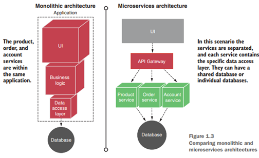
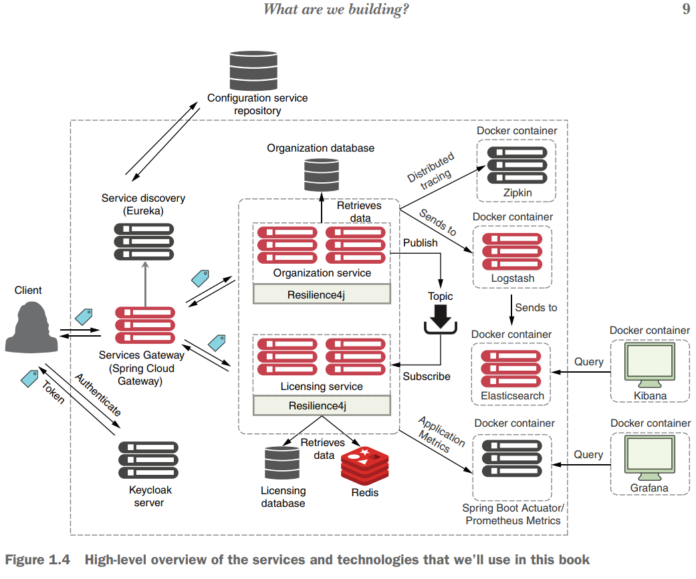
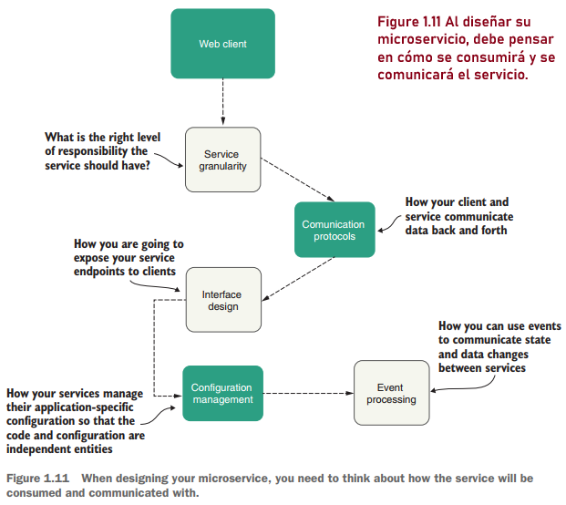
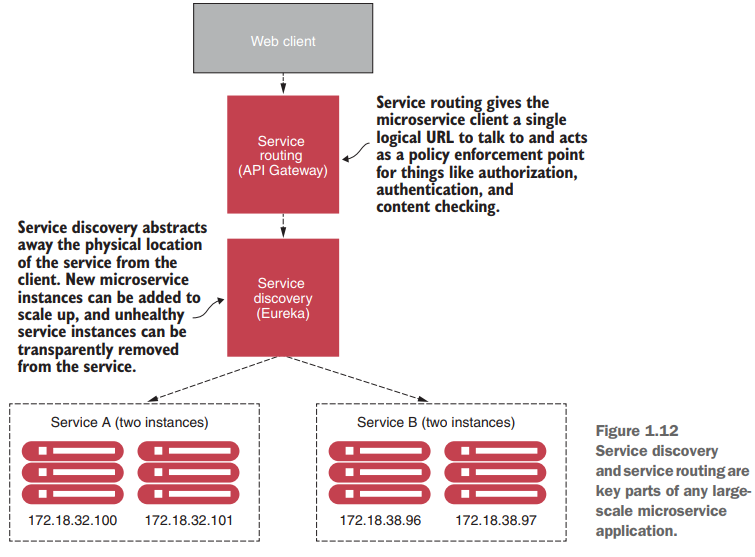
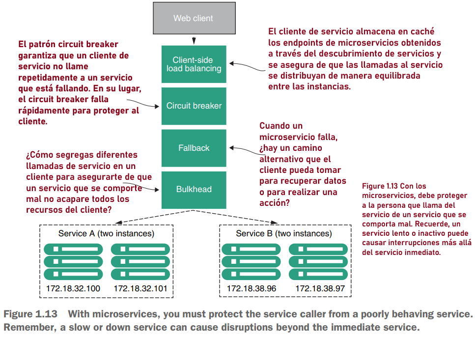
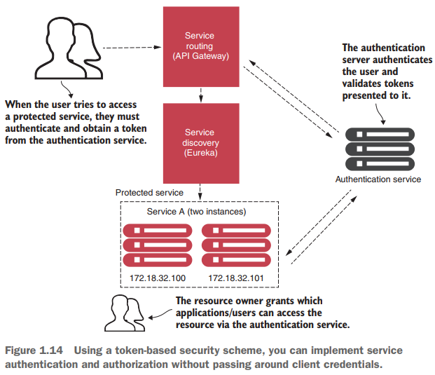
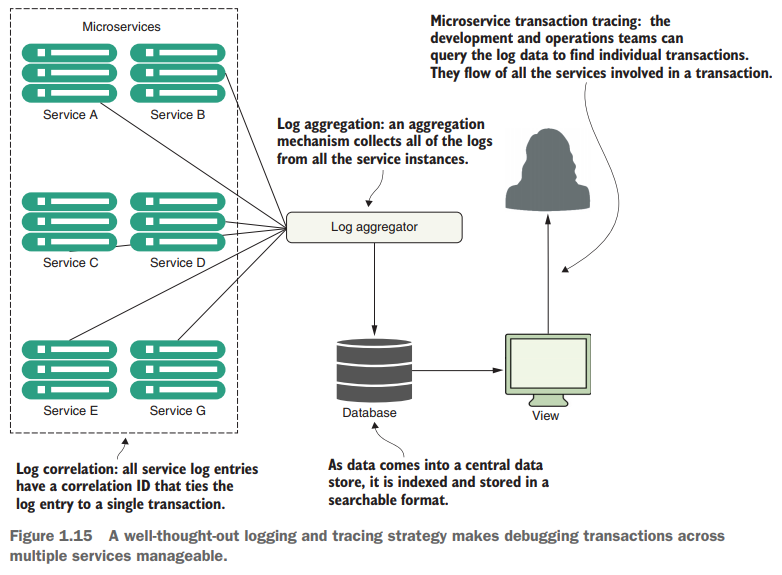

# (Book) Spring Microservices In Action, Second Edition - 2021

Este repositorio corresponde a los temas tratados en el libro **Spring Microservices In Action, Second Edition - 2021**
cuyos autores son **John Carnell y Illary Huaylupo Sánchez.**

---

## [Pág. 4] ¿Qué es un microservicio?

`Un microservicio es un servicio distribuido pequeño y débilmente acoplado`. Los microservicios le permiten tomar una
aplicación extensa y descomponerla en componentes fáciles de administrar con responsabilidades estrictamente definidas.
Los microservicios ayudan a combatir los problemas tradicionales de complejidad en una gran base de código al
descomponerla en partes pequeñas y bien definidas.

Un microservicio tiene las siguientes características:

- La lógica de la aplicación se divide en componentes pequeños con límites de responsabilidad bien definidos y
  coordinados.

- Cada componente tiene un pequeño ámbito de responsabilidad y se implementa independientemente de los demás. Un único
  microservicio es responsable de una parte de un dominio empresarial.

- Los microservicios emplean protocolos de comunicación ligeros como HTTP y JSON (notación de objetos JavaScript) para
  intercambiar datos entre el consumidor del servicio y el proveedor del servicio.

- Debido a que las aplicaciones de microservicio siempre se comunican con un formato tecnológicamente neutral (JSON es
  el más común), la implementación técnica subyacente del servicio es irrelevante. Esto significa que una aplicación
  creada utilizando un enfoque de microservicio se puede construir con múltiples lenguajes y tecnologías.

- Los microservicios, por su naturaleza pequeña, independiente y distribuida, permiten a las organizaciones tener
  equipos de desarrollo más pequeños con áreas de responsabilidad bien definidas. Estos equipos pueden trabajar para
  lograr un único objetivo, como entregar una aplicación, pero cada equipo es responsable únicamente de los servicios en
  los que está trabajando.

La `Figura 1.3` compara un diseño monolítico con un enfoque de microservicios para una pequeña aplicación típica de
comercio electrónico.

## [Pág. 9] ¿Qué es lo que vamos a construir?

Este libro ofrece una guía paso a paso sobre cómo crear una arquitectura de microservicios completa utilizando Spring
Boot, Spring Cloud y otras tecnologías útiles y modernas. `La Figura 1.4` muestra una descripción general de alto nivel
de algunos de los servicios e integraciones de tecnología que usaremos a lo largo del libro.

`La Figura 1.4` describe una solicitud de un cliente para actualizar y recuperar la información de la organización en la
arquitectura de microservicio que crearemos. Para iniciar la solicitud, el cliente primero debe autenticarse con
Keycloak para obtener un token de acceso. Una vez que se obtiene el token, el cliente realiza una solicitud a Spring
Cloud API Gateway. El servicio API Gateway es el punto de entrada a toda nuestra arquitectura; este servicio se comunica
con el descubrimiento de servicios Eureka para recuperar las ubicaciones del servicio de organización y del servicio de
licencia y luego llama al microservicio específico.

Una vez que la solicitud llega al servicio de la organización, valida el token de acceso con Keycloak para ver si el
usuario tiene permiso para continuar el proceso. Una vez validado, el servicio de la organización actualiza y recupera
su información de la base de datos de la organización y la envía de vuelta al cliente como un HTTP response. Como ruta
alternativa, una vez que se actualiza la información de la organización, el servicio de la organización agrega un
mensaje al topic de Kafka para que el servicio de licencias esté al tanto del cambio.

Cuando el mensaje llega al servicio de licencias, Redis almacena la información específica en la base de datos en
memoria de Redis. A lo largo de este proceso, la arquitectura utiliza seguimiento distribuido de Zipkin, Elasticsearch y
Logstash para administrar y mostrar los registros y emplea Spring Boot Actuator, Prometheus y Grafana para exponer y
mostrar las métricas de la aplicación.

A medida que avancemos veremos temas como Spring Boot, Spring Cloud, Elasticsearch, Logstash, Kibana, Prometheus,
Grafana y Kafka, entre otros. Todas estas tecnologías pueden parecer complicadas, pero veremos cómo crear e integrar los
diferentes componentes que componen el diagrama de la `figura 1.4` a medida que avancemos en el libro.

## [Pág. 21] Patrones de microservicios

Este libro adopta un enfoque basado en patrones a medida que analizamos estos elementos con más detalle. Con un enfoque
basado en patrones, veremos diseños comunes que se pueden utilizar en diferentes implementaciones tecnológicas.
Específicamente, cubriremos los siguientes patrones de microservicios:

- Core development pattern
- Routing patterns
- Client resiliency pattern
- Security patterns
- Logging and tracing patterns
- Application metrics patterns
- Build and deployment pattern

## [Pág. 21] Core microservice development pattern

**El patrón central de desarrollo de microservicios** aborda los conceptos básicos de la creación de un microservicio.
La `Figura 1.11` destaca los temas que cubriremos en torno al diseño de servicios básicos.

Los siguientes patrones (que se muestran en la figura 1.11) muestran los conceptos básicos de la creación de un
microservicio:

- `Granularidad del servicio`: ¿cómo aborda la descomposición de un dominio empresarial en microservicios para que cada
  microservicio tenga el nivel adecuado de responsabilidad? Hacer que un servicio sea demasiado generalizado, con
  responsabilidades que se superponen en diferentes dominios de problemas comerciales, hace que el servicio sea difícil
  de
  mantener y cambiar con el tiempo. Hacer que el servicio sea demasiado detallado aumenta la complejidad general de la
  aplicación y convierte el servicio en una capa de abstracción de datos "tonta" sin lógica excepto la necesaria para
  acceder al almacén de datos. **La granularidad del servicio se trata en el capítulo 3.**

- `Protocolos de comunicación`: ¿cómo se comunicarán los desarrolladores con su servicio? El primer paso es definir si
  desea un protocolo `sincrónico` o `asincrónico`. Para la comunicación `síncrona`, la comunicación más común es `REST`
  basada en HTTP que utiliza XML (lenguaje de marcado extensible), JSON (notación de objetos JavaScript) o un protocolo
  binario como Thrift para enviar datos de ida y vuelta a sus microservicios. Para `asíncrono`, el protocolo más popular
  es AMQP (Protocolo avanzado de cola de mensajes) que utiliza uno a uno (cola) o uno a muchos (topic) con
  intermediarios de mensajes como `RabbitMQ`, `Apache Kafka` y `Amazon Simple Queue Service. (SQS)`. En capítulos
  posteriores, aprenderemos sobre los protocolos de comunicación.

- `Diseño de interfaz`: ¿Cuál es la mejor manera de diseñar las interfaces de servicio reales que los desarrolladores
  utilizarán para llamar a su servicio? ¿Cómo estructura sus servicios? ¿Cuáles son las mejores prácticas? Las mejores
  prácticas y el diseño de interfaces se tratan en los siguientes capítulos.

- `Gestión de la configuración del servicio`: ¿Cómo gestiona la configuración de su microservicio para que se mueva
  entre diferentes entornos en la nube? Esto se puede gestionar con configuración y perfiles externalizados como se ve
  en el capítulo 5.

- `Procesamiento de eventos entre servicios`: ¿cómo desacopla su microservicio utilizando eventos para minimizar las
  dependencias codificadas entre sus servicios y aumentar la resiliencia de su aplicación? Usaremos una arquitectura
  basada en eventos con Spring Cloud Stream como se explica en el capítulo 10.

## [Pág. 22] Microservice routing patterns

Los patrones de enrutamiento de microservicios abordan cómo una aplicación cliente que desea consumir un microservicio
descubre la ubicación del servicio y se enruta hacia él. En una aplicación basada en la nube, es posible tener cientos
de instancias de microservicios en ejecución. Para hacer cumplir las políticas de seguridad y contenido, es necesario
abstraer la dirección IP física de esos servicios y tener un único punto de entrada para las llamadas de servicio.
¿Cómo? Los siguientes patrones responderán a esa pregunta:

- `Descubrimiento de servicios`: con el descubrimiento de servicios y su característica clave, el registro de servicios,
  puede hacer que su microservicio sea reconocible para que las aplicaciones cliente puedan encontrarlo sin tener la
  ubicación del servicio codificada en su aplicación. ¿Cómo? Explicamos esto en el capítulo 6. Recuerde que el
  descubrimiento de servicios es un servicio interno, no un servicio de cara al cliente.  
  Tenga en cuenta que en este libro utilizamos `Netflix Eureka Service Discovery`, pero existen otros registros de
  servicios como etcd, Consul y Apache Zookeeper. Además, algunos sistemas no cuentan con un registro de servicios
  explícito. En cambio, estos utilizan una infraestructura de comunicación entre servicios conocida como malla de
  servicios.

- `Enrutamiento de servicios`: con `API Gateway`, puede proporcionar un único punto de entrada para todos sus servicios,
  de modo que las políticas de seguridad y las reglas de enrutamiento se apliquen de manera uniforme a múltiples
  servicios e instancias de servicios en sus aplicaciones de microservicios. ¿Cómo? Con `Spring Cloud API Gateway`, como
  explicamos en el capítulo 8.

La `Figura 1.12` muestra cómo el descubrimiento de servicios y el enrutamiento de servicios parecen tener una secuencia
codificada de eventos entre ellos (primero viene el enrutamiento de servicios y luego el descubrimiento de servicios).
Sin embargo, los dos patrones no dependen uno del otro. Por ejemplo, podemos implementar el descubrimiento de servicios
sin enrutamiento de servicios, y podemos implementar el enrutamiento de servicios sin descubrimiento de servicios (
aunque su implementación es más difícil)

## [Pág. 23] Microservice client resiliency

Debido a que las arquitecturas de microservicios están altamente distribuidas, debe ser extremadamente sensible a la
hora de evitar que un problema en un solo servicio (o instancia de servicio) se propague en cascada hacia los
consumidores del servicio. **Con este fin, cubriremos cuatro patrones de resiliencia del cliente:**

- `Client-side load balancing`: cómo almacena en caché la ubicación de sus instancias de servicio en el servicio para
  que las llamadas a múltiples instancias de un microservicio tengan un equilibrio de carga para todas las instancias de
  estado de ese microservicio.

- `Circuit breaker pattern`: cómo se evita que un cliente siga llamando a un servicio que está fallando o que sufre
  problemas de rendimiento. Cuando un servicio se ejecuta lentamente, consume recursos del cliente que lo llama. Quiere
  que estas llamadas de microservicio fallen rápidamente para que el cliente que llama pueda responder rápidamente y
  tomar las medidas adecuadas.

- `Fallback pattern`: cuando falla una llamada de servicio, cómo se proporciona un mecanismo de “complemento” que
  permite al cliente del servicio intentar realizar su trabajo a través de medios alternativos además del microservicio
  al que se llama.

- `Bulkhead pattern`: las aplicaciones de microservicio utilizan múltiples recursos distribuidos para realizar su
  trabajo. Este patrón se refiere a cómo compartimenta estas llamadas para que el mal comportamiento de una llamada de
  servicio no afecte negativamente al resto de la aplicación.

La `Figura 1.13` muestra cómo estos patrones protegen al consumidor del servicio de verse afectado cuando un servicio se
comporta mal. Estos temas se tratan en el capítulo 7.

## [Pág. 25] Microservice security patterns

Para garantizar que los microservicios no estén abiertos al público, es importante aplicar los siguientes patrones de
seguridad a la arquitectura para garantizar que solo las solicitudes concedidas con las credenciales adecuadas puedan
invocar los servicios. La `Figura 1.14` muestra cómo puede implementar estos tres patrones para crear un servicio de
autenticación que pueda proteger sus microservicios:

- `Autenticación`: cómo se determina que el cliente del servicio que llama al servicio es quien dice ser.

- `Autorización`: cómo se determina si el cliente del servicio que llama a un microservicio tiene permiso para realizar
  la acción que está intentando realizar.

- `Gestión y propagación de credenciales`: cómo evitar que un cliente de servicio tenga que presentar constantemente sus
  credenciales para las llamadas de servicio involucradas en una transacción. Para lograr esto, veremos cómo se pueden
  utilizar estándares de seguridad basados en tokens, como `OAuth2` y `JSON Web Tokens (JWT)`, para obtener un token que
  se pueda pasar de una llamada de servicio a otra para autenticar y autorizar al usuario.

## [Pág. 26] Microservice logging and tracing patterns

La desventaja de una arquitectura de microservicio es que es mucho más difícil depurar, rastrear y monitorear los
problemas porque una simple acción puede desencadenar numerosas llamadas de microservicio dentro de su aplicación. Otros
capítulos cubrirán cómo implementar el seguimiento distribuido con Spring Cloud Sleuth, Zipkin y ELK Stack. Por este
motivo, veremos los siguientes tres patrones principales de registro y seguimiento `(logging and tracing)` para lograr
un seguimiento distribuido:

- `Log correlation`: cómo vincula todos los registros producidos entre servicios para una sola transacción de usuario.
  Con este patrón, veremos cómo implementar una ID de correlación, que es un identificador único que se incluye en todas
  las llamadas de servicio en una transacción y que se puede utilizar para vincular las entradas de registro producidas
  por cada servicio.

- `Log aggregation`: con este patrón, veremos cómo reunir todos los registros producidos por sus microservicios (y sus
  instancias individuales) en una única base de datos consultable en todos los servicios involucrados y comprenderemos
  las características de rendimiento de los servicios en la transacción.

- `Microservice tracing`: exploraremos cómo visualizar el flujo de una transacción de cliente en todos los servicios
  involucrados y comprenderemos las características de rendimiento de los servicios de la transacción.

La `figura 1.15` muestra cómo encajan estos patrones. Cubriremos los patrones de registro y rastreo con mayor detalle en
el capítulo 11.

